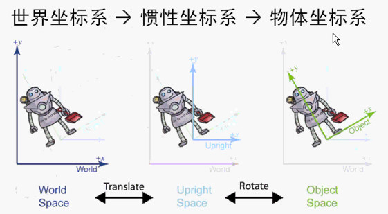

# Matlab

> [Matlab帮助文档](https://ww2.mathworks.cn/help/matlab/index.html)

## 变量及基本操作

```matlab
% 清屏
clc
% 清除所有变量
clear all 
%% 区分大小写
A = 2
a = 3
%%
%  变量名不能超过63位，高版本报错，低版本会截取前63位
abcdefghabcdefghabcdefghabcdefghabcdefghabcdefghabcdefghabcdefgh = 1
%%
% 变量名以字母开头，可以有字母、数字、下划线，不能使用标点
```

```matlab
%% cell 元胞数组(对象)
A = cell(1,6)
% 单位矩阵
A{1} = eye(3)
A{2} = magic(5)
A{2}
%% 结构体
books = struct('name',{{'test1','test2'}},'price',[30 40])
% 元胞数组
books.name(1)
% 值
books.name{1}
```

```matlab
%% 矩阵
A = [1 2 3; 4 5 2; 3 2 7]
B = A'
C = A(:)
D = inv(A)
D*A
E = zeros(10,5,3)
E(:,:,1) = rand(10,5)
% 低版本不能使用
E(:,:,2) = randint(5,10,5)
E(:,:,3) = randn(10,5)

%% 矩阵操作
% 矩阵的定义与构造
A = [1 2 3 5 8 5 4 6]
% 最小值:不长:最大值
B = 1:2:9
C = repmat(B,3,3)
D = ones(2,4)
E = zeros(2,4)

%% 矩阵的四则运算 
A = [1 2 3 4; 5 6 7 8]
B = [1 1 2 2; 2 2 1 1]
% 矩阵相加          A B 行列相等
C = A+B
% 矩阵相减          A B 行列相等
D = A-B
% 矩阵相乘          A的列数=B的行数
E = A*B'
% 矩阵对应项相乘    A B 行列相等
F = A.*B
% 矩阵相除          A的列数=B的行数
G = A/B % G*B = A => G*B*pinv(B) = A*pinv(B) => G = A*pinv(B)
% 矩阵对应项相除    A B 行列相等
H = A./B

% 矩阵的下标已经查找
A = magic(5)
B = A(2,3)
C = A(3,:)
C = A(:,3)
% 找大于20的序号值/矩阵
[m,n] = find(A>20)
```

[MATLAB中find函数详解](https://blog.csdn.net/wangyang20170901/article/details/78745611)

## 基本数据运算

> [Matlab变量、分支语句和循环语句](https://blog.csdn.net/xingjiarong/article/details/50590685)
>
> [MATLAB的基本语句结构](https://blog.csdn.net/weixin_36292962/article/details/102632802)
>
> [MATLAB的基础知识（基本符号，数据类型，运算符，复数运算，三角函数运算）](https://blog.csdn.net/weixin_44566643/article/details/97530502)

## 二维平面绘图

```matlab
x = 0:0.01:2*pi
y = sin(x)
figure
plot(x,y)
title('y = sin(x)')
xlabel('x')
ylabel('sin(x)')
xlim([0 2*pi])
```

| 颜色  | 字符 | 颜色 | 字符 |
| ----- | ---- | ---- | ---- |
| 红R   | r    | 青M  | m    |
| 绿G   | g    | 黄Y  | y    |
| 蓝B   | b    | 黑K  | k    |
| 洋红C | c    | 白W  | w    |

| 线型   | 符号 | 实例                                |
| ------ | ---- | ----------------------------------- |
| 实线   | -    | ~~-                             -~~ |
| 虚线   | --   | ————————                            |
| 冒号线 | :    | ·······························     |
| 点画线 | -.   | — - — - — - — - —                   |


```matlab
x = 0:0.01:20;
y1 = 200*exp(-0.05*x).*sin(x)
y2 = 0.8*exp(-0.5*x).*sin(10*x)
figure
[AX, H1, H2] = plotyy(x, y1,x,y2,'plot') ;
set(get(AX(1), 'Ylabel'), 'String', 'Slow Decay')
set(get(AX(2), 'Ylabel'), 'String', 'Fast Decay')
xlabel('Time (\musec)')
title('Multiple Decay Rates')
set(H1,'LineStyle','--')
set(H2,'LineStyle',':')

x = 0:0.1:20;
y1 = 200*exp(-0.05*x).*sin(x)
y2 = 200*exp(-0.5*x).*sin(10*x)
figure
plot(x,y1,'-.')
hold on % 保存当前绘制 hold off 不保存当前绘制
plot(x,y2,':')
xlabel('Time (\musec)')
ylabel('衰变')
title('多重衰变率')
```

绘制平面直角坐标系

```matlab
%clear all
clc
x = [5 0 2 -2]
y = [2 5 -3 -3]

if(min(y)>min(x))
    Mymin = min(x)+round(min(x)*0.3)
else
    Mymin = min(y)+round(min(y)*0.3)
end
if(max(y)>max(x))
    Mymax = max(y)+round(max(y)*0.3)
else
    Mymax = max(x)+round(max(x)*0.3)
end
figure
plot(x,y,'o')
axis off
hold on;

plot([0 0],[Mymin Mymax],'k',[Mymin Mymax],[0 0],'k');
ax=[Mymax,Mymax-0.3,Mymax-0.3;0,0.2,-0.2];
fill(ax(1,:),ax(2,:),'k');
ay=[0,0.15,-0.15;Mymax,Mymax-0.4,Mymax-0.4];
fill(ay(1,:),ay(2,:),'k'); hold on
for i=Mymin:Mymax
    plot([i,i],[0,0.1],'k'); hold on
    a=text(i,-0.4,num2str(i));
    set(a,'HorizontalAlignment','center')
    plot([0,0.1],[i,i],'k'); hold on
    b=text(-0.4,i,num2str(i));
    set(b,'HorizontalAlignment','center')
end
c=text(-0.4,-0.4,num2str(0));
set(c,'HorizontalAlignment','center')
```

## 三维平面绘图

```matlab
t = 0: pi/50:10*pi
plot3(sin(t), cos(t), t)
hold on
plot3(sin(t)+10, cos(t)+10, t)
xlabel('sin(t)')
ylabel('cos(t)')
zlabel('t')
grid on % 网格
axis square % 刻度同一
```


# 3D数学(立体几何)

## 坐标系

### 笛卡尔坐标系

- 1D-数轴


- 2D-平面几何

2d 坐标系一般来说大家都有默认： x轴朝右，y轴朝向。

- 3D-立体几何

  - 左手坐标系

    

    而对于三维坐标系，一般有两种习俗，左手坐标系和右手坐标系，它们的重点不是在于 z 轴标注的是哪根，而是三个方向的组合，比如之前的[从零开始[计算机图形学](https://www.zhihu.com/search?q=计算机图形学&search_source=Entity&hybrid_search_source=Entity&hybrid_search_extra={"sourceType"%3A"article"%2C"sourceId"%3A64707259})]系列一直用左手坐标系，为了作图方便，我把 z 轴指向屏幕里。

    - 右手坐标系

      

      如果我们为了作图方便将 x轴 放到右边，y轴放到上边，那么 z轴的朝向屏幕外

### 多坐标系

1. 为什么要有多坐标系

　　当我们使用一个坐标系来描绘整个场景的时候，场景中的任意点都可以用该坐标系描述，此时如果有一只羊一遍摇动着耳朵，一边走，这个时候如果进行坐标的转换会发现异常的麻烦，此时如果我们把羊看做整体，羊的移动问题就可以用这个坐标系解决，但是这只该死的羊还摇动耳朵，这时候我们应该以羊为坐标系，羊的耳朵移动是在羊这个坐标系的基础上就简单了。

2. 世界坐标系

**世界坐标系的概念**

　　世界坐标系是一个特殊的坐标系，它建立了描述其他坐标系所需要的参考框架。世界坐标系就是最大的坐标系，世界坐标系也被称为全局坐标系或者宇宙坐标系。

**关于世界坐标系的常见问题**

- 世界坐标系的典型问题都是关于初始位置和环境的。如下
- 每个物体的位置和方向
- 摄像机的位置和方向
- 世界中每一点的地形是什么（如山丘，建筑，湖泊等）
- 各物体从哪里来到哪里去（NPC的运动策略）

3. 物体坐标系

**物体坐标系的概念**

　　物体坐标系是和特定物体相关联的坐标系，每个物体都有他们独立的坐标系，当物体移动或者改变方向的时候，和该物体相关联的坐标系将随之移动或改变方向。例如，我们每个人都带着自己的坐标系，如果我告诉你“向前一步走”是指在物体坐标系中向前走，当我告诉你“向北一步走”，此时的向北是在世界坐标系的基础上，因为前后左右是物体坐标系自己知道的，但是东西南北是在世界坐标系下衍生出来的概念。

　　还有一个简单的例子，例如我询问你车里的音响是在哪，即使你在潍坊，你也不能告诉我在潍坊，而是告诉我在车的哪里，应该说在车门上。这个时候就是以物体坐标系为基础，而不是世界坐标系。

**物体坐标系常见问题**

-  周围有互相作用的物体吗？（我需要攻击他吗）
- 哪个方向？在我前面吗？我左边一点？（我应该是射击它还是逃跑）

4. 摄像机坐标系

**摄像机坐标系的概念**

　　摄像机坐标系是和观察者密切相关的坐标系。摄像机坐标系和屏幕坐标系相似，差别在于摄像机坐标系处于3D空间中，而屏幕坐标系是在2D平面里，可以理解摄像机坐标的获取视景展示在屏幕上。摄像机坐标系可以理解为特殊的“物体坐标系”，摄像机坐标系中，摄像机在原点，x轴向右，z轴向前（摄像机的拍摄方向），y轴向上（不是世界的上方，而是摄像机本身的上方，如果放反了，拍出来的就是反的效果）


**摄像机坐标系常见的问题**

- 3D空间中的给定点在摄像机前方吗？
- 3D空间中给定点是在屏幕上，还是超出了摄像机平截锥体的左右上下边界？（平截锥体就是摄像机能观察到的金字塔区域）
- 某个物体是否在屏幕上？它的部分在，或全部不在？
- 两个物体，谁在前面？（该问题称作可见性检测）

5. 惯性坐标系

**惯性坐标系的概念**

　　有时候，好的术语是引领人们正确理解主题的关键。为了简化世界坐标系到物体坐标系的转换，人们引入了一种新的坐标系，称作惯性坐标系，意思是在世界坐标系到物体坐标系的“半途”。惯性坐标系的原点与物体坐标系的原点相重合，并且惯性坐标系的轴平行于世界坐标系的轴。



上图中，物体坐标系（Object Space）的坐标点要转换到世界坐标系（World Space）中，就需要实用惯性坐标系（Inertial Space)作为过渡。 

## ==向量==

### 定义

- 数学定义

  一个数组，向量的维数：2维、3维、4维，标量是1维向量

  行向量$\left[\begin{matrix} 1&2&3\end{matrix}\right]$，列向量（常用、方便计算）$\left[\begin{matrix} 1\\2\\3\end{matrix}\right]$

- 几何定义

  向量是有个大小和方向的有向线段

  向量没有位置，只有大小和方向

  位置和位移

  $\left[\begin{matrix} x&y\end{matrix}\right]$、$\left[\begin{matrix} x&y&z\end{matrix}\right]$

- [向量和点的关系](https://zhuanlan.zhihu.com/p/374209437)

  向量与坐标之间是等号连接

  点的坐标，是在点的字母后直接加坐标

  关系向量AB是用B的横纵坐标减去A点的横纵坐标。

### 向量运算

#### 零向量

向量里面的每一个元素都为0如：

$\left[\begin{matrix} 0&\cdots&0\end{matrix}\right]$		$\left[\begin{matrix} 0\\\vdots\\0\end{matrix}\right]$

#### 负向量

一个向量的负向量为这个向量的每一个元素加上符号，$\vec{v} + -\vec{v} = \vec{0}$

几何意义：向量和与之对应的负向量大小相同、方向相反

#### 向量大小、长度、模

$||\vec{v}|| = \sqrt{\sum_{i=1}^{n}v_i^2} = \sqrt{v_1^2+v_2^2+\cdots+v_{n-1}^2+v_n^2}$

$||\vec{v}|| = \sqrt{v_x^2+v_y^2}$

#### 标量与向量的乘法和除法

$k\left[\begin{matrix} a_1\\a_2\\\vdots\\a_{n-1}\\a_n\end{matrix}\right] = \left[\begin{matrix} a_1\\a_2\\\vdots\\a_{n-1}\\a_n\end{matrix}\right]k=\left[\begin{matrix} ka_1\\ka_2\\\vdots\\ka_{n-1}\\ka_n\end{matrix}\right]$${(-1<k<1)}$极为除法

几何意义：${(-1>=k,k>=1)}$和正数相乘，相当于向量变长，和负数相乘，相当于向量变长且方向相反

${(-1<k<1)}$和正数相除，相当于向量变短，和负数相除，相当于向量变短且方向相反

#### 标准化向量(单位向量)

$\hat{v}=\frac{\vec{v}}{||\vec{v}||}$

几何意义：模的值为1的向量就是单位向量

#### 向量的加法和减法

$\left[\begin{matrix} a_1\\a_2\\\vdots\\a_{n-1}\\a_n\end{matrix}\right]+\left[\begin{matrix} b_1\\b_2\\\vdots\\b_{n-1}\\b_n\end{matrix}\right] = \left[\begin{matrix} a_1+b_1\\a_2+b_2\\\vdots\\a_{n-1}+b_{n-1}\\a_n+b_n\end{matrix}\right]$

$\left[\begin{matrix} a_1\\a_2\\\vdots\\a_{n-1}\\a_n\end{matrix}\right] - \left[\begin{matrix} b_1\\b_2\\\vdots\\b_{n-1}\\b_n\end{matrix}\right] = \left[\begin{matrix} a_1\\a_2\\\vdots\\a_{n-1}\\a_n\end{matrix}\right] + \left(-\left[\begin{matrix} b_1\\b_2\\\vdots\\b_{n-1}\\b_n\end{matrix}\right] \right)= \left[\begin{matrix} a_1-b_1\\a_2-b_2\\\vdots\\a_{n-1}-b_{n-1}\\a_n-b_n\end{matrix}\right]$

几何意义：

 

#### 距离公式

两点之间的距离可以通过向量来计算如：

#### 向量点乘

$\vec{a}\cdot\vec{b}=\sum_{i=1}^{n}a_ib_i$

$\left[\begin{matrix} a_1\\a_2\\···\\a_{n-1}\\a_n\end{matrix}\right] \cdot \left[\begin{matrix} b_1\\b_2\\···\\b_{n-1}\\b_n\end{matrix}\right] = a_1b_1+a_2b_2+\cdots+a_{n-1}b_{n-1}+a_{n}b_{n}$

$\vec{a}\cdot\vec{b}=||\vec{a}|| \ ||\vec{b}||\cos{\theta}$

$\theta = \arccos{\frac{\vec{a}\cdot\vec{b}}{||\vec{a}|| \ ||\vec{b}||}}$

($\sin(\arcsin{(x)})=\cos(\arccos{(x)})=\tan(\arctan{(x)})=\cot(arccot{(x)})=x$)

| $\vec{a}\cdot\vec{b}$ | $\theta$ | 角度 |                    |
| --------------------- | -------- | ---- | ------------------ |
| >0                    | (0,90)   | 锐角 | 主要指向同一个方向 |
| 0                     | 90       | 直角 | 垂直的             |
| <0                    | (90,180) | 钝角 | 主要指向相反的方向 |


#### 向量投影

#### 向量叉乘

# 计算几何

