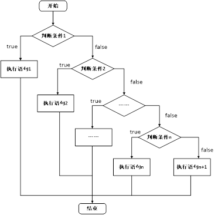

# C++基础入门

## 1、C++初识

### 1.1、第一个C++程序

编写一个C++程序总共分为4个步骤

* 创建项目
* 创建文件
* 编写代码
* 运行程序

#### 1.1.1、创建项目

Visual Studio是我们用来编写C++程序的主要工具，我们先将它打开


#### 1.1.2、创建文件

右键源文件，选择添加->新建项


给C++文件起个名称，然后点击添加即可。


#### 1.1.3、编写代码

```c++
#include<iostream>
using namespace std;

int main() {
	cout << "Hello world" << endl;
	system("pause");
	return 0;
}
```

#### 1.1.4、运行程序


### 1.2、注释

**作用**：在代码中加一些说明和解释，方便自己或其他程序员程序员阅读代码

**两种格式**

1. **单行注释**：`// 描述信息` 
   - 通常放在一行代码的上方，或者一条语句的末尾，==对该行代码说明==
2. **多行注释**： `/* 描述信息 */`
   - 通常放在一段代码的上方，==对该段代码做整体说明==

> 提示：编译器在编译代码时，会忽略注释的内容

### 1.3、变量

**作用**：给一段指定的内存空间起名，方便操作这段内存

**语法**：`数据类型 变量名 = 初始值;`

**示例：**

```C++
#include<iostream>
using namespace std;
int main() {
	//变量的定义
	//语法：数据类型  变量名 = 初始值
	int a = 10;
	cout << "a = " << a << endl;
	system("pause");
	return 0;
}
```

> 注意：C++在创建变量时，必须给变量一个初始值，否则会报错

### 1.4、常量

**作用**：用于记录程序中不可更改的数据

C++定义常量两种方式

1. **\#define** 宏常量： `#define 常量名 常量值`
   * ==通常在文件上方定义==，表示一个常量


2. **const**修饰的变量 `const 数据类型 常量名 = 常量值`
   * ==通常在变量定义前加关键字const==，修饰该变量为常量，不可修改

**示例：**

```C++
//1、宏常量
#define day 7
int main() {
	cout << "一周里总共有 " << day << " 天" << endl;
	//day = 8;  //报错，宏常量不可以修改
	//2、const修饰变量
	const int month = 12;
	cout << "一年里总共有 " << month << " 个月份" << endl;
	//month = 24; //报错，常量是不可以修改的
	system("pause");
	return 0;
}
```


### 1.5 关键字

**作用：**关键字是C++中预先保留的单词（标识符）

* **在定义变量或者常量时候，不要用关键字**

C++关键字如下：

| asm            | do               | if                   | return          | typedef      |
| -------------- | ---------------- | -------------------- | --------------- | ------------ |
| **auto**       | **double**       | **inline**           | **short**       | **typeid**   |
| **bool**       | **dynamic_cast** | **int**              | **signed**      | **typename** |
| **break**      | **else**         | **long**             | **sizeof**      | **union**    |
| **case**       | **enum**         | **mutable**          | **static**      | **unsigned** |
| **catch**      | **explicit**     | **namespace**        | **static_cast** | **using**    |
| **char**       | **export**       | **new**              | **struct**      | **virtual**  |
| **class**      | **extern**       | **operator**         | **switch**      | **void**     |
| **const**      | **false**        | **private**          | **template**    | **volatile** |
| **const_cast** | **float**        | **protected**        | **this**        | **wchar_t**  |
| **continue**   | **for**          | **public**           | **throw**       | **while**    |
| **default**    | **friend**       | **register**         | **true**        |              |
| **delete**     | **goto**         | **reinterpret_cast** | **try**         |              |

`提示：在给变量或者常量起名称时候，不要用C++得关键字，否则会产生歧义。`

### 1.6、标识符命名规则

**作用**：C++规定给标识符（变量、常量）命名时，有一套自己的规则

* 标识符不能是关键字
* 标识符只能由字母、数字、下划线组成
* 第一个字符必须为字母或下划线
* 标识符中字母区分大小写

> 建议：给标识符命名时，争取做到见名知意的效果，方便自己和他人的阅读

## 2、数据类型

C++规定在创建一个变量或者常量时，必须要指定出相应的数据类型，否则无法给变量分配内存

### 2.1、整型

**作用**：整型变量表示的是==整数类型==的数据

C++中能够表示整型的类型有以下几种方式，**区别在于所占内存空间不同**：

| **数据类型**        | **占用空间**                                    | 取值范围         |
| ------------------- | ----------------------------------------------- | ---------------- |
| short(短整型)       | 2字节                                           | (-2^15 ~ 2^15-1) |
| int(整型)           | 4字节                                           | (-2^31 ~ 2^31-1) |
| long(长整形)        | Windows为4字节，Linux为4字节(32位)，8字节(64位) | (-2^31 ~ 2^31-1) |
| long long(长长整形) | 8字节                                           | (-2^63 ~ 2^63-1) |

### 2.2、sizeof关键字

**作用：**利用sizeof关键字可以==统计数据类型所占内存大小==

**语法：** `sizeof( 数据类型 / 变量)`

**示例：**

```C++
int main() {
	cout << "short 类型所占内存空间为： " << sizeof(short) << endl;
	cout << "int 类型所占内存空间为： " << sizeof(int) << endl;
	cout << "long 类型所占内存空间为： " << sizeof(long) << endl;
	cout << "long long 类型所占内存空间为： " << sizeof(long long) << endl;
	system("pause");
	return 0;
}
```

> **整型结论**：==short < int <= long <= long long==

### 2.3、实型（浮点型）

**作用**：用于==表示小数==

浮点型变量分为两种：

1. 单精度float 
2. 双精度double

两者的**区别**在于表示的有效数字范围不同。

| **数据类型** | **占用空间** | **有效数字范围** |
| ------------ | ------------ | ---------------- |
| float        | 4字节        | 7位有效数字      |
| double       | 8字节        | 15～16位有效数字 |

**示例：**

```C++
int main() {
	float f1 = 3.14f;
	double d1 = 3.14;
	cout << f1 << endl;
	cout << d1<< endl;
	cout << "float  sizeof = " << sizeof(f1) << endl;
	cout << "double sizeof = " << sizeof(d1) << endl;
	//科学计数法
	float f2 = 3e2; // 3 * 10 ^ 2 
	cout << "f2 = " << f2 << endl;
	float f3 = 3e-2;  // 3 * 0.1 ^ 2
	cout << "f3 = " << f3 << endl;
	system("pause");
	return 0;
}
/*输出
3.14
3.14
float  sizeof = 4
double sizeof = 8
f2 = 300
f3 = 0.03
*/
```

### 2.4、字符型

**作用：**字符型变量用于显示单个字符

**语法：**`char ch = 'a';`

> 注意1：在显示字符型变量时，用单引号将字符括起来，不要用双引号
>
> 注意2：单引号内只能有一个字符，不可以是字符串

- C和C++中字符型变量只占用==1个字节==。
- 字符型变量并不是把字符本身放到内存中存储，而是将对应的ASCII编码放入到存储单元

示例：

```C++
int main() {
	char ch = 'a';
	cout << ch << endl;
	cout << sizeof(char) << endl;
	//ch = "abcde"; //错误，不可以用双引号
	//ch = 'abcde'; //错误，单引号内只能引用一个字符
	cout << (int)ch << endl;  //查看字符a对应的ASCII码
	ch = 97; //可以直接用ASCII给字符型变量赋值
	cout << ch << endl;
	system("pause");
	return 0;
}
/*输出
a
1
97
a
*/
```

ASCII码表格：

| **ASCII**值 | **控制字符** | **ASCII**值 | **字符** | **ASCII**值 | **字符** | **ASCII**值 | **字符** |
| ----------- | ------------ | ----------- | -------- | ----------- | -------- | ----------- | -------- |
| 0           | NUT          | 32          | (space)  | 64          | @        | 96          | 、       |
| 1           | SOH          | 33          | !        | 65          | A        | 97          | a        |
| 2           | STX          | 34          | "        | 66          | B        | 98          | b        |
| 3           | ETX          | 35          | #        | 67          | C        | 99          | c        |
| 4           | EOT          | 36          | $        | 68          | D        | 100         | d        |
| 5           | ENQ          | 37          | %        | 69          | E        | 101         | e        |
| 6           | ACK          | 38          | &        | 70          | F        | 102         | f        |
| 7           | BEL          | 39          | ,        | 71          | G        | 103         | g        |
| 8           | BS           | 40          | (        | 72          | H        | 104         | h        |
| 9           | HT           | 41          | )        | 73          | I        | 105         | i        |
| 10          | LF           | 42          | *        | 74          | J        | 106         | j        |
| 11          | VT           | 43          | +        | 75          | K        | 107         | k        |
| 12          | FF           | 44          | ,        | 76          | L        | 108         | l        |
| 13          | CR           | 45          | -        | 77          | M        | 109         | m        |
| 14          | SO           | 46          | .        | 78          | N        | 110         | n        |
| 15          | SI           | 47          | /        | 79          | O        | 111         | o        |
| 16          | DLE          | 48          | 0        | 80          | P        | 112         | p        |
| 17          | DCI          | 49          | 1        | 81          | Q        | 113         | q        |
| 18          | DC2          | 50          | 2        | 82          | R        | 114         | r        |
| 19          | DC3          | 51          | 3        | 83          | S        | 115         | s        |
| 20          | DC4          | 52          | 4        | 84          | T        | 116         | t        |
| 21          | NAK          | 53          | 5        | 85          | U        | 117         | u        |
| 22          | SYN          | 54          | 6        | 86          | V        | 118         | v        |
| 23          | TB           | 55          | 7        | 87          | W        | 119         | w        |
| 24          | CAN          | 56          | 8        | 88          | X        | 120         | x        |
| 25          | EM           | 57          | 9        | 89          | Y        | 121         | y        |
| 26          | SUB          | 58          | :        | 90          | Z        | 122         | z        |
| 27          | ESC          | 59          | ;        | 91          | [        | 123         | {        |
| 28          | FS           | 60          | <        | 92          | /        | 124         | \|       |
| 29          | GS           | 61          | =        | 93          | ]        | 125         | }        |
| 30          | RS           | 62          | >        | 94          | ^        | 126         | `        |
| 31          | US           | 63          | ?        | 95          | _        | 127         | DEL      |

ASCII 码大致由以下**两部分组**成：

* ASCII 非打印控制字符： ASCII 表上的数字 **0-31** 分配给了控制字符，用于控制像打印机等一些外围设备。
* ASCII 打印字符：数字 **32-126** 分配给了能在键盘上找到的字符，当查看或打印文档时就会出现。

### 2.5、转义字符

**作用：**用于表示一些==不能显示出来的ASCII字符==

现阶段我们常用的转义字符有：` \n  \\  \t`

| **转义字符** | **含义**                                | **ASCII**码值（十进制） |
| ------------ | --------------------------------------- | ----------------------- |
| \a           | 警报                                    | 007                     |
| \b           | 退格(BS) ，将当前位置移到前一列         | 008                     |
| \f           | 换页(FF)，将当前位置移到下页开头        | 012                     |
| **\n**       | **换行(LF) ，将当前位置移到下一行开头** | **010**                 |
| \r           | 回车(CR) ，将当前位置移到本行开头       | 013                     |
| **\t**       | **水平制表(HT)  （跳到下一个TAB位置）** | **009**                 |
| \v           | 垂直制表(VT)                            | 011                     |
| **\\\\**     | **代表一个反斜线字符"\"**               | **092**                 |
| \'           | 代表一个单引号（撇号）字符              | 039                     |
| \"           | 代表一个双引号字符                      | 034                     |
| \?           | 代表一个问号                            | 063                     |
| \0           | 数字0                                   | 000                     |
| \ddd         | 8进制转义字符，d范围0~7                 | 3位8进制                |
| \xhh         | 16进制转义字符，h范围0~9，a~f，A~F      | 3位16进制               |

示例：

```C++
int main() {
	cout << "\\" << endl;
	cout << "\tHello" << endl;
	cout << "\n" << endl;
	system("pause");
	return 0;
}
```

### 2.6、字符串型

**作用**：用于表示一串字符

**两种风格**

1. **C风格字符串**： `char 变量名[] = "字符串值"`

   示例：

```C++
int main() {
    char str1[] = "hello world";
    cout << str1 << endl;
    system("pause");
    return 0;
}
```

> 注意：C风格的字符串要用双引号括起来

1. **C++风格字符串**：  `string  变量名 = "字符串值"`

   示例：

```C++
int main() {
    string str = "hello world";
    cout << str << endl;
    system("pause");
    return 0;
}
```

> 注意：C++风格字符串，需要加入头文件==#include\<string>==

### 2.7、布尔类型 bool

**作用：**布尔数据类型代表真或假的值 

bool类型只有两个值：

* true  --- 真（本质是1）
* false --- 假（本质是0）

**bool类型占==1个字节==大小**

示例：

```C++
int main() {
	bool flag = true;
	cout << flag << endl; // 1
	flag = false;
	cout << flag << endl; // 0
	cout << "size of bool = " << sizeof(bool) << endl; //1
	system("pause");
	return 0;
}
```

### 2.8、数据的输入

**作用：用于从键盘获取数据**

**关键字：**cin

**语法：** `cin >> 变量 `

示例：

```C++
int main(){
	//整型输入
	int a = 0;
	cout << "请输入整型变量：" << endl;
	cin >> a;
	cout << a << endl;

	//浮点型输入
	double d = 0;
	cout << "请输入浮点型变量：" << endl;
	cin >> d;
	cout << d << endl;

	//字符型输入
	char ch = 0;
	cout << "请输入字符型变量：" << endl;
	cin >> ch;
	cout << ch << endl;

	//字符串型输入
	string str;
	cout << "请输入字符串型变量：" << endl;
	cin >> str;
	cout << str << endl;

	//布尔类型输入
	bool flag = true;
	cout << "请输入布尔型变量：" << endl;
	cin >> flag;
	cout << flag << endl;
	system("pause");
	return EXIT_SUCCESS;
}
```

## 3、运算符

**作用：**用于执行代码的运算

本章我们主要讲解以下几类运算符：

| **运算符类型** | **作用**                               |
| -------------- | -------------------------------------- |
| 算术运算符     | 用于处理四则运算                       |
| 赋值运算符     | 用于将表达式的值赋给变量               |
| 比较运算符     | 用于表达式的比较，并返回一个真值或假值 |
| 逻辑运算符     | 用于根据表达式的值返回真值或假值       |

### 3.1、算术运算符

**作用**：用于处理四则运算 

算术运算符包括以下符号：

| **运算符** | **术语**   | **示例**    | **结果**  |
| ---------- | ---------- | ----------- | --------- |
| +          | 正号       | +3          | 3         |
| -          | 负号       | -3          | -3        |
| +          | 加         | 10 + 5      | 15        |
| -          | 减         | 10 - 5      | 5         |
| *          | 乘         | 10 * 5      | 50        |
| /          | 除         | 10 / 5      | 2         |
| %          | 取模(取余) | 10 % 3      | 1         |
| ++         | 前置递增   | a=2; b=++a; | a=3; b=3; |
| ++         | 后置递增   | a=2; b=a++; | a=3; b=2; |
| --         | 前置递减   | a=2; b=--a; | a=1; b=1; |
| --         | 后置递减   | a=2; b=a--; | a=1; b=2; |

**示例1：**

```C++
//加减乘除
int main() {
	int a1 = 10;
	int b1 = 3;

	cout << a1 + b1 << endl;
	cout << a1 - b1 << endl;
	cout << a1 * b1 << endl;
	cout << a1 / b1 << endl;  //两个整数相除结果依然是整数

	int a2 = 10;
	int b2 = 20;
	cout << a2 / b2 << endl; 

	int a3 = 10;
	int b3 = 0;
	//cout << a3 / b3 << endl; //报错，除数不可以为0

	//两个小数可以相除
	double d1 = 0.5;
	double d2 = 0.25;
	cout << d1 / d2 << endl;

	system("pause");
	return 0;
}
```

> 总结：在除法运算中，除数不能为0

**示例2：**

```C++
//取模
int main() {

	int a1 = 10;
	int b1 = 3;
	cout << 10 % 3 << endl;

	int a2 = 10;
	int b2 = 20;
	cout << a2 % b2 << endl;

	int a3 = 10;
	int b3 = 0;
	//cout << a3 % b3 << endl; //取模运算时，除数也不能为0

	//两个小数不可以取模
	double d1 = 3.14;
	double d2 = 1.1;
	//cout << d1 % d2 << endl;

	system("pause");
	return 0;
}

```

> 总结：只有整型变量可以进行取模运算

**示例3：**

```C++
//递增
int main() {

	//后置递增
	int a = 10;
	a++; //等价于a = a + 1
	cout << a << endl; // 11

	//前置递增
	int b = 10;
	++b;
	cout << b << endl; // 11

	//区别
	//前置递增先对变量进行++，再计算表达式
	int a2 = 10;
	int b2 = ++a2 * 10;
	cout << b2 << endl;

	//后置递增先计算表达式，后对变量进行++
	int a3 = 10;
	int b3 = a3++ * 10;
	cout << b3 << endl;

	system("pause");
	return 0;
}

```

> 总结：前置递增先对变量进行++，再计算表达式，后置递增相反

### 3.2、赋值运算符

**作用：**用于将表达式的值赋给变量

赋值运算符包括以下几个符号：

| **运算符** | **术语** | **示例**   | **结果**  |
| ---------- | -------- | ---------- | --------- |
| =          | 赋值     | a=2; b=3;  | a=2; b=3; |
| +=         | 加等于   | a=0; a+=2; | a=2;      |
| -=         | 减等于   | a=5; a-=3; | a=2;      |
| *=         | 乘等于   | a=2; a*=2; | a=4;      |
| /=         | 除等于   | a=4; a/=2; | a=2;      |
| %=         | 模等于   | a=3; a%2;  | a=1;      |

**示例：**

```C++
int main() {
	//赋值运算符
	// =
	int a = 10;
	a = 100;
	cout << "a = " << a << endl;

	// +=
	a = 10;
	a += 2; // a = a + 2;
	cout << "a = " << a << endl;

	// -=
	a = 10;
	a -= 2; // a = a - 2
	cout << "a = " << a << endl;

	// *=
	a = 10;
	a *= 2; // a = a * 2
	cout << "a = " << a << endl;

	// /=
	a = 10;
	a /= 2;  // a = a / 2;
	cout << "a = " << a << endl;

	// %=
	a = 10;
	a %= 2;  // a = a % 2;
	cout << "a = " << a << endl;

	system("pause");
	return 0;
}
```

### 3.3、比较运算符

**作用：**用于表达式的比较，并返回一个真值或假值

比较运算符有以下符号：

| **运算符** | **术语** | **示例** | **结果** |
| ---------- | -------- | -------- | -------- |
| ==         | 相等于   | 4 == 3   | 0        |
| !=         | 不等于   | 4 != 3   | 1        |
| <          | 小于     | 4 < 3    | 0        |
| \>         | 大于     | 4 > 3    | 1        |
| <=         | 小于等于 | 4 <= 3   | 0        |
| \>=        | 大于等于 | 4 >= 1   | 1        |

**示例：**

```C++
int main() {
	int a = 10;
	int b = 20;
	cout << (a == b) << endl; // 0 
	cout << (a != b) << endl; // 1
	cout << (a > b) << endl; // 0
	cout << (a < b) << endl; // 1
	cout << (a >= b) << endl; // 0
	cout << (a <= b) << endl; // 1
	system("pause");
	return 0;
}
```

> 注意：C和C++ 语言的比较运算中， ==“真”用数字“1”来表示， “假”用数字“0”来表示。== 

### 3.4、逻辑运算符

**作用：**用于根据表达式的值返回真值或假值

逻辑运算符有以下符号：

| **运算符** | **术语** | **示例** | **结果**                                                 |
| ---------- | -------- | -------- | -------------------------------------------------------- |
| !          | 非       | !a       | 如果a为假，则!a为真；  如果a为真，则!a为假。             |
| &&         | 与       | a && b   | 如果a和b都为真，则结果为真，否则为假。                   |
| \|\|       | 或       | a \|\| b | 如果a和b有一个为真，则结果为真，二者都为假时，结果为假。 |

**示例1：**逻辑非

```C++
//逻辑运算符  --- 非
int main() {
	int a = 10;
	cout << !a << endl; // 0
	cout << !!a << endl; // 1
	system("pause");
	return 0;
}
```

> 总结： 真变假，假变真

**示例2：**逻辑与

```C++
//逻辑运算符  --- 与
int main() {
	int a = 10;
	int b = 10;
	cout << (a && b) << endl;// 1
    
	a = 10;
	b = 0;
	cout << (a && b) << endl;// 0 

	a = 0;
	b = 0;
	cout << (a && b) << endl;// 0

	system("pause");
	return 0;
}

```

> 总结：逻辑==与==运算符总结： ==同真为真，其余为假==

**示例3：**逻辑或

```c++
//逻辑运算符  --- 或
int main() {
	int a = 10;
	int b = 10;
	cout << (a || b) << endl;// 1

	a = 10;
	b = 0;
	cout << (a || b) << endl;// 1 

	a = 0;
	b = 0;
	cout << (a || b) << endl;// 0

	system("pause");
	return 0;
}
```

> 逻辑==或==运算符总结： ==同假为假，其余为真==

## 4、程序流程结构

C/C++支持最基本的三种程序运行结构：==顺序结构、选择结构、循环结构==

* 顺序结构：程序按顺序执行，不发生跳转
* 选择结构：依据条件是否满足，有选择的执行相应功能
* 循环结构：依据条件是否满足，循环多次执行某段代码

### 4.1、选择结构

#### 4.1.1、if语句

**作用：**执行满足条件的语句

if语句的三种形式

* 单行格式if语句

* 多行格式if语句

* 多条件的if语句


1. 单行格式if语句：`if(条件){ 条件满足执行的语句 }`

   

**示例：**

```C++
int main() {
	//选择结构-单行if语句
	//输入一个分数，如果分数大于600分，视为考上一本大学，并在屏幕上打印
	int score = 0;
	cout << "请输入一个分数：" << endl;
	cin >> score;
	cout << "您输入的分数为： " << score << endl;

	//if语句
	//注意事项，在if判断语句后面，不要加分号
	if (score > 600)
	{
		cout << "我考上了一本大学！！！" << endl;
	}
	system("pause");
	return 0;
}
```


> 注意：if条件表达式后不要加分号

2. 多行格式if语句：`if(条件){ 条件满足执行的语句 }else{ 条件不满足执行的语句 };`


**示例：**

```C++
int main() {
	int score = 0;
	cout << "请输入考试分数：" << endl;
	cin >> score;
	if (score > 600){
		cout << "我考上了一本大学" << endl;
	}
	else{
		cout << "我未考上一本大学" << endl;
	}
	system("pause");
	return 0;
}
```

3. 多条件的if语句：`if(条件1){ 条件1满足执行的语句 }else if(条件2){条件2满足执行的语句}... else{ 都不满足执行的语句}`



**示例：**

```C++
int main() {
    int score = 0;
    cout << "请输入考试分数：" << endl;
    cin >> score;
    if (score > 600)
    {
        cout << "我考上了一本大学" << endl;
    }
    else if (score > 500)
    {
        cout << "我考上了二本大学" << endl;
    }
    else if (score > 400)
    {
        cout << "我考上了三本大学" << endl;
    }
    else
    {
        cout << "我未考上本科" << endl;
    }
    system("pause");
    return 0;
}
```

**嵌套if语句**：在if语句中，可以嵌套使用if语句，达到更精确的条件判断

案例需求：

* 提示用户输入一个高考考试分数，根据分数做如下判断
* 分数如果大于600分视为考上一本，大于500分考上二本，大于400考上三本，其余视为未考上本科；
* 在一本分数中，如果大于700分，考入北大，大于650分，考入清华，大于600考入人大。

**示例：**

```c++
int main() {
	int score = 0;
	cout << "请输入考试分数：" << endl;
	cin >> score;
	if (score > 600)
	{
		cout << "我考上了一本大学" << endl;
		if (score > 700)
		{
			cout << "我考上了北大" << endl;
		}
		else if (score > 650)
		{
			cout << "我考上了清华" << endl;
		}
		else
		{
			cout << "我考上了人大" << endl;
		}
	}
	else if (score > 500)
	{
		cout << "我考上了二本大学" << endl;
	}
	else if (score > 400)
	{
		cout << "我考上了三本大学" << endl;
	}
	else
	{
		cout << "我未考上本科" << endl;
	}
	system("pause");
	return 0;
}
```

#### 4.1.2、三目运算符

**作用：** 通过三目运算符实现简单的判断

**语法：**`表达式1 ? 表达式2 ：表达式3`

**解释：**

如果表达式1的值为真，执行表达式2，并返回表达式2的结果；

如果表达式1的值为假，执行表达式3，并返回表达式3的结果。

**示例：**

```C++
int main() {
	int a = 10;
	int b = 20;
	int c = 0;
	c = a > b ? a : b;
	cout << "c = " << c << endl;
	//C++中三目运算符返回的是变量,可以继续赋值
	(a > b ? a : b) = 100;
	cout << "a = " << a << endl;
	cout << "b = " << b << endl;
	cout << "c = " << c << endl;
	system("pause");
	return 0;
}
```

> 总结：和if语句比较，三目运算符优点是短小整洁，缺点是如果用嵌套，结构不清晰

#### 4.1.3、switch语句

**作用：**执行多条件分支语句

**语法：**

```C++
switch(表达式)
{
	case 结果1：执行语句;break;
	case 结果2：执行语句;break;
	...
	default:执行语句;break;
}
```

**示例：**

```C++
int main() {
    //请给电影评分 
    //10 ~ 9   经典   
    // 8 ~ 7   非常好
    // 6 ~ 5   一般
    // 5分以下 烂片
    int score = 0;
    cout << "请给电影打分" << endl;
    cin >> score;
    switch (score)
    {
        case 10:
        case 9:
            cout << "经典" << endl;
            break;
        case 8:
            cout << "非常好" << endl;
            break;
        case 7:
        case 6:
            cout << "一般" << endl;
            break;
        default:
            cout << "烂片" << endl;
            break;
    }
    system("pause");
    return 0;
}
```

> 注意1：switch语句中表达式类型只能是整型或者字符型
>
> 注意2：case里如果没有break，那么程序会一直向下执行
>
> 总结：与if语句比，对于多条件判断时，switch的结构清晰，执行效率高，缺点是switch不可以判断区间

### 4.2、循环结构

#### 4.2.1、while循环语句

**作用：**满足循环条件，执行循环语句

**语法：**` while(循环条件){ 循环语句 }`

**解释：**==只要循环条件的结果为真，就执行循环语句==


**示例：**

```C++
int main() {
	int num = 0;
	while (num < 10)
	{
		cout << "num = " << num << endl;
		num++;
	}
	system("pause");
	return 0;
}
```

> 注意：在执行循环语句时候，程序必须提供跳出循环的出口，否则出现死循环

#### 4.2.2、do...while循环语句

**作用：** 满足循环条件，执行循环语句

**语法：** `do{ 循环语句 } while(循环条件);`

**注意：**与while的区别在于==do...while会先执行一次循环语句==，再判断循环条件


**示例：**

```C++
int main() {
	int num = 0;
	do
	{
		cout << num << endl;
		num++;

	} while (num < 10);
	system("pause");
	return 0;
}
```

> 总结：与while循环区别在于，do...while先执行一次循环语句，再判断循环条件

#### 4.2.3、for循环语句

**作用：** 满足循环条件，执行循环语句

**语法：**` for(起始表达式;条件表达式;末尾循环体) { 循环语句; }`

**示例：**

```C++
int main() {
	for (int i = 0; i < 10; i++)
	{
		cout << i << endl;
	}
	system("pause");
	return 0;
}
```

**详解：**


> 注意：for循环中的表达式，要用分号进行分隔
>
> 总结：while , do...while, for都是开发中常用的循环语句，for循环结构比较清晰，比较常用

#### 4.2.4、嵌套循环

**作用：** 在循环体中再嵌套一层循环，解决一些实际问题

例如我们想在屏幕中打印如下图片，就需要利用嵌套循环


**示例：**

```C++
int main() {
	//外层循环执行1次，内层循环执行1轮
	for (int i = 0; i < 10; i++)
	{
		for (int j = 0; j < 10; j++)
		{
			cout << "*" << " ";
		}
		cout << endl;
	}
	system("pause");
	return 0;
}
```

### 4.3、跳转语句

#### 4.3.1、break语句

**作用:** 用于跳出==选择结构==或者==循环结构==

break使用的时机：

* 出现在switch条件语句中，作用是终止case并跳出switch
* 出现在循环语句中，作用是跳出当前的循环语句
* 出现在嵌套循环中，跳出最近的内层循环语句

**示例1：**

```C++
int main() {
    //1、在switch 语句中使用break
    cout << "请选择您挑战副本的难度：" << endl;
    cout << "1、普通" << endl;
    cout << "2、中等" << endl;
    cout << "3、困难" << endl;
    int num = 0;
    cin >> num;
    switch (num)
    {
        case 1:
            cout << "您选择的是普通难度" << endl;
            break;
        case 2:
            cout << "您选择的是中等难度" << endl;
            break;
        case 3:
            cout << "您选择的是困难难度" << endl;
            break;
    }
    system("pause");
    return 0;
}
```

**示例2：**

```C++
int main() {
	//2、在循环语句中用break
	for (int i = 0; i < 10; i++)
	{
		if (i == 5)
		{
			break; //跳出循环语句
		}
		cout << i << endl;
	}
	system("pause");
	return 0;
}
```

**示例3：**

```C++
int main() {
	//在嵌套循环语句中使用break，退出内层循环
	for (int i = 0; i < 10; i++)
	{
		for (int j = 0; j < 10; j++)
		{
			if (j == 5)
			{
				break;
			}
			cout << "*" << " ";
		}
		cout << endl;
	}
	system("pause");
	return 0;
}
```

#### 4.3.2、continue语句

**作用：**在==循环语句==中，跳过本次循环中余下尚未执行的语句，继续执行下一次循环

**示例：**

```C++
int main() {
	for (int i = 0; i < 100; i++)
	{
		if (i % 2 == 0)
		{
			continue;
		}
		cout << i << endl;
	}
	system("pause");
	return 0;
}
```

> 注意：continue并没有使整个循环终止，而break会跳出循环

#### 4.3.3、goto语句

**作用：**可以无条件跳转语句

**语法：** `goto 标记;`

**解释：**如果标记的名称存在，执行到goto语句时，会跳转到标记的位置

**示例：**

```C++
int main() {
	cout << "1" << endl;
	goto FLAG;
	cout << "2" << endl;
	cout << "3" << endl;
	cout << "4" << endl;
	FLAG:
	cout << "5" << endl;
	system("pause");
	return 0;
}
```

> 注意：在程序中不建议使用goto语句，以免造成程序流程混乱

## 5、数组

### 5.1、概述

所谓数组，就是一个集合，里面存放了相同类型的数据元素

**特点1：**数组中的每个==数据元素都是相同的数据类型==

**特点2：**数组是由==连续的内存==位置组成的

### 5.2、一维数组

#### 5.2.1、一维数组定义方式

一维数组定义的三种方式：

1. ` 数据类型  数组名[ 数组长度 ]; `
2. `数据类型  数组名[ 数组长度 ] = { 值1，值2 ...};`
3. `数据类型  数组名[ ] = { 值1，值2 ...};`

**示例**

```C++
int main() {
	//定义方式1
	//数据类型 数组名[元素个数];
	int score[10];
	//利用下标赋值
	score[0] = 100;
	score[1] = 99;
	score[2] = 85;
	//利用下标输出
	cout << score[0] << endl;
	cout << score[1] << endl;
	cout << score[2] << endl;
	//第二种定义方式
	//数据类型 数组名[元素个数] =  {值1，值2 ，值3 ...};
	//如果{}内不足10个数据，剩余数据用0补全
	int score2[10] = { 100, 90,80,70,60,50,40,30,20,10 };
	//逐个输出
	//cout << score2[0] << endl;
	//cout << score2[1] << endl;
	//一个一个输出太麻烦，因此可以利用循环进行输出
	for (int i = 0; i < 10; i++)
	{
		cout << score2[i] << endl;
	}
	//定义方式3
	//数据类型 数组名[] =  {值1，值2 ，值3 ...};
	int score3[] = { 100,90,80,70,60,50,40,30,20,10 };
	for (int i = 0; i < 10; i++)
	{
		cout << score3[i] << endl;
	}
	system("pause");
	return 0;
}
```

> 总结1：数组名的命名规范与变量名命名规范一致，不要和变量重名
>
> 总结2：数组中下标是从0开始索引

#### 5.2.2、一维数组数组名

一维数组名称的**用途**：

1. 可以统计整个数组在内存中的长度
2. 可以获取数组在内存中的首地址

**示例：**

```C++
int main() {
	//数组名用途
	//1、可以获取整个数组占用内存空间大小
	int arr[10] = { 1,2,3,4,5,6,7,8,9,10 };
	cout << "整个数组所占内存空间为： " << sizeof(arr) << endl;
	cout << "每个元素所占内存空间为： " << sizeof(arr[0]) << endl;
	cout << "数组的元素个数为： " << sizeof(arr) / sizeof(arr[0]) << endl;
	//2、可以通过数组名获取到数组首地址
	cout << "数组首地址为： " << (int)arr << endl;
	cout << "数组中第一个元素地址为： " << (int)&arr[0] << endl;
	cout << "数组中第二个元素地址为： " << (int)&arr[1] << endl;
	//arr = 100; 错误，数组名是常量，因此不可以赋值
	system("pause");
	return 0;
}
```

> 注意：数组名是常量，不可以赋值
>
> 总结1：直接打印数组名，可以查看数组所占内存的首地址
>
> 总结2：对数组名进行sizeof，可以获取整个数组占内存空间的大小

#### 5.2.3、冒泡排序

**作用：** 最常用的排序算法，对数组内元素进行排序

1. 比较相邻的元素。如果第一个比第二个大，就交换他们两个。
2. 对每一对相邻元素做同样的工作，执行完毕后，找到第一个最大值。
3. 重复以上的步骤，每次比较次数-1，直到不需要比较


**示例：** 将数组 { 4,2,8,0,5,7,1,3,9 } 进行升序排序

```C++
int main() {
	int arr[9] = { 4,2,8,0,5,7,1,3,9 };
	for (int i = 0; i < 9 - 1; i++)
	{
		for (int j = 0; j < 9 - 1 - i; j++)
		{
			if (arr[j] > arr[j + 1])
			{
				int temp = arr[j];
				arr[j] = arr[j + 1];
				arr[j + 1] = temp;
			}
		}
	}
	for (int i = 0; i < 9; i++)
	{
		cout << arr[i] << endl;
	}
	system("pause");
	return 0;
}
```

### 5.3、二维数组

二维数组就是在一维数组上，多加一个维度。

#### 5.3.1、二维数组定义方式

二维数组定义的四种方式：

1. ` 数据类型  数组名[ 行数 ][ 列数 ]; `
2. `数据类型  数组名[ 行数 ][ 列数 ] = { {数据1，数据2 } ，{数据3，数据4 } };`
3. `数据类型  数组名[ 行数 ][ 列数 ] = { 数据1，数据2，数据3，数据4};`
4. ` 数据类型  数组名[  ][ 列数 ] = { 数据1，数据2，数据3，数据4};`

> 建议：以上4种定义方式，利用==第二种更加直观，提高代码的可读性==

**示例：**

```C++
int main() {
	//方式1  
	//数组类型 数组名 [行数][列数]
	int arr[2][3];
	arr[0][0] = 1;
	arr[0][1] = 2;
	arr[0][2] = 3;
	arr[1][0] = 4;
	arr[1][1] = 5;
	arr[1][2] = 6;
	for (int i = 0; i < 2; i++)
	{
		for (int j = 0; j < 3; j++)
		{
			cout << arr[i][j] << " ";
		}
		cout << endl;
	}
	//方式2 
	//数据类型 数组名[行数][列数] = { {数据1，数据2 } ，{数据3，数据4 } };
	int arr2[2][3] =
	{
		{1,2,3},
		{4,5,6}
	};
	//方式3
	//数据类型 数组名[行数][列数] = { 数据1，数据2 ,数据3，数据4  };
	int arr3[2][3] = { 1,2,3,4,5,6 }; 
	//方式4 
	//数据类型 数组名[][列数] = { 数据1，数据2 ,数据3，数据4  };
	int arr4[][3] = { 1,2,3,4,5,6 };
	system("pause");
	return 0;
}
```

> 总结：在定义二维数组时，如果初始化了数据，可以省略行数

#### 5.3.2、二维数组数组名

* 查看二维数组所占内存空间
* 获取二维数组首地址

**示例：**

```C++
int main() {
	//二维数组数组名
	int arr[2][3] =
	{
		{1,2,3},
		{4,5,6}
	};
	cout << "二维数组大小： " << sizeof(arr) << endl;
	cout << "二维数组一行大小： " << sizeof(arr[0]) << endl;
	cout << "二维数组元素大小： " << sizeof(arr[0][0]) << endl;
	cout << "二维数组行数： " << sizeof(arr) / sizeof(arr[0]) << endl;
	cout << "二维数组列数： " << sizeof(arr[0]) / sizeof(arr[0][0]) << endl;
	//地址
	cout << "二维数组首地址：" << arr << endl;
	cout << "二维数组第一行地址：" << arr[0] << endl;
	cout << "二维数组第二行地址：" << arr[1] << endl;
	cout << "二维数组第一个元素地址：" << &arr[0][0] << endl;
	cout << "二维数组第二个元素地址：" << &arr[0][1] << endl;
	system("pause");
	return 0;
}
```

> 总结1：二维数组名就是这个数组的首地址
>
> 总结2：对二维数组名进行sizeof时，可以获取整个二维数组占用的内存空间大小

#### **5.3.3、二维数组应用案例**

**考试成绩统计：**

案例描述：有三名同学（张三，李四，王五），在一次考试中的成绩分别如下表，**请分别输出三名同学的总成绩**

|      | 语文 | 数学 | 英语 |
| ---- | ---- | ---- | ---- |
| 张三 | 100  | 100  | 100  |
| 李四 | 90   | 50   | 100  |
| 王五 | 60   | 70   | 80   |

**参考答案：**

```C++
int main() {
	int scores[3][3] =
	{
		{100,100,100},
		{90,50,100},
		{60,70,80},
	};
	string names[3] = { "张三","李四","王五" };
	for (int i = 0; i < 3; i++)
	{
		int sum = 0;
		for (int j = 0; j < 3; j++)
		{
			sum += scores[i][j];
		}
		cout << names[i] << "同学总成绩为： " << sum << endl;
	}
	system("pause");
	return 0;
}
```


## 6、函数

### 6.1、概述

**作用：**将一段经常使用的代码封装起来，减少重复代码

一个较大的程序，一般分为若干个程序块，每个模块实现特定的功能。

### 6.2、函数的定义

函数的定义一般主要有5个步骤：

1、返回值类型 

2、函数名

3、参数表列

4、函数体语句 

5、return 表达式

**语法：** 

```C++
返回值类型 函数名 （参数列表）
{
       函数体语句
       return表达式
}
```

* 返回值类型 ：一个函数可以返回一个值。在函数定义中
* 函数名：给函数起个名称
* 参数列表：使用该函数时，传入的数据
* 函数体语句：花括号内的代码，函数内需要执行的语句
* return表达式： 和返回值类型挂钩，函数执行完后，返回相应的数据

**示例：**定义一个加法函数，实现两个数相加

```C++
//函数定义
int add(int num1, int num2)
{
	int sum = num1 + num2;
	return sum;
}
```

### 6.3、函数的调用

**功能：**使用定义好的函数

**语法：**` 函数名（参数）`

**示例：**

```C++
//函数定义
int add(int num1, int num2) //定义中的num1,num2称为形式参数，简称形参
{
	int sum = num1 + num2;
	return sum;
}

int main() {
	int a = 10;
	int b = 10;
	//调用add函数
	int sum = add(a, b);//调用时的a，b称为实际参数，简称实参
	cout << "sum = " << sum << endl;
	a = 100;
	b = 100;
	sum = add(a, b);
	cout << "sum = " << sum << endl;
	system("pause");
	return 0;
}
```

> 总结：函数定义里小括号内称为形参，函数调用时传入的参数称为实参

### 6.4、值传递

* 所谓值传递，就是函数调用时实参将数值传入给形参
* 值传递时，==如果形参发生，并不会影响实参==

**示例：**

```C++
void swap(int num1, int num2)
{
	cout << "交换前：" << endl;
	cout << "num1 = " << num1 << endl;
	cout << "num2 = " << num2 << endl;
	int temp = num1;
	num1 = num2;
	num2 = temp;
	cout << "交换后：" << endl;
	cout << "num1 = " << num1 << endl;
	cout << "num2 = " << num2 << endl;
	//return ; 当函数声明时候，不需要返回值，可以不写return
}

int main() {
	int a = 10;
	int b = 20;
	swap(a, b);
	cout << "mian中的 a = " << a << endl;
	cout << "mian中的 b = " << b << endl;
	system("pause");
	return 0;
}
```

> 总结： 值传递时，形参是修饰不了实参的

### **6.5、函数的常见样式**

常见的函数样式有4种

1. 无参无返
2. 有参无返
3. 无参有返
4. 有参有返

**示例：**

```C++
//函数常见样式
//1、 无参无返
void test01()
{
	//void a = 10; //无类型不可以创建变量,原因无法分配内存
	cout << "this is test01" << endl;
	//test01(); 函数调用
}
//2、 有参无返
void test02(int a)
{
	cout << "this is test02" << endl;
	cout << "a = " << a << endl;
}
//3、无参有返
int test03()
{
	cout << "this is test03 " << endl;
	return 10;
}
//4、有参有返
int test04(int a, int b)
{
	cout << "this is test04 " << endl;
	int sum = a + b;
	return sum;
}
```

### 6.6、函数的声明

**作用：** 告诉编译器函数名称及如何调用函数。函数的实际主体可以单独定义。

*  函数的**声明可以多次**，但是函数的**定义只能有一次**

**示例：**

```C++
//声明可以多次，定义只能一次
//声明
int max(int a, int b);
int max(int a, int b);
//定义
int max(int a, int b)
{
	return a > b ? a : b;
}
int main() {
	int a = 100;
	int b = 200;
	cout << max(a, b) << endl;
	system("pause");
	return 0;
}
```

### 6.7、函数的分文件编写

**作用：**让代码结构更加清晰

函数分文件编写一般有4个步骤

1. 创建后缀名为.h的头文件  
2. 创建后缀名为.cpp的源文件
3. 在头文件中写函数的声明
4. 在源文件中写函数的定义

**示例：**

```C++
//swap.h文件
#include<iostream>
using namespace std;
//实现两个数字交换的函数声明
void swap(int a, int b);
```

```C++
//swap.cpp文件
#include "swap.h"
void swap(int a, int b)
{
	int temp = a;
	a = b;
	b = temp;
	cout << "a = " << a << endl;
	cout << "b = " << b << endl;
}
```

```C++
//main函数文件
#include "swap.h"
int main() {
	int a = 100;
	int b = 200;
	swap(a, b);
	system("pause");
	return 0;
}
```

## 7、指针

### 7.1、指针的基本概念

**指针的作用：** 可以通过指针间接访问内存

* 内存编号是从0开始记录的，一般用十六进制数字表示
* 可以利用指针变量保存地址


### 7.2、指针变量的定义和使用

指针变量定义语法： `数据类型 * 变量名；`

**示例：**

```C++
int main() {
	//1、指针的定义
	int a = 10; //定义整型变量a
	//指针定义语法： 数据类型 * 变量名 ;
	int * p;
	//指针变量赋值
	p = &a; //指针指向变量a的地址
	cout << &a << endl; //打印数据a的地址
	cout << p << endl;  //打印指针变量p
	//2、指针的使用
	//通过*操作指针变量指向的内存
	cout << "*p = " << *p << endl;
	system("pause");
	return 0;
}
```

指针变量和普通变量的区别

* 普通变量存放的是数据,指针变量存放的是地址
* 指针变量可以通过" * "操作符，操作指针变量指向的内存空间，这个过程称为解引用

> 总结1： 我们可以通过 & 符号 获取变量的地址
>
> 总结2：利用指针可以记录地址
>
> 总结3：对指针变量解引用，可以操作指针指向的内存

### 7.3、指针所占内存空间

提问：指针也是种数据类型，那么这种数据类型占用多少内存空间？

**示例：**

```C++
int main() {
	int a = 10;
	int * p;
	p = &a; //指针指向数据a的地址
	cout << *p << endl; //* 解引用
	cout << sizeof(p) << endl;
	cout << sizeof(char *) << endl;
	cout << sizeof(float *) << endl;
	cout << sizeof(double *) << endl;
	system("pause");
	return 0;
}
```

> 总结：所有指针类型在32位操作系统下是4个字节

### 7.4、空指针和野指针

**空指针**：指针变量指向内存中编号为0的空间

**用途：**初始化指针变量

**注意：**空指针指向的内存是不可以访问的

**示例1：空指针**

```C++
int main() {
	//指针变量p指向内存地址编号为0的空间
	int * p = NULL;
	//访问空指针报错 
	//内存编号0 ~255为系统占用内存，不允许用户访问
	cout << *p << endl;
	system("pause");
	return 0;
}
```

**野指针**：指针变量指向非法的内存空间

**示例2：野指针**

```C++
int main() {
	//指针变量p指向内存地址编号为0x1100的空间
	int * p = (int *)0x1100;
	//访问野指针报错 
	cout << *p << endl;
	system("pause");
	return 0;
}
```

> 总结：空指针和野指针都不是我们申请的空间，因此不要访问。

### 7.5、==const修饰指针==

const修饰指针有三种情况

1. const修饰指针   --- 常量指针
2. const修饰常量   --- 指针常量
3. const即修饰指针，又修饰常量


**示例：**


```c++
int main() {
	int a = 10;
	int b = 10;
	//const修饰的是指针，指针指向可以改，指针指向的值不可以更改
	const int * p1 = &a; 
	p1 = &b; //正确
	//*p1 = 100;  报错
    
	//const修饰的是常量，指针指向不可以改，指针指向的值可以更改
	int * const p2 = &a;
	//p2 = &b; //错误
	*p2 = 100; //正确
    
    //const既修饰指针又修饰常量
	const int * const p3 = &a;
	//p3 = &b; //错误
	//*p3 = 100; //错误
	system("pause");
	return 0;
}
```

> 技巧：看const右侧紧跟着的是指针还是常量, 是指针就是常量指针，是常量就是指针常量

### 7.6、指针和数组

**作用：**利用指针访问数组中元素

**示例：**

```C++
int main() {
	int arr[] = { 1,2,3,4,5,6,7,8,9,10 };
	int * p = arr;  //指向数组的指针
	cout << "第一个元素： " << arr[0] << endl;
	cout << "指针访问第一个元素： " << *p << endl;
	for (int i = 0; i < 10; i++)
	{
		//利用指针遍历数组
		cout << *p << endl;
		p++;
	}
	system("pause");
	return 0;
}
```

### 7.7、指针和函数

**作用：**利用指针作函数参数，可以修改实参的值

**示例：**

```C++
//值传递
void swap1(int a ,int b)
{
	int temp = a;
	a = b; 
	b = temp;
}
//地址传递
void swap2(int * p1, int *p2)
{
	int temp = *p1;
	*p1 = *p2;
	*p2 = temp;
}
int main() {
	int a = 10;
	int b = 20;
	swap1(a, b); // 值传递不会改变实参
	swap2(&a, &b); //地址传递会改变实参
	cout << "a = " << a << endl;
	cout << "b = " << b << endl;
	system("pause");
	return 0;
}
```

> 总结：如果不想修改实参，就用值传递，如果想修改实参，就用地址传递

### 7.8、指针、数组、函数

**案例描述：**封装一个函数，利用冒泡排序，实现对整型数组的升序排序

例如数组：int arr[10] = { 4,3,6,9,1,2,10,8,7,5 };

**示例：**

```c++
//冒泡排序函数
void bubbleSort(int * arr, int len)  //int * arr 也可以写为int arr[]
{
	for (int i = 0; i < len - 1; i++)
	{
		for (int j = 0; j < len - 1 - i; j++)
		{
			if (arr[j] > arr[j + 1])
			{
				int temp = arr[j];
				arr[j] = arr[j + 1];
				arr[j + 1] = temp;
			}
		}
	}
}
//打印数组函数
void printArray(int arr[], int len)
{
	for (int i = 0; i < len; i++)
	{
		cout << arr[i] << endl;
	}
}
int main() {
	int arr[10] = { 4,3,6,9,1,2,10,8,7,5 };
	int len = sizeof(arr) / sizeof(int);
	bubbleSort(arr, len);
	printArray(arr, len);
	system("pause");
	return 0;
}
```

> 总结：当数组名传入到函数作为参数时，被退化为指向首元素的指针

## 8 结构体

### 8.1 结构体基本概念

结构体属于用户==自定义的数据类型==，允许用户存储不同的数据类型

### 8.2 结构体定义和使用

**语法：**`struct 结构体名 { 结构体成员列表 }；`

通过结构体创建变量的方式有三种：

* struct 结构体名 变量名
* struct 结构体名 变量名 = { 成员1值 ， 成员2值...}
* 定义结构体时顺便创建变量

**示例：**

```C++
//结构体定义
struct student
{
	//成员列表
	string name;  //姓名
	int age;      //年龄
	int score;    //分数
}stu3; //结构体变量创建方式3 
int main() {
	//结构体变量创建方式1
	struct student stu1; //struct 关键字可以省略
	stu1.name = "张三";
	stu1.age = 18;
	stu1.score = 100;
	cout << "姓名：" << stu1.name << " 年龄：" << stu1.age  << " 分数：" << stu1.score << endl;
	//结构体变量创建方式2
	struct student stu2 = { "李四",19,60 };
	cout << "姓名：" << stu2.name << " 年龄：" << stu2.age  << " 分数：" << stu2.score << endl;
	stu3.name = "王五";
	stu3.age = 18;
	stu3.score = 80;
	cout << "姓名：" << stu3.name << " 年龄：" << stu3.age  << " 分数：" << stu3.score << endl;
	system("pause");
	return 0;
}
```

> 总结1：定义结构体时的关键字是struct，不可省略
>
> 总结2：创建结构体变量时，关键字struct可以省略
>
> 总结3：结构体变量利用操作符 ''.''  访问成员

### 8.3、结构体数组

**作用：**将自定义的结构体放入到数组中方便维护

**语法：**` struct  结构体名 数组名[元素个数] = {  {} , {} , ... {} }`

**示例：**

```C++
//结构体定义
struct student
{
	//成员列表
	string name;  //姓名
	int age;      //年龄
	int score;    //分数
}
int main() {
	//结构体数组
	struct student arr[3]=
	{
		{"张三",18,80 },
		{"李四",19,60 },
		{"王五",20,70 }
	};
	for (int i = 0; i < 3; i++)
	{
		cout << "姓名：" << arr[i].name << " 年龄：" << arr[i].age << " 分数：" << arr[i].score << endl;
	}
	system("pause");
	return 0;
}
```

### 8.4、结构体指针

**作用：**通过指针访问结构体中的成员

* 利用操作符 `-> `可以通过结构体指针访问结构体属性

**示例：**

```C++
//结构体定义
struct student
{
	//成员列表
	string name;  //姓名
	int age;      //年龄
	int score;    //分数
};
int main() {
	struct student stu = { "张三",18,100, };
	struct student * p = &stu;
	p->score = 80; //指针通过 -> 操作符可以访问成员
	cout << "姓名：" << p->name << " 年龄：" << p->age << " 分数：" << p->score << endl;
	system("pause");
	return 0;
}
```

> 总结：结构体指针可以通过 -> 操作符 来访问结构体中的成员

### 8.5、结构体嵌套结构体

**作用：** 结构体中的成员可以是另一个结构体

**例如：**每个老师辅导一个学员，一个老师的结构体中，记录一个学生的结构体

**示例：**

```C++
//学生结构体定义
struct student
{
	//成员列表
	string name;  //姓名
	int age;      //年龄
	int score;    //分数
};
//教师结构体定义
struct teacher
{
    //成员列表
	int id; //职工编号
	string name;  //教师姓名
	int age;   //教师年龄
	struct student stu; //子结构体 学生
};
int main() {
	struct teacher t1;
	t1.id = 10000;
	t1.name = "老王";
	t1.age = 40;
    
	t1.stu.name = "张三";
	t1.stu.age = 18;
	t1.stu.score = 100;
	cout << "教师 职工编号： " << t1.id << " 姓名： " << t1.name << " 年龄： " << t1.age << endl;
	cout << "辅导学员 姓名： " << t1.stu.name << " 年龄：" << t1.stu.age << " 考试分数： " << t1.stu.score << endl;
	system("pause");
	return 0;
}
```

> 总结：在结构体中可以定义另一个结构体作为成员，用来解决实际问题

### 8.6、结构体做函数参数 

**作用：**将结构体作为参数向函数中传递

传递方式有两种：

* 值传递
* 地址传递

**示例：**

```C++
//学生结构体定义
struct student
{
	//成员列表
	string name;  //姓名
	int age;      //年龄
	int score;    //分数
};
//值传递
void printStudent(student stu)
{
	stu.age = 28;
	cout << "子函数中 姓名：" << stu.name << " 年龄： " << stu.age  << " 分数：" << stu.score << endl;
}
//地址传递
void printStudent2(student *stu)
{
	stu->age = 28;
	cout << "子函数中 姓名：" << stu->name << " 年龄： " << stu->age  << " 分数：" << stu->score << endl;
}

int main() {
	student stu = { "张三",18,100};
	//值传递
	printStudent(stu);
	cout << "主函数中 姓名：" << stu.name << " 年龄： " << stu.age << " 分数：" << stu.score << endl;
	cout << endl;
	//地址传递
	printStudent2(&stu);
	cout << "主函数中 姓名：" << stu.name << " 年龄： " << stu.age  << " 分数：" << stu.score << endl;
	system("pause");
	return 0;
}
```

> 总结：如果不想修改主函数中的数据，用值传递，反之用地址传递

### 8.7、结构体中 const使用场景

**作用：**用const来防止误操作

**示例：**

```C++
//学生结构体定义
struct student
{
	//成员列表
	string name;  //姓名
	int age;      //年龄
	int score;    //分数
};
//const使用场景
void printStudent(const student *stu) //加const防止函数体中的误操作
{
	//stu->age = 100; //操作失败，因为加了const修饰
	cout << "姓名：" << stu->name << " 年龄：" << stu->age << " 分数：" << stu->score << endl;
}
int main() {
	student stu = { "张三",18,100 };
	printStudent(&stu);
	system("pause");
	return 0;
}
```

> [7.5、const修饰指针](#7.5、==const修饰指针==)

### 8.8、结构体案例

#### 8.8.1、案例1

**案例描述：**

学校正在做毕设项目，每名老师带领5个学生，总共有3名老师，需求如下

设计学生和老师的结构体，其中在老师的结构体中，有老师姓名和一个存放5名学生的数组作为成员

学生的成员有姓名、考试分数，创建数组存放3名老师，通过函数给每个老师及所带的学生赋值

最终打印出老师数据以及老师所带的学生数据。

**示例：**

```C++
struct Student
{
	string name;
	int score;
};
struct Teacher
{
	string name;
	Student sArray[5];
};
void allocateSpace(Teacher tArray[] , int len)
{
	string tName = "教师";
	string sName = "学生";
	string nameSeed = "ABCDE";
	for (int i = 0; i < len; i++)
	{
		tArray[i].name = tName + nameSeed[i];
		
		for (int j = 0; j < 5; j++)
		{
			tArray[i].sArray[j].name = sName + nameSeed[j];
			tArray[i].sArray[j].score = rand() % 61 + 40;
		}
	}
}
void printTeachers(Teacher tArray[], int len)
{
	for (int i = 0; i < len; i++)
	{
		cout << tArray[i].name << endl;
		for (int j = 0; j < 5; j++)
		{
			cout << "\t姓名：" << tArray[i].sArray[j].name << " 分数：" << tArray[i].sArray[j].score << endl;
		}
	}
}
int main() {
	srand((unsigned int)time(NULL)); //随机数种子 头文件 #include <ctime>
	Teacher tArray[3]; //老师数组
	int len = sizeof(tArray) / sizeof(Teacher);
	allocateSpace(tArray, len); //创建数据
	printTeachers(tArray, len); //打印数据
	system("pause");
	return 0;
}
```

#### 8.8.2、案例2

**案例描述：**

设计一个英雄的结构体，包括成员姓名，年龄，性别;创建结构体数组，数组中存放5名英雄。

通过冒泡排序的算法，将数组中的英雄按照年龄进行升序排序，最终打印排序后的结果。

五名英雄信息如下：

```C++
{"刘备",23,"男"},
{"关羽",22,"男"},
{"张飞",20,"男"},
{"赵云",21,"男"},
{"貂蝉",19,"女"},
```

**示例：**

```C++
//英雄结构体
struct hero
{
	string name;
	int age;
	string sex;
};
//冒泡排序
void bubbleSort(hero arr[] , int len)
{
	for (int i = 0; i < len - 1; i++)
	{
		for (int j = 0; j < len - 1 - i; j++)
		{
			if (arr[j].age > arr[j + 1].age)
			{
				hero temp = arr[j];
				arr[j] = arr[j + 1];
				arr[j + 1] = temp;
			}
		}
	}
}
//打印数组
void printHeros(hero arr[], int len)
{
	for (int i = 0; i < len; i++)
	{
		cout << "姓名： " << arr[i].name << " 性别： " << arr[i].sex << " 年龄： " << arr[i].age << endl;
	}
}

int main() {
	struct hero arr[5] =
	{
		{"刘备",23,"男"},
		{"关羽",22,"男"},
		{"张飞",20,"男"},
		{"赵云",21,"男"},
		{"貂蝉",19,"女"},
	};
	int len = sizeof(arr) / sizeof(hero); //获取数组元素个数
	bubbleSort(arr, len); //排序
	printHeros(arr, len); //打印
	system("pause");
	return 0;
}
```

# C++核心编程

本阶段主要针对C++==面向对象==编程技术做详细讲解，探讨C++中的核心和精髓。

## 1、内存分区模型

C++程序在执行时，将内存大方向划分为**4个区域**

- 代码区：存放函数体的二进制代码，由操作系统进行管理的
- 全局区：存放全局变量和静态变量以及常量
- 栈区：由编译器自动分配释放, 存放函数的参数值,局部变量等
- 堆区：由程序员分配和释放,若程序员不释放,程序结束时由操作系统回收

**内存四区意义：**

不同区域存放的数据，赋予不同的生命周期, 给我们更大的灵活编程

### 1.1、程序运行前

在程序编译后，生成了exe可执行程序，**未执行该程序前**分为两个区域

**代码区：**

- 存放 CPU 执行的机器指令

- 代码区是**共享**的，共享的目的是对于频繁被执行的程序，只需要在内存中有一份代码即可

- 代码区是**只读**的，使其只读的原因是防止程序意外地修改了它的指令


**全局区：**

- 全局变量和静态变量存放在此.

- 全局区还包含了常量区, 字符串常量和其他常量也存放在此.

- ==该区域的数据在程序结束后由操作系统释放==.

**示例：**

```c++
//全局变量
int g_a = 10;
int g_b = 10;
//全局常量
const int c_g_a = 10;
const int c_g_b = 10;
int main() {
	//局部变量
	int a = 10;
	int b = 10;
	//打印地址
	cout << "局部变量a地址为： " << (int)&a << endl;
	cout << "局部变量b地址为： " << (int)&b << endl;
	cout << "全局变量g_a地址为： " <<  (int)&g_a << endl;
	cout << "全局变量g_b地址为： " <<  (int)&g_b << endl;
	//静态变量
	static int s_a = 10;
	static int s_b = 10;
	cout << "静态变量s_a地址为： " << (int)&s_a << endl;
	cout << "静态变量s_b地址为： " << (int)&s_b << endl;
	cout << "字符串常量地址为： " << (int)&"hello world" << endl;
	cout << "字符串常量地址为： " << (int)&"hello world1" << endl;
	cout << "全局常量c_g_a地址为： " << (int)&c_g_a << endl;
	cout << "全局常量c_g_b地址为： " << (int)&c_g_b << endl;
	const int c_l_a = 10;
	const int c_l_b = 10;
	cout << "局部常量c_l_a地址为： " << (int)&c_l_a << endl;
	cout << "局部常量c_l_b地址为： " << (int)&c_l_b << endl;
	system("pause");
	return 0;
}
```

打印结果：


总结：

* C++中在程序运行前分为全局区和代码区
* 代码区特点是共享和只读
* 全局区中存放全局变量、静态变量、常量
* 常量区中存放 const修饰的全局常量  和 字符串常量


### 1.2、程序运行后

**栈区：**

- 由编译器自动分配释放, 存放函数的参数值,局部变量等

- 注意事项：不要返回局部变量的地址，栈区开辟的数据由编译器自动释放


**示例：**

```c++
int * func()
{
	int a = 10;
	return &a;
}
int main() {
	int *p = func();
	cout << *p << endl;
	cout << *p << endl;
	system("pause");
	return 0;
}
/*输出
10
0
*/
```

**堆区：**

- 由程序员分配释放,若程序员不释放,程序结束时由操作系统回收

- 在C++中主要利用new在堆区开辟内存


**示例：**

```c++
int* func()
{
	int* a = new int(10);
	return a;
}
int main() {
	int *p = func();
	cout << *p << endl;
	cout << *p << endl;
	system("pause");
	return 0;
}
/*输出
10
10
*/
```

**总结：**

堆区数据由程序员管理开辟和释放

堆区数据利用new关键字进行开辟内存

### 1.3、new操作符

C++中利用==new==操作符在堆区开辟数据

堆区开辟的数据，由程序员手动开辟，手动释放，释放利用操作符 ==delete==

**语法：**` new 数据类型`

利用new创建的数据，会返回该数据对应的类型的指针

**示例1： 基本语法**

```c++
int* func()
{
	int* a = new int(10);
	return a;
}
int main() {
	int *p = func();
	cout << *p << endl;
	cout << *p << endl;
	//利用delete释放堆区数据
	delete p;
	//cout << *p << endl; //报错，释放的空间不可访问
	system("pause");
	return 0;
}
```

**示例2：开辟数组**

```c++
//堆区开辟数组
int main() {
	int* arr = new int[10];
	for (int i = 0; i < 10; i++)
	{
		arr[i] = i + 100;
	}
	for (int i = 0; i < 10; i++)
	{
		cout << arr[i] << endl;
	}
	//释放数组 delete 后加 []
	delete[] arr;
	system("pause");
	return 0;
}
```

## 2、引用

### 2.1、引用的基本使用

**作用： **给变量起别名

**语法：** `数据类型 &别名 = 原名`

**示例：**

```C++
int main() {
	int a = 10;
	int &b = a;
	cout << "a = " << a << endl;
	cout << "b = " << b << endl;
	b = 100;
	cout << "a = " << a << endl;
	cout << "b = " << b << endl;
	system("pause");
	return 0;
}
```

### 2.2、引用注意事项

* 引用必须初始化
* 引用在初始化后，不可以改变

**示例：**

```C++
int main() {
	int a = 10;
	int b = 20;
	//int &c; //错误，引用必须初始化
	int &c = a; //一旦初始化后，就不可以更改
	c = b; //这是赋值操作，不是更改引用
	cout << "a = " << &a << endl;
	cout << "b = " << &b << endl;
	cout << "c = " << &c << endl;
	system("pause");
	return 0;
}
/*输出
a = 0x6ffe14
b = 0x6ffe10
c = 0x6ffe14
*/
```

### 2.3、引用做函数参数

**作用：**函数传参时，可以利用引用的技术让形参修饰实参

**优点：**可以简化指针修改实参

**示例：**

```C++
//1. 值传递
void mySwap01(int a, int b) {
	int temp = a;
	a = b;
	b = temp;
}
//2. 地址传递
void mySwap02(int* a, int* b) {
	int temp = *a;
	*a = *b;
	*b = temp;
}
//3. 引用传递
void mySwap03(int& a, int& b) {
	int temp = a;
	a = b;
	b = temp;
}
int main() {
	int a = 10;
	int b = 20;
	mySwap01(a, b);
	cout << "a:" << a << " b:" << b << endl;
	mySwap02(&a, &b);
	cout << "a:" << a << " b:" << b << endl;
	mySwap03(a, b);
	cout << "a:" << a << " b:" << b << endl;
	system("pause");
	return 0;
}
```

> 总结：通过引用参数产生的效果同按地址传递是一样的。引用的语法更清楚简单

### 2.4、引用做函数返回值

**作用：**引用是可以作为函数的返回值存在的

**注意：**不要返回局部变量引用

**用法：**函数调用作为左值

**示例：**

```C++
//返回局部变量引用
int& test01() {	
    int a = 10; //局部变量	
    return a;
}
//返回静态变量引用
int& test02() {	
    static int a = 20;	
    return a;
}
int main() {	
    //不能返回局部变量的引用	
    int& ref = test01();
    cout << "ref = " << ref << endl;
    cout << "ref = " << ref << endl;
    //如果函数做左值，那么必须返回引用
    int& ref2 = test02();
    cout << "ref2 = " << ref2 << endl;
    cout << "ref2 = " << ref2 << endl;
    test02() = 1000;
    cout << "ref2 = " << ref2 << endl;
    cout << "ref2 = " << ref2 << endl;
    system("pause");
    return 0;
}
```

### 2.5、引用的本质

本质：**引用的本质在c++内部实现是一个指针常量.**

讲解示例：

```C++
//发现是引用，转换为 int* const ref = &a;
void func(int& ref){
    ref = 100;// ref是引用，转换为*ref = 100
}
int main(){
    int a = 10;
    int& ref = a;//自动转换为 int* const ref = &a; 
    //指针常量是指针指向不可改，也说明为什么引用不可更改
    ref = 20;
    //内部发现ref是引用，自动帮我们转换为: *ref = 20;
    cout << "a:" << a << endl;
    cout << "ref:" << ref << endl;
    func(a);
    return 0;
}
```

> 结论：C++推荐用引用技术，因为语法方便，引用本质是指针常量，但是所有的指针操作编译器都帮我们做了

### 2.6、常量引用

**作用：**常量引用主要用来修饰形参，防止误操作

在函数形参列表中，可以加==const修饰形参==，防止形参改变实参

**示例：**

```C++
//引用使用的场景，通常用来修饰形参
void showValue(const int& v) {
	//v += 10;
	cout << v << endl;
}
int main() {
	//int& ref = 10;  引用本身需要一个合法的内存空间，因此这行错误	
	//加入const就可以了，编译器优化代码，int temp = 10; const int& ref = temp;	
	const int& ref = 10;	
	//ref = 100;加入const后不可以修改变量
	cout << ref << endl;	
	//函数中利用常量引用防止误操作修改实参
	int a = 10;
	showValue(a);	
	system("pause");
	return 0;
}
```

## 3、函数提高

### 3.1、函数默认参数

在C++中，函数的形参列表中的形参是可以有默认值的。

**语法：**` 返回值类型  函数名 （参数= 默认值）{}`

**示例：**

```C++
int func(int a, int b = 10, int c = 10) {	
    return a + b + c;
}
//1. 如果某个位置参数有默认值，那么从这个位置往后，从左向右，必须都要有默认值
//2. 如果函数声明有默认值，函数实现的时候就不能有默认参数
int func2(int a = 10, int b = 10);
int func2(int a, int b) {	
    return a + b;
}
int main() {
    cout << "ret = " << func(20, 20) << endl;
    cout << "ret = " << func(100) << endl;
    system("pause");
    return 0;
}
```

### 3.2、函数占位参数

C++中函数的形参列表里可以有占位参数，用来做占位，调用函数时必须填补该位置

**语法：** `返回值类型 函数名 (数据类型){}`

在现阶段函数的占位参数存在意义不大，但是后面的课程中会用到该技术

**示例：**

```C++
//函数占位参数 ，占位参数也可以有默认参数
void func(int a, int) {
    cout << "this is func" << endl;
}
int main() {
    func(10,10); //占位参数必须填补	
    system("pause");
    return 0;
}
```

### 3.3、函数重载

#### 3.3.1、函数重载概述

**作用：**函数名可以相同，提高复用性

**函数重载满足条件：**

* 同一个作用域下
* 函数名称相同
* 函数参数**类型不同**  或者 **个数不同** 或者 **顺序不同**

**注意:**  函数的返回值不可以作为函数重载的条件

**示例：**

```C++
//函数重载需要函数都在同一个作用域下
void func(){
    cout << "func 的调用！" << endl;
}
void func(int a){
    cout << "func (int a) 的调用！" << endl;
}
void func(double a){
    cout << "func (double a)的调用！" << endl;
}
void func(int a ,double b){
    cout << "func (int a ,double b) 的调用！" << endl;
}
void func(double a ,int b){
    cout << "func (double a ,int b)的调用！" << endl;
}
//函数返回值不可以作为函数重载条件
//int func(double a, int b)
//{
//	cout << "func (double a ,int b)的调用！" << endl;
//}
int main() {
    func();
    func(10);
    func(3.14);
    func(10,3.14);
    func(3.14 , 10);
    system("pause");
    return 0;
}
```

#### 3.3.2、函数重载注意事项

* 引用作为重载条件
* 函数重载碰到函数默认参数

**示例：**

```C++
//函数重载注意事项
//1、引用作为重载条件
void func(int &a){
    cout << "func (int &a) 调用 " << endl;
}
void func(const int &a){
    cout << "func (const int &a) 调用 " << endl;
}
//2、函数重载碰到函数默认参数
void func2(int a, int b = 10){
    cout << "func2(int a, int b = 10) 调用" << endl;
}
void func2(int a){
    cout << "func2(int a) 调用" << endl;
}
int main() {
    int a = 10;
    func(a);//调用无const
    func(10);//调用有const	
    //func2(a); func2(10); 
    //碰到默认参数产生歧义，需要避免
    system("pause");
    return 0;
}
```

## **4**、类和对象

C++面向对象的三大特性为：==封装、继承、多态==

C++认为==万事万物都皆为对象==，对象上有其属性和行为

**例如：**

​	人可以作为对象，属性有姓名、年龄、身高、体重...，行为有走、跑、跳、吃饭、唱歌...

​	车也可以作为对象，属性有轮胎、方向盘、车灯...,行为有载人、放音乐、放空调...

​	具有相同性质的==对象==，我们可以抽象称为==类==，人属于人类，车属于车类

### 4.1、封装

#### 4.1.1、封装的意义

封装是C++面向对象三大特性之一

封装的意义：

* 将属性和行为作为一个整体，表现生活中的事物
* 将属性和行为加以权限控制

**封装意义一：**

​	在设计类的时候，属性和行为写在一起，表现事物

**语法：** `class 类名{   访问权限： 属性  / 行为  };`

**示例1：**设计一个圆类，求圆的周长

**示例代码：**

```C++
//圆周率
const double PI = 3.14;
//1、封装的意义
//将属性和行为作为一个整体，用来表现生活中的事物
//封装一个圆类，求圆的周长
//class代表设计一个类，后面跟着的是类名
class Circle{
    public:  
    //访问权限  公共的权限	
    //属性	
    int m_r;//半径	
    //行为	
    //获取到圆的周长	
    double calculateZC()	{		
        //2 * pi  * r		
        //获取圆的周长		
        return  2 * PI * m_r;
    }
};
int main() {
    //通过圆类，创建圆的对象
    // c1就是一个具体的圆
    Circle c1;	c1.m_r = 10;
    //给圆对象的半径 进行赋值操作
    //2 * pi * 10 = = 62.8
    cout << "圆的周长为： " << c1.calculateZC() << endl;
    system("pause");
    return 0;
}
```

**示例2：**设计一个学生类，属性有姓名和学号，可以给姓名和学号赋值，可以显示学生的姓名和学号

**示例2代码：**

```C++
//学生类
class Student {
    public:	
    void setName(string name) {
        m_name = name;	
    }
    void setID(int id) {
        m_id = id;
    }
    void showStudent() {
        cout << "name:" << m_name << " ID:" << m_id << endl;
    }
    public:
    string m_name;
    int m_id;
};
int main() {
    Student stu;
    stu.setName("德玛西亚");
    stu.setID(250);
    stu.showStudent();
    system("pause");
    return 0;
}
```

**封装意义二：**

类在设计时，可以把属性和行为放在不同的权限下，加以控制

访问权限有三种：

1. public        公共权限  
2. protected 保护权限
3. private      私有权限

**示例：**

```C++
//三种权限
//公共权限  public     类内可以访问  类外可以访问
//保护权限  protected  类内可以访问  类外不可以访问
//私有权限  private    类内可以访问  类外不可以访问
class Person{
    //姓名  公共权限
    public:	string m_Name;
    //汽车  保护权限
    protected:	string m_Car;
    //银行卡密码  私有权限private:
    int m_Password;
    public:
    void func()	{
        m_Name = "张三";
        m_Car = "拖拉机";
        m_Password = 123456;
    }
};
int main() {
    Person p;
    p.m_Name = "李四";
    //p.m_Car = "奔驰";
    //保护权限类外访问不到
    //p.m_Password = 123;
    //私有权限类外访问不到
    system("pause");
    return 0;
}
```

#### 4.1.2、struct和class区别

> [C++和C#中的class和struct区别](https://blog.csdn.net/maohuiabc/article/details/21113239)

在C++中 struct和class唯一的**区别**就在于 **默认的访问权限不同**

区别：

* struct 默认权限为公共
* class   默认权限为私有

```C++
class C1{
    int  m_A;
    //默认是私有权限
};
struct C2{
    int m_A;
    //默认是公共权限
};
int main() {
    C1 c1;	
    c1.m_A = 10;
    //错误，访问权限是私有
    C2 c2;	
    c2.m_A = 10;
    //正确，访问权限是公共
    system("pause");
    return 0;
}
```

#### 4.1.3、成员属性设置为私有

**优点1：**将所有成员属性设置为私有，可以自己控制读写权限

**优点2：**对于写权限，我们可以检测数据的有效性

**示例：**

```C++
class Person {
    public:
    //姓名设置可读可写
    void setName(string name) {
        m_Name = name;
    }
    string getName() {
        return m_Name;
    }
    //获取年龄
    int getAge() {
        return m_Age;
    }
    //设置年龄
    void setAge(int age) {
        if (age < 0 || age > 150) {
            cout << "你个老妖精!" << endl;
            return;
        }
        m_Age = age;
    }
    //情人设置为只写
    void setLover(string lover) {
        m_Lover = lover;
    }
    private:
    string m_Name;
    //可读可写  姓名
    int m_Age;
    //可读可写  年龄
    string m_Lover;
    //只写  情人
};
int main() {
    Person p;
    //姓名设置
    p.setName("张三");
    cout << "姓名： " << p.getName() << endl;
    //年龄设置
    p.setAge(50);
    cout << "年龄： " << p.getAge() << endl;
    //情人设置
    p.setLover("苍井");
    //cout << "情人： " << p.m_Lover << endl;
    //只写属性，不可以读取
    system("pause");
    return 0;
}
```

### 4.2、对象的初始化和清理

*  生活中我们买的电子产品都基本会有出厂设置，在某一天我们不用时候也会删除一些自己信息数据保证安全
*  C++中的面向对象来源于生活，每个对象也都会有初始设置以及 对象销毁前的清理数据的设置。

#### 4.2.1、构造函数和析构函数

对象的**初始化和清理**也是两个非常重要的安全问题

- 一个对象或者变量没有初始状态，对其使用后果是未知

- 同样的使用完一个对象或变量，没有及时清理，也会造成一定的安全问题


c++利用了**构造函数**和**析构函数**解决上述问题，这两个函数将会被编译器自动调用，完成对象初始化和清理工作。

对象的初始化和清理工作是编译器强制要我们做的事情，因此如果**我们不提供构造和析构，编译器会提供**

**编译器提供的构造函数和析构函数是空实现。**

* 构造函数：主要作用在于创建对象时为对象的成员属性赋值，构造函数由编译器自动调用，无须手动调用。
* 析构函数：主要作用在于对象**销毁前**系统自动调用，执行一些清理工作。

**构造函数语法：**`类名(){}`

1. 构造函数，没有返回值也不写void
2. 函数名称与类名相同
3. 构造函数可以有参数，因此可以发生重载
4. 程序在调用对象时候会自动调用构造，无须手动调用,而且只会调用一次

**析构函数语法：** `~类名(){}`

1. 析构函数，没有返回值也不写void
2. 函数名称与类名相同,在名称前加上符号  ~
3. 析构函数不可以有参数，因此不可以发生重载
4. 程序在对象销毁前会自动调用析构，无须手动调用,而且只会调用一次

```C++
class Person{
    public:	
    //构造函数	
    Person() {
        cout << "Person的构造函数调用" << endl;
    }
    //析构函数
    ~Person() {
        cout << "Person的析构函数调用" << endl;
    }
};
void test01(){
    Person p;
}
int main() {
    test01();
    system("pause");
    return 0;
}
```

#### 4.2.2、构造函数的分类及调用

两种分类方式：

​	按参数分为： 有参构造和无参构造

​	按类型分为： 普通构造和拷贝构造

三种调用方式：

​	括号法

​	显示法

​	隐式转换法

**示例：**

```C++
//1、构造函数分类
// 按照参数分类分为 有参和无参构造   无参又称为默认构造函数
// 按照类型分类分为 普通构造和拷贝构造
class Person {
    public:
    //无参（默认）构造函数
    Person() {
        cout << "无参构造函数!" << endl;
    }
    //有参构造函数
    Person(int a) {
        age = a;
        cout << "有参构造函数!" << endl;
    }
    //拷贝构造函数
    Person(const Person& p) {
        age = p.age;
        cout << "拷贝构造函数!" << endl;
    }
    //析构函数
    ~Person() {
        cout << "析构函数!" << endl;
    }
    public:
    int age;
};
//2、构造函数的调用
//调用无参构造函数
void test01() {
    Person p;
    //调用无参构造函数
}
//调用有参的构造函数
void test02() {
    //2.1  括号法，常用
    Person p1(10);
    //注意1：调用无参构造函数不能加括号，如果加了编译器认为这是一个函数声明
    //Person p2();
    //2.2 显式法
    Person p2 = Person(10);
    Person p3 = Person(p2);
    //Person(10)单独写就是匿名对象  当前行结束之后，马上析构
    //2.3 隐式转换法
    Person p4 = 10;
    // Person p4 = Person(10);
    Person p5 = p4;
    // Person p5 = Person(p4); 	
    //注意2：不能利用 拷贝构造函数 初始化匿名对象 编译器认为是对象声明
    //Person p5(p4);
}
int main() {
    test01();
    //test02();
    system("pause");
    return 0;
}
```

#### 4.2.3、拷贝构造函数调用时机

C++中拷贝构造函数调用时机通常有三种情况

* 使用一个已经创建完毕的对象来初始化一个新对象
* 值传递的方式给函数参数传值
* 以值方式返回局部对象

**示例：**

```C++
class Person {
    public:
    Person() {
        cout << "无参构造函数!" << endl;
        mAge = 0;
    }
    Person(int age) {
        cout << "有参构造函数!" << endl;
        mAge = age;
    }
    Person(const Person& p) {
        cout << "拷贝构造函数!" << endl;
        mAge = p.mAge;
    }
    //析构函数在释放内存之前调用	
    ~Person() {
        cout << "析构函数!" << endl;
    }
    public:
    int mAge;
};
//1. 使用一个已经创建完毕的对象来初始化一个新对象
void test01() {
    Person man(100);
    //p对象已经创建完毕
    Person newman(man);
    //调用拷贝构造函数
    Person newman2 = man;
    //拷贝构造
    //Person newman3;
    //newman3 = man;
    //不是调用拷贝构造函数，赋值操作
}
//2. 值传递的方式给函数参数传值
//相当于Person p1 = p;
void doWork(Person p1) {}
void test02() {
    Person p;
    //无参构造函数
    doWork(p);
}
//3. 以值方式返回局部对象
Person doWork2(){
    Person p1;
    cout << (int *)&p1 << endl;
    return p1;
}
void test03(){
    Person p = doWork2();
    cout << (int *)&p << endl;
}
int main() {
    //test01();
    //test02();
    test03();
    system("pause");
    return 0;
}
```

#### 4.2.4、构造函数调用规则

默认情况下，c++编译器至少给一个类添加3个函数

1．默认构造函数(无参，函数体为空)

2．默认析构函数(无参，函数体为空)

3．默认拷贝构造函数，对属性进行值拷贝

构造函数调用规则如下：

* 如果用户定义有参构造函数，c++不在提供默认无参构造，但是会提供默认拷贝构造


* 如果用户定义拷贝构造函数，c++不会再提供其他构造函数

示例：

```C++
class Person {
    public:
    //无参（默认）构造函数
    Person() {
        cout << "无参构造函数!" << endl;
    }
    //有参构造函数
    Person(int a) {
        age = a;
        cout << "有参构造函数!" << endl;
    }
    //拷贝构造函数
    Person(const Person& p) {
        age = p.age;
        cout << "拷贝构造函数!" << endl;
    }
    //析构函数
    ~Person() {
        cout << "析构函数!" << endl;
    }
    public:
    int age;
};
void test01(){
    Person p1(18);
    //如果不写拷贝构造，编译器会自动添加拷贝构造，并且做浅拷贝操作
    Person p2(p1);
    cout << "p2的年龄为： " << p2.age << endl;
}
void test02(){
    //如果用户提供有参构造，编译器不会提供默认构造，会提供拷贝构造
    Person p1;
    //此时如果用户自己没有提供默认构造，会出错
    Person p2(10);
    //用户提供的有参
    Person p3(p2);
    //此时如果用户没有提供拷贝构造，编译器会提供
    //如果用户提供拷贝构造，编译器不会提供其他构造函数
    Person p4;
    //此时如果用户自己没有提供默认构造，会出错
    Person p5(10);
    //此时如果用户自己没有提供有参，会出错
    Person p6(p5);
    //用户自己提供拷贝构造
}
int main() {
    test01();
    system("pause");
    return 0;
}
```

#### 4.2.5、==深拷贝与浅拷贝==

深浅拷贝是面试经典问题，也是常见的一个坑

浅拷贝：简单的赋值拷贝操作

深拷贝：在堆区重新申请空间，进行拷贝操作

**示例：**

```C++
class Person {
    public:
    //无参（默认）构造函数
    Person() {
        cout << "无参构造函数!" << endl;
    }
    //有参构造函数
    Person(int age ,int height) {
        cout << "有参构造函数!" << endl;
        m_age = age;
        m_height = new int(height);	
    }
    //拷贝构造函数 
    Person(const Person& p) {
        cout << "拷贝构造函数!" << endl;
        //如果不利用深拷贝在堆区创建新内存，会导致浅拷贝带来的重复释放堆区问题
        m_age = p.m_age;
        m_height = new int(*p.m_height);
    }
    //析构函数
    ~Person() {
        cout << "析构函数!" << endl;
        if (m_height != NULL) {
            delete m_height;
        }
    }
    public:
    int m_age;
    int* m_height;
};
void test01(){
    Person p1(18, 180);
    Person p2(p1);
    cout << "p1的年龄： " << p1.m_age << " 身高： " << *p1.m_height << endl;
    cout << "p2的年龄： " << p2.m_age << " 身高： " << *p2.m_height << endl;
}
int main() {
    test01();
    system("pause");
    return 0;
}
```

> 总结：如果属性有在堆区开辟的，一定要自己提供拷贝构造函数，防止浅拷贝带来的问题

#### 4.2.6、==初始化列表==

**作用：**

C++提供了初始化列表语法，用来初始化属性

**语法：**`构造函数()：属性1(值1),属性2（值2）... {}`

**示例：**

```C++
class Person {
    public:
    //传统方式初始化	
    //Person(int a, int b, int c) {
    //	m_A = a;
    //	m_B = b;
    //	m_C = c;
    //
    //}	
    //初始化列表方式初始化
    Person(int a, int b, int c) :m_A(a), m_B(b), m_C(c) {}
    void PrintPerson() {
        cout << "mA:" << m_A << endl;
        cout << "mB:" << m_B << endl;
        cout << "mC:" << m_C << endl;
    }
    private:
    int m_A;
    int m_B;
    int m_C;
};
int main() {
    Person p(1, 2, 3);
    p.PrintPerson();
    system("pause");
    return 0;
}
```

#### 4.2.7、类对象作为类成员

C++类中的成员可以是另一个类的对象，我们称该成员为 对象成员

例如：

```C++
class A {};
class B{
    A a;
}
```

B类中有对象A作为成员，A为对象成员

那么当创建B对象时，A与B的构造和析构的顺序是谁先谁后？

**示例：**

```C++
class Phone{
    public:	Phone(string name) {
        m_PhoneName = name;
        cout << "Phone构造" << endl;
    }
    ~Phone() {
        cout << "Phone析构" << endl;
    }	string m_PhoneName;
};
class Person{
    public:
    //初始化列表可以告诉编译器调用哪一个构造函数
    Person(string name, string pName) :m_Name(name), m_Phone(pName)	{
        cout << "Person构造" << endl;
    }
    ~Person() {
        cout << "Person析构" << endl;
    }
    void playGame()	{
        cout << m_Name << " 使用" << m_Phone.m_PhoneName << " 牌手机! " << endl;
    }
    string m_Name;
    Phone m_Phone;
};
void test01(){
    //当类中成员是其他类对象时，我们称该成员为 对象成员
    //构造的顺序是 ：先调用对象成员的构造，再调用本类构造
    //析构顺序与构造相反
    Person p("张三" , "苹果X");
    p.playGame();
}
int main() {
    test01();
    system("pause");
    return 0;
}
```

#### 4.2.8、静态成员

静态成员就是在成员变量和成员函数前加上关键字static，称为静态成员

静态成员分为：

*  静态成员变量
   *  所有对象共享同一份数据
   *  在编译阶段分配内存
   *  类内声明，类外初始化
*  静态成员函数
   *  所有对象共享同一个函数
   *  静态成员函数只能访问静态成员变量

**示例1 ：**静态成员变量

```C++
class Person{
    public:
    static int m_A;
    //静态成员变量
    //静态成员变量特点
    //1 在编译阶段分配内存
    //2 类内声明，类外初始化
    //3 所有对象共享同一份数据
    private:
    static int m_B;
    //静态成员变量也是有访问权限的
};
int Person::m_A = 10;
int Person::m_B = 10;
void test01(){
    //静态成员变量两种访问方式
    //1、通过对象
    Person p1;
    p1.m_A = 100;
    cout << "p1.m_A = " << p1.m_A << endl;
    Person p2;
    p2.m_A = 200;
    cout << "p1.m_A = " << p1.m_A << endl;
    //共享同一份数据
    cout << "p2.m_A = " << p2.m_A << endl;
    //2、通过类名
    cout << "m_A = " << Person::m_A << endl;
    //cout << "m_B = " << Person::m_B << endl;
    //私有权限访问不到
}
int main() {
    test01();
    system("pause");
    return 0;
}
```

**示例2：**静态成员函数

```C++
class Person{
    public:
    //静态成员函数特点：
    //1 程序共享一个函数
    //2 静态成员函数只能访问静态成员变量
    static void func() {
        cout << "func调用" << endl;
        m_A = 100;
        //m_B = 100;
        //错误，不可以访问非静态成员变量
    }
    static int m_A;
    //静态成员变量
    int m_B;
    // private:
    //静态成员函数也是有访问权限的
    static void func2()	{
        cout << "func2调用" << endl;
    }
};
int Person::m_A = 10;
void test01(){
    //静态成员变量两种访问方式
    //1、通过对象
    Person p1;	p1.func();
    //2、通过类名
    Person::func();
    //Person::func2();
    //私有权限访问不到
}
int main() {
    test01();
    system("pause");
    return 0;
}
```

### 4.3、C++对象模型和this指针

#### 4.3.1、成员变量和成员函数分开存储

在C++中，类内的成员变量和成员函数分开存储

只有非静态成员变量才属于类的对象上

```C++
class Person {
    public:
    Person() {
        mA = 0;
    }
    //非静态成员变量占对象空间
    int mA;
    //静态成员变量不占对象空间
    static int mB;
    //函数也不占对象空间，所有函数共享一个函数实例
    void func() {
        cout << "mA:" << this->mA << endl;
    }
    //静态成员函数也不占对象空间
    static void sfunc() {
    }
};
int main() {
    cout << sizeof(Person) << endl;
    system("pause");
    return 0;
}
```

#### 4.3.2、this指针概念

通过4.3.1我们知道在C++中成员变量和成员函数是分开存储的

每一个非静态成员函数只会诞生一份函数实例，也就是说多个同类型的对象会共用一块代码

那么问题是：这一块代码是如何区分那个对象调用自己的呢？

c++通过提供特殊的对象指针，this指针，解决上述问题。**this指针指向被调用的成员函数所属的对象**

this指针是隐含每一个非静态成员函数内的一种指针

this指针不需要定义，直接使用即可

this指针的用途：

*  当形参和成员变量同名时，可用this指针来区分
*  在类的非静态成员函数中返回对象本身，可使用return *this

```C++
class Person{
    public:	Person(int age)	{
        //1、当形参和成员变量同名时，可用this指针来区分
        this->age = age;
    }
    Person& PersonAddPerson(Person p)	{
        this->age += p.age;
        //返回对象本身
        return *this;
    }
    int age;
};
void test01(){
    Person p1(10);
    cout << "p1.age = " << p1.age << endl;
    Person p2(10);
    p2.PersonAddPerson(p1).PersonAddPerson(p1).PersonAddPerson(p1);
    cout << "p2.age = " << p2.age << endl;
}
int main() {
    test01();
    system("pause");
    return 0;
}
```

#### 4.3.3、空指针访问成员函数

C++中空指针也是可以调用成员函数的，但是也要注意有没有用到this指针

如果用到this指针，需要加以判断保证代码的健壮性

**示例：**

```C++
//空指针访问成员函数
class Person {
    public:
    void ShowClassName() {
        cout << "我是Person类!" << endl;
    }
    void ShowPerson() {
        if (this == NULL) {
            return;
        }
        cout << mAge << endl;
    }
    public:
    int mAge;
};
void test01(){
    Person * p = NULL;
    p->ShowClassName();
    //空指针，可以调用成员函数
    p->ShowPerson();
    //但是如果成员函数中用到了this指针，就不可以了
}
int main() {
    test01();
    system("pause");
    return 0;
}
```

#### 4.3.4、const修饰成员函数

**常函数：**

* 成员函数后加const后我们称为这个函数为**常函数**
* 常函数内不可以修改成员属性
* 成员属性声明时加关键字mutable后，在常函数中依然可以修改

**常对象：**

* 声明对象前加const称该对象为常对象
* 常对象只能调用常函数

**示例：**

```C++
class Person {
    public:	Person() {
        m_A = 0;
        m_B = 0;
    }
    //this指针的本质是一个指针常量，指针的指向不可修改
    //如果想让指针指向的值也不可以修改，需要声明常函数
    void ShowPerson() const {
        //const Type* const pointer;
        //this = NULL;
        //不能修改指针的指向 Person* const this;
        //this->mA = 100;
        //但是this指针指向的对象的数据是可以修改的
        //const修饰成员函数，表示指针指向的内存空间的数据不能修改，除了mutable修饰的变量
        this->m_B = 100;
    }
    void MyFunc() const {
        //mA = 10000;
    }
    public:
    int m_A;
    mutable int m_B;
    //可修改 可变的
};
//const修饰对象  常对象
void test01() {
    const Person person;
    //常量对象
    cout << person.m_A << endl;
    //person.mA = 100;
    //常对象不能修改成员变量的值,但是可以访问
    person.m_B = 100;
    //但是常对象可以修改mutable修饰成员变量
    //常对象访问成员函数
    person.MyFunc();
    //常对象不能调用const的函数
}
int main() {
    test01();
    system("pause");
    return 0;
}
```


### 4.4、友元

生活中你的家有客厅(Public)，有你的卧室(Private)

客厅所有来的客人都可以进去，但是你的卧室是私有的，也就是说只有你能进去

但是呢，你也可以允许你的好闺蜜好基友进去。

在程序里，有些私有属性 也想让类外特殊的一些函数或者类进行访问，就需要用到友元的技术

友元的目的就是让一个函数或者类 访问另一个类中私有成员

友元的关键字为  ==friend==

友元的三种实现

* 全局函数做友元
* 类做友元
* 成员函数做友元

#### 4.4.1、全局函数做友元

```C++
class Building{
    //告诉编译器 goodGay全局函数 是 Building类的好朋友，可以访问类中的私有内容
    friend void goodGay(Building * building);
    public:	Building()	{
        this->m_SittingRoom = "客厅";
        this->m_BedRoom = "卧室";
    }public:
    string m_SittingRoom;
    //客厅
    private:
    string m_BedRoom;
    //卧室
};
void goodGay(Building * building){
    cout << "好基友正在访问： " << building->m_SittingRoom << endl;
    cout << "好基友正在访问： " << building->m_BedRoom << endl;
}
void test01(){
    Building b;
    goodGay(&b);
}
int main(){
    test01();
    system("pause");
    return 0;
}
```

#### 4.4.2 类做友元

```C++
class Building;
class goodGay{
    public:	goodGay();
    void visit();
    private:
    Building *building;
};
class Building{
    //告诉编译器 goodGay类是Building类的好朋友，可以访问到Building类中私有内容
    friend class goodGay;
    public:	Building();
    public:	string m_SittingRoom;//客厅
    private:
    string m_BedRoom; //卧室
};
Building::Building(){
    this->m_SittingRoom = "客厅";	this->m_BedRoom = "卧室";
}
goodGay::goodGay(){
    building = new Building;
}
void goodGay::visit(){
    cout << "好基友正在访问" << building->m_SittingRoom << endl;
    cout << "好基友正在访问" << building->m_BedRoom << endl;
}
void test01(){
    goodGay gg;
    gg.visit();
}
int main(){
    test01();
    system("pause");
    return 0;
}
```

#### 4.4.3、成员函数做友元

```C++
class Building;
class goodGay{
    public:
    goodGay();
    void visit();
    //只让visit函数作为Building的好朋友，可以发访问Building中私有内容
    void visit2();
    private:
    Building *building;
};
class Building{
    //告诉编译器  goodGay类中的visit成员函数 是Building好朋友，可以访问私有内容
    friend void goodGay::visit();
    public:	Building();
    public:	string m_SittingRoom;//客厅
    private:
    string m_BedRoom; //卧室
};
Building::Building(){
    this->m_SittingRoom = "客厅";
    this->m_BedRoom = "卧室";
}
goodGay::goodGay(){
    building = new Building;
}
void goodGay::visit(){
    cout << "好基友正在访问" << building->m_SittingRoom << endl;
    cout << "好基友正在访问" << building->m_BedRoom << endl;
}
void goodGay::visit2(){
    cout << "普通人正在访问" << building->m_SittingRoom << endl;
    //cout << "普通人正在访问" << building->m_BedRoom << endl;
}
void test01(){
    goodGay  gg;
    gg.visit2();
}
int main(){
    test01();
    system("pause");
    return 0;
}
```

### 4.5、运算符重载

运算符重载概念：对已有的运算符重新进行定义，赋予其另一种功能，以适应不同的数据类型

#### 4.5.1 加号运算符重载

作用：实现两个自定义数据类型相加的运算

```C++
class Person {
    public:
    Person() {};
    Person(int a, int b) {
        this->m_A = a;
        this->m_B = b;
    }
    //成员函数实现 + 号运算符重载
    Person operator+(const Person& p) {
        Person temp;
        temp.m_A = this->m_A + p.m_A;
        temp.m_B = this->m_B + p.m_B;
        return temp;
    }
    public:
    int m_A;
    int m_B;
};
//全局函数实现 + 号运算符重载
//Person operator+(const Person& p1, const Person& p2) {
//	Person temp(0, 0);
//	temp.m_A = p1.m_A + p2.m_A;
//	temp.m_B = p1.m_B + p2.m_B;
//	return temp;
//}
//运算符重载 可以发生函数重载
Person operator+(const Person& p2, int val)  {
    Person temp;
    temp.m_A = p2.m_A + val;
    temp.m_B = p2.m_B + val;
    return temp;
}
void test() {
    Person p1(10, 10);
    Person p2(20, 20);
    //成员函数方式
    Person p3 = p2 + p1;
    //相当于 p2.operaor+(p1)
    cout << "mA:" << p3.m_A << " mB:" << p3.m_B << endl;
    Person p4 = p3 + 10;
    //相当于 operator+(p3,10)
    cout << "mA:" << p4.m_A << " mB:" << p4.m_B << endl;
}
int main() {
    test();
    system("pause");
    return 0;
}
```

> 总结1：对于内置的数据类型的表达式的的运算符是不可能改变的
>
> 总结2：不要滥用运算符重载

#### 4.5.2、左移运算符重载

作用：可以输出自定义数据类型

```C++
class Person {
    friend ostream& operator<<(ostream& out, Person& p);
    public:	Person(int a, int b) {
        this->m_A = a;
        this->m_B = b;
    }
    //成员函数 实现不了  p << cout 不是我们想要的效果
    //void operator<<(Person& p){
    //}
    private:
    int m_A;
    int m_B;
};
//全局函数实现左移重载
//ostream对象只能有一个
ostream& operator<<(ostream& out, Person& p) {
    out << "a:" << p.m_A << " b:" << p.m_B;
    return out;
}
void test() {
    Person p1(10, 20);
    cout << p1 << "hello world" << endl;
    //链式编程
}
int main() {
    test();
    system("pause");
    return 0;
}
```

> 总结：重载左移运算符配合友元可以实现输出自定义数据类型

#### 4.5.3 递增运算符重载

作用： 通过重载递增运算符，实现自己的整型数据

```C++
class MyInteger {
    friend ostream& operator<<(ostream& out, MyInteger myint);
    public:	MyInteger() {
        m_Num = 0;
    }
    //前置++
    MyInteger& operator++() {
        //先++
        m_Num++;
        //再返回
        return *this;
    }
    //后置++
    MyInteger operator++(int) {
        //先返回
        MyInteger temp = *this;
        //记录当前本身的值，然后让本身的值加1，但是返回的是以前的值，达到先返回后++
        m_Num++;
        return temp;
    }
    private:
    int m_Num;
};
ostream& operator<<(ostream& out, MyInteger myint) {
    out << myint.m_Num;	return out;
}
//前置++ 先++ 再返回
void test01() {
    MyInteger myInt;
    cout << ++myInt << endl;
    cout << myInt << endl;
}
//后置++ 先返回 再++
void test02() {
    MyInteger myInt;
    cout << myInt++ << endl;
    cout << myInt << endl;
}
int main() {
    test01();
    //test02();
    system("pause");
    return 0;
}
```

> 总结： 前置递增返回引用，后置递增返回值

#### 4.5.4、赋值运算符重载

c++编译器至少给一个类添加4个函数

1. 默认构造函数(无参，函数体为空)
2. 默认析构函数(无参，函数体为空)
3. 默认拷贝构造函数，对属性进行值拷贝
4. 赋值运算符 operator=, 对属性进行值拷贝

如果类中有属性指向堆区，做赋值操作时也会出现深浅拷贝问题

**示例：**

```C++
class Person{
    public:
    Person(int age)	{
        //将年龄数据开辟到堆区
        m_Age = new int(age);
    }
    //重载赋值运算符
    Person& operator=(Person &p) {
        if (m_Age != NULL) {
            delete m_Age;
            m_Age = NULL;
        }
        //编译器提供的代码是浅拷贝
        //m_Age = p.m_Age;
        //提供深拷贝 解决浅拷贝的问题
        m_Age = new int(*p.m_Age);
        //返回自身
        return *this;
    }
    ~Person() {
        if (m_Age != NULL) {
            delete m_Age;
            m_Age = NULL;
        }
    }
    //年龄的指针	
    int *m_Age;
};
void test01() {
    Person p1(18);
    Person p2(20);
    Person p3(30);
    p3 = p2 = p1;
    //赋值操作
    cout << "p1的年龄为：" << *p1.m_Age << endl;
    cout << "p2的年龄为：" << *p2.m_Age << endl;
    cout << "p3的年龄为：" << *p3.m_Age << endl;
}
int main() {
    test01();
    system("pause");
    return 0;
}
```

#### 4.5.5、关系运算符重载

**作用：**重载关系运算符，可以让两个自定义类型对象进行对比操作

**示例：**

```C++
class Person{
    public:
    Person(string name, int age) {
        this->m_Name = name;
        this->m_Age = age;
    };
    bool operator==(Person & p)	{
        if (this->m_Name == p.m_Name && this->m_Age == p.m_Age) {
            return true;
        } else {
            return false;
        }
    }
    bool operator!=(Person & p)	{
        if (this->m_Name == p.m_Name && this->m_Age == p.m_Age) {
            return false;
        } else {
            return true;
        }
    }
    string m_Name;
    int m_Age;
};
void test01(){
    Person a("孙悟空", 18);
    Person b("孙悟空", 18);
    if (a == b)	{
        cout << "a和b相等" << endl;
    } else {
        cout << "a和b不相等" << endl;
    }
    if (a != b)	{
        cout << "a和b不相等" << endl;
    } else {
        cout << "a和b相等" << endl;
    }
}int main() {
    test01();
    system("pause");
    return 0;
}
```

#### 4.5.6、函数调用运算符重载

* 函数调用运算符 ()  也可以重载
* 由于重载后使用的方式非常像函数的调用，因此称为仿函数
* 仿函数没有固定写法，非常灵活

**示例：**

```C++
class MyPrint{
    public:	
    void operator()(string text) {
        cout << text << endl;
    }
};
void test01(){
    //重载的（）操作符 也称为仿函数
    MyPrint myFunc;
    myFunc("hello world");
}
class MyAdd{
    public:
    int operator()(int v1, int v2) {
        return v1 + v2;
    }
};
void test02(){
    MyAdd add;
    int ret = add(10, 10);
    cout << "ret = " << ret << endl;
    //匿名对象调用
    cout << "MyAdd()(100,100) = " << MyAdd()(100, 100) << endl;
}int main() {
    test01();
    test02();
    system("pause");
    return 0;
}
```

### 4.6、继承

**继承是面向对象三大特性之一**

有些类与类之间存在特殊的关系，例如下图中：


我们发现，定义这些类时，下级别的成员除了拥有上一级的共性，还有自己的特性。

这个时候我们就可以考虑利用继承的技术，减少重复代码

#### 4.6.1 继承的基本语法

例如我们看到很多网站中，都有公共的头部，公共的底部，甚至公共的左侧列表，只有中心内容不同

接下来我们分别利用普通写法和继承的写法来实现网页中的内容，看一下继承存在的意义以及好处

**普通实现：**

```C++
//Java页面
class Java {
    public:
    void header() {
        cout << "首页、公开课、登录、注册...（公共头部）" << endl;
    }
    void footer() {
        cout << "帮助中心、交流合作、站内地图...(公共底部)" << endl;
    }
    void left()	{
        cout << "Java,Python,C++...(公共分类列表)" << endl;
    }
    void content()	{
        cout << "JAVA学科视频" << endl;
    }
};
//Python页面
class Python{
    public:	void header() {
        cout << "首页、公开课、登录、注册...（公共头部）" << endl;
    }
    void footer() {
        cout << "帮助中心、交流合作、站内地图...(公共底部)" << endl;
    }
    void left()	{
        cout << "Java,Python,C++...(公共分类列表)" << endl;
    }
    void content() {
        cout << "Python学科视频" << endl;
    }
};
//C++页面
class CPP {
    public:
    void header() {
        cout << "首页、公开课、登录、注册...（公共头部）" << endl;
    }
    void footer() {
        cout << "帮助中心、交流合作、站内地图...(公共底部)" << endl;
    }
    void left()	{
        cout << "Java,Python,C++...(公共分类列表)" << endl;
    }
    void content() {
        cout << "C++学科视频" << endl;
    }
};
void test01(){
    //Java页面
    cout << "Java下载视频页面如下： " << endl;
    Java ja;
    ja.header();
    ja.footer();
    ja.left();
    ja.content();
    cout << "--------------------" << endl;
    //Python页面
    cout << "Python下载视频页面如下： " << endl;
    Python py;
    py.header();
    py.footer();
    py.left();
    py.content();
    cout << "--------------------" << endl;
    //C++页面
    cout << "C++下载视频页面如下： " << endl;
    CPP cp;	cp.header();
    cp.footer();
    cp.left();
    cp.content();
}
int main() {
    test01();
    system("pause");
    return 0;
}
```

**继承实现：**

```C++
//公共页面
class BasePage{
    public:
    void header() {
        cout << "首页、公开课、登录、注册...（公共头部）" << endl;
    }
    void footer() {
        cout << "帮助中心、交流合作、站内地图...(公共底部)" << endl;
    }
    void left()	{
        cout << "Java,Python,C++...(公共分类列表)" << endl;
    }};
//Java页面
class Java : public BasePage{
    public:	void content()	{
        cout << "JAVA学科视频" << endl;
    }
};
//Python页面
class Python : public BasePage{
    public:	void content()	{
        cout << "Python学科视频" << endl;
    }
};
//C++页面
class CPP : public BasePage{
    public:	void content()	{
        cout << "C++学科视频" << endl;
    }
};
void test01(){
    //Java页面
    cout << "Java下载视频页面如下： " << endl;
    Java ja;
    ja.header();
    ja.footer();
    ja.left();
    ja.content();
    cout << "--------------------" << endl;
    //Python页面
    cout << "Python下载视频页面如下： " << endl;
    Python py;
    py.header();
    py.footer();
    py.left();
    py.content();
    cout << "--------------------" << endl;
    //C++页面
    cout << "C++下载视频页面如下： " << endl;
    CPP cp;	cp.header();
    cp.footer();
    cp.left();
    cp.content();
}
int main() {
    test01();
    system("pause");
    return 0;
}
```

**总结：**

继承的好处：==可以减少重复的代码==

class A : public B; 

A 类称为子类 或 派生类

B 类称为父类 或 基类

**派生类中的成员，包含两大部分**：

一类是从基类继承过来的，一类是自己增加的成员。

从基类继承过过来的表现其共性，而新增的成员体现了其个性。

#### 4.6.2、继承方式

继承的语法：`class 子类 : 继承方式  父类`

**继承方式一共有三种：**

* 公共继承
* 保护继承
* 私有继承


**示例：**

```C++
class Base{
    public: int m_A;
    protected: int m_B;
    private: int m_C;
};
//公共继承
class Son1 : public Base{
    public:	void func()	{
        m_A; //可访问 public权限
        m_B; //可访问 protected权限
        //m_C; //不可访问
    }
};
void myClass(){	
    Son1 s1;
    s1.m_A;
    //其他类只能访问到公共权限
}
//保护继承
class Son2:protected Base{
    public:	void func()	{
        m_A; //可访问 protected权限
        m_B; //可访问 protected权限
        //m_C; //不可访问
    }
};
void myClass2(){
    Son2 s;
    //s.m_A;
    //不可访问
}
//私有继承
class Son3:private Base{
    public:
    void func()	{
        m_A; //可访问 private权限
        m_B; //可访问 private权限
        //m_C; //不可访问
    }
};
class GrandSon3 :public Son3{
    public:	void func()	{
        //Son3是私有继承，所以继承Son3的属性在GrandSon3中都无法访问到
        //m_A;
        //m_B;
        //m_C;
    }
};
```

#### 4.6.3、继承中的对象模型

**问题：**从父类继承过来的成员，哪些属于子类对象中？

**示例：**

```C++
class Base{
    public:	int m_A;
    protected:	int m_B;
    private:	int m_C;
    //私有成员只是被隐藏了，但是还是会继承下去
};
//公共继承
class Son :public Base{
    public:	int m_D;
};
void test01(){
    cout << "sizeof Son = " << sizeof(Son) << endl;
}
int main() {
    test01();
    system("pause");
    return 0;
}
```

利用工具查看：


打开工具窗口后，定位到当前CPP文件的盘符

然后输入： cl /d1 reportSingleClassLayout查看的类名   所属文件名

效果如下图：


> 结论： 父类中私有成员也是被子类继承下去了，只是由编译器给隐藏后访问不到

#### 4.6.4、继承中构造和析构顺序

子类继承父类后，当创建子类对象，也会调用父类的构造函数

问题：父类和子类的构造和析构顺序是谁先谁后？

**示例：**

```C++
class Base {
    public:
    Base() {
        cout << "Base构造函数!" << endl;
    }
    ~Base()	{
        cout << "Base析构函数!" << endl;
    }
};
class Son : public Base{
    public:	Son() {
        cout << "Son构造函数!" << endl;
    }
    ~Son() {
        cout << "Son析构函数!" << endl;
    }
};
void test01() {
    //继承中 先调用父类构造函数，再调用子类构造函数，析构顺序与构造相反
    Son s;
}
int main() {
    test01();
    system("pause");
    return 0;
}
```

> 总结：继承中 先调用父类构造函数，再调用子类构造函数，析构顺序与构造相反

#### 4.6.5、继承同名成员处理方式

问题：当子类与父类出现同名的成员，如何通过子类对象，访问到子类或父类中同名的数据呢？

* 访问子类同名成员   直接访问即可
* 访问父类同名成员   需要加作用域

**示例：**

```C++
class Base {
    public:	Base() {
        m_A = 100;
    }
    void func()	{
        cout << "Base - func()调用" << endl;
    }
    void func(int a) {
        cout << "Base - func(int a)调用" << endl;
    }
    public:	int m_A;
};
class Son : public Base {
    public:	Son() {
        m_A = 200;
    }
    //当子类与父类拥有同名的成员函数，子类会隐藏父类中所有版本的同名成员函数
    //如果想访问父类中被隐藏的同名成员函数，需要加父类的作用域
    void func()	{
        cout << "Son - func()调用" << endl;
    }
    public:
    int m_A;
};
void test01() {
    Son s;
    cout << "Son下的m_A = " << s.m_A << endl;
    cout << "Base下的m_A = " << s.Base::m_A << endl;
    s.func();
    s.Base::func();
    s.Base::func(10);
}
int main() {
    test01();
    system("pause");
    return EXIT_SUCCESS;
}
```

总结：

1. 子类对象可以直接访问到子类中同名成员
2. 子类对象加作用域可以访问到父类同名成员
3. 当子类与父类拥有同名的成员函数，子类会隐藏父类中同名成员函数，加作用域可以访问到父类中同名函数

#### 4.6.6 继承同名静态成员处理方式


问题：继承中同名的静态成员在子类对象上如何进行访问？


静态成员和非静态成员出现同名，处理方式一致


- 访问子类同名成员   直接访问即可
- 访问父类同名成员   需要加作用域


**示例：**

```C++
class Base {public:	static void func()	{		cout << "Base - static void func()" << endl;	}	static void func(int a)	{		cout << "Base - static void func(int a)" << endl;	}	static int m_A;};int Base::m_A = 100;class Son : public Base {public:	static void func()	{		cout << "Son - static void func()" << endl;	}	static int m_A;};int Son::m_A = 200;//同名成员属性void test01(){	//通过对象访问	cout << "通过对象访问： " << endl;	Son s;	cout << "Son  下 m_A = " << s.m_A << endl;	cout << "Base 下 m_A = " << s.Base::m_A << endl;	//通过类名访问	cout << "通过类名访问： " << endl;	cout << "Son  下 m_A = " << Son::m_A << endl;	cout << "Base 下 m_A = " << Son::Base::m_A << endl;}//同名成员函数void test02(){	//通过对象访问	cout << "通过对象访问： " << endl;	Son s;	s.func();	s.Base::func();	cout << "通过类名访问： " << endl;	Son::func();	Son::Base::func();	//出现同名，子类会隐藏掉父类中所有同名成员函数，需要加作作用域访问	Son::Base::func(100);}int main() {	//test01();	test02();	system("pause");	return 0;}
```

> 总结：同名静态成员处理方式和非静态处理方式一样，只不过有两种访问的方式（通过对象 和 通过类名）


#### 4.6.7 多继承语法


C++允许**一个类继承多个类**


语法：` class 子类 ：继承方式 父类1 ， 继承方式 父类2...`


多继承可能会引发父类中有同名成员出现，需要加作用域区分


**C++实际开发中不建议用多继承**


**示例：**

```C++
class Base1 {public:	Base1()	{		m_A = 100;	}public:	int m_A;};class Base2 {public:	Base2()	{		m_A = 200;  //开始是m_B 不会出问题，但是改为mA就会出现不明确	}public:	int m_A;};//语法：class 子类：继承方式 父类1 ，继承方式 父类2 class Son : public Base2, public Base1 {public:	Son()	{		m_C = 300;		m_D = 400;	}public:	int m_C;	int m_D;};//多继承容易产生成员同名的情况//通过使用类名作用域可以区分调用哪一个基类的成员void test01(){	Son s;	cout << "sizeof Son = " << sizeof(s) << endl;	cout << s.Base1::m_A << endl;	cout << s.Base2::m_A << endl;}int main() {	test01();	system("pause");	return 0;}
```


> 总结： 多继承中如果父类中出现了同名情况，子类使用时候要加作用域


#### 4.6.8 菱形继承


**菱形继承概念：**

​	两个派生类继承同一个基类

​	又有某个类同时继承者两个派生类

​	这种继承被称为菱形继承，或者钻石继承


**典型的菱形继承案例：**


**菱形继承问题：**


1.     羊继承了动物的数据，驼同样继承了动物的数据，当草泥马使用数据时，就会产生二义性。

2.     草泥马继承自动物的数据继承了两份，其实我们应该清楚，这份数据我们只需要一份就可以。


**示例：**

```C++
class Animal{public:	int m_Age;};//继承前加virtual关键字后，变为虚继承//此时公共的父类Animal称为虚基类class Sheep : virtual public Animal {};class Tuo   : virtual public Animal {};class SheepTuo : public Sheep, public Tuo {};void test01(){	SheepTuo st;	st.Sheep::m_Age = 100;	st.Tuo::m_Age = 200;	cout << "st.Sheep::m_Age = " << st.Sheep::m_Age << endl;	cout << "st.Tuo::m_Age = " <<  st.Tuo::m_Age << endl;	cout << "st.m_Age = " << st.m_Age << endl;}int main() {	test01();	system("pause");	return 0;}
```


总结：

* 菱形继承带来的主要问题是子类继承两份相同的数据，导致资源浪费以及毫无意义
* 利用虚继承可以解决菱形继承问题


### 4.7  多态

#### 4.7.1 多态的基本概念


**多态是C++面向对象三大特性之一**

多态分为两类

* 静态多态: 函数重载 和 运算符重载属于静态多态，复用函数名
* 动态多态: 派生类和虚函数实现运行时多态


静态多态和动态多态区别：

* 静态多态的函数地址早绑定  -  编译阶段确定函数地址
* 动态多态的函数地址晚绑定  -  运行阶段确定函数地址


下面通过案例进行讲解多态


```C++
class Animal{public:	//Speak函数就是虚函数	//函数前面加上virtual关键字，变成虚函数，那么编译器在编译的时候就不能确定函数调用了。	virtual void speak()	{		cout << "动物在说话" << endl;	}};class Cat :public Animal{public:	void speak()	{		cout << "小猫在说话" << endl;	}};class Dog :public Animal{public:	void speak()	{		cout << "小狗在说话" << endl;	}};//我们希望传入什么对象，那么就调用什么对象的函数//如果函数地址在编译阶段就能确定，那么静态联编//如果函数地址在运行阶段才能确定，就是动态联编void DoSpeak(Animal & animal){	animal.speak();}////多态满足条件： //1、有继承关系//2、子类重写父类中的虚函数//多态使用：//父类指针或引用指向子类对象void test01(){	Cat cat;	DoSpeak(cat);	Dog dog;	DoSpeak(dog);}int main() {	test01();	system("pause");	return 0;}
```

总结：

多态满足条件

* 有继承关系
* 子类重写父类中的虚函数

多态使用条件

* 父类指针或引用指向子类对象

重写：函数返回值类型  函数名 参数列表 完全一致称为重写


#### 4.7.2 多态案例一-计算器类


案例描述：

分别利用普通写法和多态技术，设计实现两个操作数进行运算的计算器类


多态的优点：

* 代码组织结构清晰
* 可读性强
* 利于前期和后期的扩展以及维护


**示例：**

```C++
//普通实现class Calculator {public:	int getResult(string oper)	{		if (oper == "+") {			return m_Num1 + m_Num2;		}		else if (oper == "-") {			return m_Num1 - m_Num2;		}		else if (oper == "*") {			return m_Num1 * m_Num2;		}		//如果要提供新的运算，需要修改源码	}public:	int m_Num1;	int m_Num2;};void test01(){	//普通实现测试	Calculator c;	c.m_Num1 = 10;	c.m_Num2 = 10;	cout << c.m_Num1 << " + " << c.m_Num2 << " = " << c.getResult("+") << endl;	cout << c.m_Num1 << " - " << c.m_Num2 << " = " << c.getResult("-") << endl;	cout << c.m_Num1 << " * " << c.m_Num2 << " = " << c.getResult("*") << endl;}//多态实现//抽象计算器类//多态优点：代码组织结构清晰，可读性强，利于前期和后期的扩展以及维护class AbstractCalculator{public :	virtual int getResult()	{		return 0;	}	int m_Num1;	int m_Num2;};//加法计算器class AddCalculator :public AbstractCalculator{public:	int getResult()	{		return m_Num1 + m_Num2;	}};//减法计算器class SubCalculator :public AbstractCalculator{public:	int getResult()	{		return m_Num1 - m_Num2;	}};//乘法计算器class MulCalculator :public AbstractCalculator{public:	int getResult()	{		return m_Num1 * m_Num2;	}};void test02(){	//创建加法计算器	AbstractCalculator *abc = new AddCalculator;	abc->m_Num1 = 10;	abc->m_Num2 = 10;	cout << abc->m_Num1 << " + " << abc->m_Num2 << " = " << abc->getResult() << endl;	delete abc;  //用完了记得销毁	//创建减法计算器	abc = new SubCalculator;	abc->m_Num1 = 10;	abc->m_Num2 = 10;	cout << abc->m_Num1 << " - " << abc->m_Num2 << " = " << abc->getResult() << endl;	delete abc;  	//创建乘法计算器	abc = new MulCalculator;	abc->m_Num1 = 10;	abc->m_Num2 = 10;	cout << abc->m_Num1 << " * " << abc->m_Num2 << " = " << abc->getResult() << endl;	delete abc;}int main() {	//test01();	test02();	system("pause");	return 0;}
```

> 总结：C++开发提倡利用多态设计程序架构，因为多态优点很多


#### 4.7.3 纯虚函数和抽象类


在多态中，通常父类中虚函数的实现是毫无意义的，主要都是调用子类重写的内容


因此可以将虚函数改为**纯虚函数**


纯虚函数语法：`virtual 返回值类型 函数名 （参数列表）= 0 ;`


当类中有了纯虚函数，这个类也称为==抽象类==


**抽象类特点**：

 * 无法实例化对象
 * 子类必须重写抽象类中的纯虚函数，否则也属于抽象类


**示例：**

```C++
class Base{public:	//纯虚函数	//类中只要有一个纯虚函数就称为抽象类	//抽象类无法实例化对象	//子类必须重写父类中的纯虚函数，否则也属于抽象类	virtual void func() = 0;};class Son :public Base{public:	virtual void func() 	{		cout << "func调用" << endl;	};};void test01(){	Base * base = NULL;	//base = new Base; // 错误，抽象类无法实例化对象	base = new Son;	base->func();	delete base;//记得销毁}int main() {	test01();	system("pause");	return 0;}
```


#### 4.7.4 多态案例二-制作饮品

**案例描述：**

制作饮品的大致流程为：煮水 -  冲泡 - 倒入杯中 - 加入辅料


利用多态技术实现本案例，提供抽象制作饮品基类，提供子类制作咖啡和茶叶


**示例：**

```C++
//抽象制作饮品class AbstractDrinking {public:	//烧水	virtual void Boil() = 0;	//冲泡	virtual void Brew() = 0;	//倒入杯中	virtual void PourInCup() = 0;	//加入辅料	virtual void PutSomething() = 0;	//规定流程	void MakeDrink() {		Boil();		Brew();		PourInCup();		PutSomething();	}};//制作咖啡class Coffee : public AbstractDrinking {public:	//烧水	virtual void Boil() {		cout << "煮农夫山泉!" << endl;	}	//冲泡	virtual void Brew() {		cout << "冲泡咖啡!" << endl;	}	//倒入杯中	virtual void PourInCup() {		cout << "将咖啡倒入杯中!" << endl;	}	//加入辅料	virtual void PutSomething() {		cout << "加入牛奶!" << endl;	}};//制作茶水class Tea : public AbstractDrinking {public:	//烧水	virtual void Boil() {		cout << "煮自来水!" << endl;	}	//冲泡	virtual void Brew() {		cout << "冲泡茶叶!" << endl;	}	//倒入杯中	virtual void PourInCup() {		cout << "将茶水倒入杯中!" << endl;	}	//加入辅料	virtual void PutSomething() {		cout << "加入枸杞!" << endl;	}};//业务函数void DoWork(AbstractDrinking* drink) {	drink->MakeDrink();	delete drink;}void test01() {	DoWork(new Coffee);	cout << "--------------" << endl;	DoWork(new Tea);}int main() {	test01();	system("pause");	return 0;}
```


#### 4.7.5 虚析构和纯虚析构


多态使用时，如果子类中有属性开辟到堆区，那么父类指针在释放时无法调用到子类的析构代码


解决方式：将父类中的析构函数改为**虚析构**或者**纯虚析构**


虚析构和纯虚析构共性：

* 可以解决父类指针释放子类对象
* 都需要有具体的函数实现

虚析构和纯虚析构区别：

* 如果是纯虚析构，该类属于抽象类，无法实例化对象


虚析构语法：

`virtual ~类名(){}`

纯虚析构语法：

` virtual ~类名() = 0;`

`类名::~类名(){}`


**示例：**

```C++
class Animal {public:	Animal()	{		cout << "Animal 构造函数调用！" << endl;	}	virtual void Speak() = 0;	//析构函数加上virtual关键字，变成虚析构函数	//virtual ~Animal()	//{	//	cout << "Animal虚析构函数调用！" << endl;	//}	virtual ~Animal() = 0;};Animal::~Animal(){	cout << "Animal 纯虚析构函数调用！" << endl;}//和包含普通纯虚函数的类一样，包含了纯虚析构函数的类也是一个抽象类。不能够被实例化。class Cat : public Animal {public:	Cat(string name)	{		cout << "Cat构造函数调用！" << endl;		m_Name = new string(name);	}	virtual void Speak()	{		cout << *m_Name <<  "小猫在说话!" << endl;	}	~Cat()	{		cout << "Cat析构函数调用!" << endl;		if (this->m_Name != NULL) {			delete m_Name;			m_Name = NULL;		}	}public:	string *m_Name;};void test01(){	Animal *animal = new Cat("Tom");	animal->Speak();	//通过父类指针去释放，会导致子类对象可能清理不干净，造成内存泄漏	//怎么解决？给基类增加一个虚析构函数	//虚析构函数就是用来解决通过父类指针释放子类对象	delete animal;}int main() {	test01();	system("pause");	return 0;}
```


总结：

​	1. 虚析构或纯虚析构就是用来解决通过父类指针释放子类对象

​	2. 如果子类中没有堆区数据，可以不写为虚析构或纯虚析构

​	3. 拥有纯虚析构函数的类也属于抽象类


#### 4.7.6 多态案例三-电脑组装


**案例描述：**


电脑主要组成部件为 CPU（用于计算），显卡（用于显示），内存条（用于存储）

将每个零件封装出抽象基类，并且提供不同的厂商生产不同的零件，例如Intel厂商和Lenovo厂商

创建电脑类提供让电脑工作的函数，并且调用每个零件工作的接口

测试时组装三台不同的电脑进行工作


**示例：**

```C++
#include<iostream>using namespace std;//抽象CPU类class CPU{public:	//抽象的计算函数	virtual void calculate() = 0;};//抽象显卡类class VideoCard{public:	//抽象的显示函数	virtual void display() = 0;};//抽象内存条类class Memory{public:	//抽象的存储函数	virtual void storage() = 0;};//电脑类class Computer{public:	Computer(CPU * cpu, VideoCard * vc, Memory * mem)	{		m_cpu = cpu;		m_vc = vc;		m_mem = mem;	}	//提供工作的函数	void work()	{		//让零件工作起来，调用接口		m_cpu->calculate();		m_vc->display();		m_mem->storage();	}	//提供析构函数 释放3个电脑零件	~Computer()	{		//释放CPU零件		if (m_cpu != NULL)		{			delete m_cpu;			m_cpu = NULL;		}		//释放显卡零件		if (m_vc != NULL)		{			delete m_vc;			m_vc = NULL;		}		//释放内存条零件		if (m_mem != NULL)		{			delete m_mem;			m_mem = NULL;		}	}private:	CPU * m_cpu; //CPU的零件指针	VideoCard * m_vc; //显卡零件指针	Memory * m_mem; //内存条零件指针};//具体厂商//Intel厂商class IntelCPU :public CPU{public:	virtual void calculate()	{		cout << "Intel的CPU开始计算了！" << endl;	}};class IntelVideoCard :public VideoCard{public:	virtual void display()	{		cout << "Intel的显卡开始显示了！" << endl;	}};class IntelMemory :public Memory{public:	virtual void storage()	{		cout << "Intel的内存条开始存储了！" << endl;	}};//Lenovo厂商class LenovoCPU :public CPU{public:	virtual void calculate()	{		cout << "Lenovo的CPU开始计算了！" << endl;	}};class LenovoVideoCard :public VideoCard{public:	virtual void display()	{		cout << "Lenovo的显卡开始显示了！" << endl;	}};class LenovoMemory :public Memory{public:	virtual void storage()	{		cout << "Lenovo的内存条开始存储了！" << endl;	}};void test01(){	//第一台电脑零件	CPU * intelCpu = new IntelCPU;	VideoCard * intelCard = new IntelVideoCard;	Memory * intelMem = new IntelMemory;	cout << "第一台电脑开始工作：" << endl;	//创建第一台电脑	Computer * computer1 = new Computer(intelCpu, intelCard, intelMem);	computer1->work();	delete computer1;	cout << "-----------------------" << endl;	cout << "第二台电脑开始工作：" << endl;	//第二台电脑组装	Computer * computer2 = new Computer(new LenovoCPU, new LenovoVideoCard, new LenovoMemory);;	computer2->work();	delete computer2;	cout << "-----------------------" << endl;	cout << "第三台电脑开始工作：" << endl;	//第三台电脑组装	Computer * computer3 = new Computer(new LenovoCPU, new IntelVideoCard, new LenovoMemory);;	computer3->work();	delete computer3;}
```


## 5 文件操作


程序运行时产生的数据都属于临时数据，程序一旦运行结束都会被释放

通过**文件可以将数据持久化**

C++中对文件操作需要包含头文件 ==&lt; fstream &gt;==


文件类型分为两种：

1. **文本文件**     -  文件以文本的**ASCII码**形式存储在计算机中
2. **二进制文件** -  文件以文本的**二进制**形式存储在计算机中，用户一般不能直接读懂它们


操作文件的三大类:

1. ofstream：写操作
2. ifstream： 读操作
3. fstream ： 读写操作


### 5.1文本文件

#### 5.1.1写文件

   写文件步骤如下：

1. 包含头文件   

   \#include <fstream\>

2. 创建流对象  

   ofstream ofs;

3. 打开文件

   ofs.open("文件路径",打开方式);

4. 写数据

   ofs << "写入的数据";

5. 关闭文件

   ofs.close();

   

文件打开方式：

| 打开方式    | 解释                       |
| ----------- | -------------------------- |
| ios::in     | 为读文件而打开文件         |
| ios::out    | 为写文件而打开文件         |
| ios::ate    | 初始位置：文件尾           |
| ios::app    | 追加方式写文件             |
| ios::trunc  | 如果文件存在先删除，再创建 |
| ios::binary | 二进制方式                 |

**注意：** 文件打开方式可以配合使用，利用|操作符

**例如：**用二进制方式写文件 `ios::binary |  ios:: out`


**示例：**

```C++
#include <fstream>void test01(){	ofstream ofs;	ofs.open("test.txt", ios::out);	ofs << "姓名：张三" << endl;	ofs << "性别：男" << endl;	ofs << "年龄：18" << endl;	ofs.close();}int main() {	test01();	system("pause");	return 0;}
```

总结：

* 文件操作必须包含头文件 fstream
* 读文件可以利用 ofstream  ，或者fstream类
* 打开文件时候需要指定操作文件的路径，以及打开方式
* 利用<<可以向文件中写数据
* 操作完毕，要关闭文件


#### 5.1.2读文件


读文件与写文件步骤相似，但是读取方式相对于比较多


读文件步骤如下：

1. 包含头文件   

   \#include <fstream\>

2. 创建流对象  

   ifstream ifs;

3. 打开文件并判断文件是否打开成功

   ifs.open("文件路径",打开方式);

4. 读数据

   四种方式读取

5. 关闭文件

   ifs.close();


**示例：**

```C++
#include <fstream>#include <string>void test01(){	ifstream ifs;	ifs.open("test.txt", ios::in);	if (!ifs.is_open())	{		cout << "文件打开失败" << endl;		return;	}	//第一种方式	//char buf[1024] = { 0 };	//while (ifs >> buf)	//{	//	cout << buf << endl;	//}	//第二种	//char buf[1024] = { 0 };	//while (ifs.getline(buf,sizeof(buf)))	//{	//	cout << buf << endl;	//}	//第三种	//string buf;	//while (getline(ifs, buf))	//{	//	cout << buf << endl;	//}	char c;	while ((c = ifs.get()) != EOF)	{		cout << c;	}	ifs.close();}int main() {	test01();	system("pause");	return 0;}
```

总结：

- 读文件可以利用 ifstream  ，或者fstream类
- 利用is_open函数可以判断文件是否打开成功
- close 关闭文件 


### 5.2 二进制文件

以二进制的方式对文件进行读写操作

打开方式要指定为 ==ios::binary==


#### 5.2.1 写文件

二进制方式写文件主要利用流对象调用成员函数write

函数原型 ：`ostream& write(const char * buffer,int len);`

参数解释：字符指针buffer指向内存中一段存储空间。len是读写的字节数


**示例：**

```C++
#include <fstream>#include <string>class Person{public:	char m_Name[64];	int m_Age;};//二进制文件  写文件void test01(){	//1、包含头文件	//2、创建输出流对象	ofstream ofs("person.txt", ios::out | ios::binary);		//3、打开文件	//ofs.open("person.txt", ios::out | ios::binary);	Person p = {"张三"  , 18};	//4、写文件	ofs.write((const char *)&p, sizeof(p));	//5、关闭文件	ofs.close();}int main() {	test01();	system("pause");	return 0;}
```

总结：

* 文件输出流对象 可以通过write函数，以二进制方式写数据


#### 5.2.2 读文件

二进制方式读文件主要利用流对象调用成员函数read

函数原型：`istream& read(char *buffer,int len);`

参数解释：字符指针buffer指向内存中一段存储空间。len是读写的字节数

示例：

```C++
#include <fstream>#include <string>class Person{public:	char m_Name[64];	int m_Age;};void test01(){	ifstream ifs("person.txt", ios::in | ios::binary);	if (!ifs.is_open())	{		cout << "文件打开失败" << endl;	}	Person p;	ifs.read((char *)&p, sizeof(p));	cout << "姓名： " << p.m_Name << " 年龄： " << p.m_Age << endl;}int main() {	test01();	system("pause");	return 0;}
```


- 文件输入流对象 可以通过read函数，以二进制方式读数据

