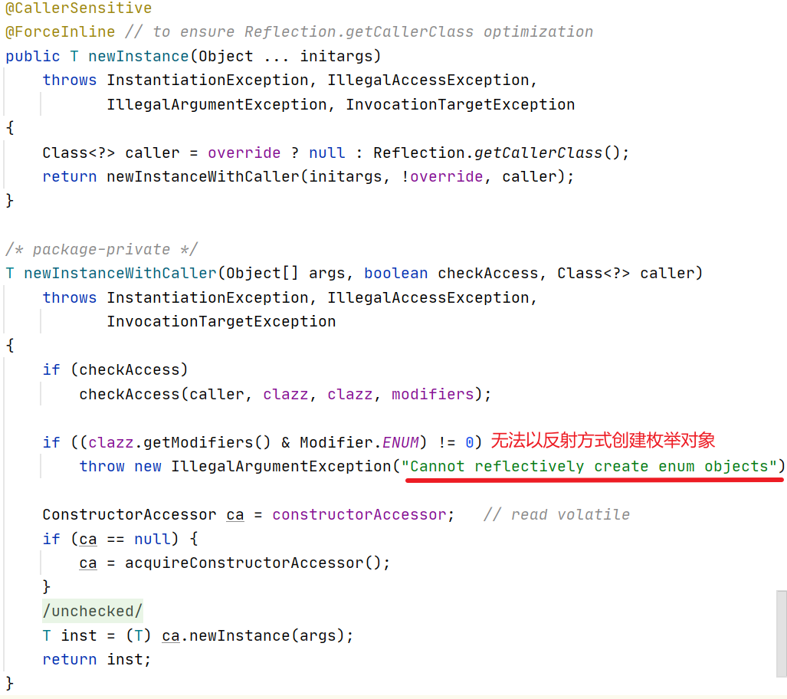

[W3Cschool java 帮助文档](https://www.w3cschool.cn/java/dict)

[阿里云`MaTools Java8`](https://www.matools.com/api/java8)

# java基础API

## 注解

### 注解基本知识

==所有的注解类型都继承自***Annotation***这个普通的接口==

- 元注解：**@Retention** **@Target** **@Document** **@Inherited**
- Annotation型定义为**@interface**, 所有的Annotation会自动继承java.lang.Annotation这一接口,并且不能再去继承别的类或是接口。
- 参数成员只能用**public**或默认(**default**)这两个访问权修饰
- 参数成员只能用基本类型**byte，short，char，int，long，float，double，boolean**八种基本数据类型和**String**、**Enum**、**Class**、**annotations**等数据类型，以及这一些类型的**数组。**
- 要获取类、方法和字段的注解信息，必须通过Java的反射技术来获取 Annotation对象,除此之外没有别的获取注解对象的方法
- 注解也可以没有定义成员, 不过这样注解就没啥用了，只起到标识作用

自定义注解类时, 可以指定目标 (类、方法、字段, 构造函数等) , 注解的生命周期(运行时,class文件或者源码中有效), 是否将注解包含在javadoc中及是否允许子类继承父类中的注解, 具体如下：

- @Target 表示该注解目标,可能的 ElemenetType 参数包括：

**CONSTRUCTOR** 构造器声明
**FIELD** 域声明(包括 enum 实例)
**LOCAL_VARIABLE** 局部变量声明
**METHOD** 方法声明
**PACKAGE** 包声明
**PARAMETER** 参数声明
**TYPE** 类，接口(包括注解类型)或enum声明

- @Retention 表示该注解的生命周期,可选的 RetentionPolicy 参数包括

**SOURCE** 注解将被编译器丢弃
**CLASS** 注解在class文件中可用，但会被JVM丢弃
**RUNTIME** JVM将在运行期也保留注释，因此可以通过反射机制读取注解的信息

- @Documented 指示将此注解包含在 javadoc 中

- @Inherited 指示允许子类继承父类中的注解

> 注解一般与反射结合使用：[反射](#反射)

# java集合


# JVM


[JAVA 常见内存泄露例子及详解](https://blog.csdn.net/m0_38110132/article/details/81986334)

# 反射


## 反射机制的相关类

与Java反射相关的类如下：

| 类名          | 用途                                             |
| ------------- | ------------------------------------------------ |
| Class类       | 代表类的实体，在运行的Java应用程序中表示类和接口 |
| Field类       | 代表类的成员变量（成员变量也称为类的属性）       |
| Method类      | 代表类的方法                                     |
| Constructor类 | 代表类的构造方法                                 |

### Class类

Class代表类的实体，在运行的Java应用程序中表示类和接口。在这个类中提供了很多有用的方法，这里对他们简单的分类介绍。

- **获得类相关的方法**

| 方法                       | 用途                                                   |
| -------------------------- | ------------------------------------------------------ |
| asSubclass(Class<U> clazz) | 把传递的类的对象转换成代表其子类的对象                 |
| Cast                       | 把对象转换成代表类或是接口的对象                       |
| getClassLoader()           | 获得类的加载器                                         |
| getClasses()               | 返回一个数组，数组中包含该类中所有公共类和接口类的对象 |
| getDeclaredClasses()       | 返回一个数组，数组中包含该类中所有类和接口类的对象     |
| forName(String className)  | 根据类名返回类的对象                                   |
| getName()                  | 获得类的完整路径名字                                   |
| newInstance()              | 创建类的实例                                           |
| getPackage()               | 获得类的包                                             |
| getSimpleName()            | 获得类的名字                                           |
| getSuperclass()            | 获得当前类继承的父类的名字                             |
| getInterfaces()            | 获得当前类实现的类或是接口                             |

- **获得类中属性相关的方法**

| 方法                          | 用途                   |
| ----------------------------- | ---------------------- |
| getField(String name)         | 获得某个公有的属性对象 |
| getFields()                   | 获得所有公有的属性对象 |
| getDeclaredField(String name) | 获得某个属性对象       |
| getDeclaredFields()           | 获得所有属性对象       |

- **获得类中注解相关的方法**

| 方法                                            | 用途                                   |
| ----------------------------------------------- | -------------------------------------- |
| getAnnotation(Class<A> annotationClass)         | 返回该类中与参数类型匹配的公有注解对象 |
| getAnnotations()                                | 返回该类所有的公有注解对象             |
| getDeclaredAnnotation(Class<A> annotationClass) | 返回该类中与参数类型匹配的所有注解对象 |
| getDeclaredAnnotations()                        | 返回该类所有的注解对象                 |

- **获得类中构造器相关的方法**

| 方法                                               | 用途                                   |
| -------------------------------------------------- | -------------------------------------- |
| getConstructor(Class...<?> parameterTypes)         | 获得该类中与参数类型匹配的公有构造方法 |
| getConstructors()                                  | 获得该类的所有公有构造方法             |
| getDeclaredConstructor(Class...<?> parameterTypes) | 获得该类中与参数类型匹配的构造方法     |
| getDeclaredConstructors()                          | 获得该类所有构造方法                   |

- **获得类中方法相关的方法**

| 方法                                                       | 用途                   |
| ---------------------------------------------------------- | ---------------------- |
| getMethod(String name, Class...<?> parameterTypes)         | 获得该类某个公有的方法 |
| getMethods()                                               | 获得该类所有公有的方法 |
| getDeclaredMethod(String name, Class...<?> parameterTypes) | 获得该类某个方法       |
| getDeclaredMethods()                                       | 获得该类所有方法       |

- **类中其他重要的方法**

| 方法                                                         | 用途                             |
| ------------------------------------------------------------ | -------------------------------- |
| isAnnotation()                                               | 如果是注解类型则返回true         |
| isAnnotationPresent(Class<? extends Annotation> annotationClass) | 如果是指定类型注解类型则返回true |
| isAnonymousClass()                                           | 如果是匿名类则返回true           |
| isArray()                                                    | 如果是一个数组类则返回true       |
| isEnum()                                                     | 如果是枚举类则返回true           |
| isInstance(Object obj)                                       | 如果obj是该类的实例则返回true    |
| isInterface()                                                | 如果是接口类则返回true           |
| isLocalClass()                                               | 如果是局部类则返回true           |
| isMemberClass()                                              | 如果是内部类则返回true           |

### Field类

Field代表类的成员变量（成员变量也称为类的属性）。

| 方法                          | 用途                    |
| ----------------------------- | ----------------------- |
| equals(Object obj)            | 属性与obj相等则返回true |
| get(Object obj)               | 获得obj中对应的属性值   |
| set(Object obj, Object value) | 设置obj中对应属性值     |

### Method类

Method代表类的方法。

| 方法                               | 用途                                     |
| ---------------------------------- | ---------------------------------------- |
| invoke(Object obj, Object... args) | 传递object对象及参数调用该对象对应的方法 |

### Constructor类

Constructor代表类的构造方法。

| 方法                            | 用途                       |
| ------------------------------- | -------------------------- |
| newInstance(Object... initargs) | 根据传递的参数创建类的对象 |

### Annotation接口

通过自定义或者有的注解来指向get到的Annotation，以此获取注解的属性


> [GitHub注解和反射相关代码](https://github.com/lieinsay/java/tree/main/AnnotationAndReflexStudy)
>
> [java.lang.reflect帮助文档](https://www.matools.com/file/manual/jdk_api_1.8_google/java/lang/reflect/package-frame.html)

# 多线程

## 线程简介

- 单线程`Process`
  - 
- 多线程`Thread` 
  - 

- 线程就是独立的执行路径。
- 在程序运行时，即使没有自己创建线程，后台也会有多个线程，如主线程，gc线程。
- main()称之为主线程，为系统的入口，用于执行整个程序。
- 在一个进程中，如果开辟了多个线程，线程的运行由调度器安排调度，调度器是与操作系统紧密相关的，先后顺序是不能认为的干预的。
- 对同一份资源操作时，会存在资源抢夺的问题，需要加入并发控制。
- 线程会带来额外的开销，如cpu调度时间，并发控制开销。
- 每个线程在自己的工作内存交互，内存控制不当会造成数据不一致。

## ==线程实现 for Java==

### Thread class 继承类

- 自定义线程类继承Thread类
- 重写run()方法，编写线程执行体
- 创建线程对象，调用start()方法启动线程

```java
// 创建线程方式一:继承Thread类，重写run()方法，调用start开启线程
public class MyThread extends Thread{
    @Override
    public void run() {
        for (int i = 0; i < 10; i++) {
            System.out.println("我是线程MyThread"+i);
        }
    }

    public static void main(String[] args) {
        MyThread myThread = new MyThread();
        myThread.start();
        for (int i = 0; i < 10; i++) {
            System.out.println("我是主线程"+i);
        }
    }
}
```

### Runnable interface 实现接口

- 定义MyRunnable类实现Runnable接口
- 实现run()方法，编写线程执行体
- 创建线程对象,调用start()方法启动线程

```java
// 方式二：实现runnable接口,重写run方法，执行线程需要丢入runnable接口实现类.调用start方法
public class MyRunnable implements Runnable{
    @Override
    public void run() {
        for (int i = 0; i < 10; i++) {
            System.out.println("我是线程MyRunnable"+i);
        }
    }

    public static void main(String[] args) {
        MyRunnable myRunnable = new MyRunnable();
        // 通过线程对象来代理自己的线程
        Thread thread = new Thread(myRunnable);
        thread.start();

        for (int i = 0; i < 10; i++) {
            System.out.println("我是主线程"+i);
        }
    }
}
```

### ==Callable== interface 实现接口

1. 实现Callable接口，需要返回值类型

2. 重写call方法，需要抛出异常

3. 创建目标对象

4. 创建执行服务:ExecutorService ser = Executors.newFixedThreadPool(1);

5. 提交执行:Future<Boolean> result1 = ser.submit(t1);

6. 获取结果:boolean r1 = result1.get()

7. 关闭服务:ser.shutdownNow();

```java
public class MyCallable implements Callable {
    @Override
    public Object call() throws Exception {
        for (int i = 0; i < 10; i++) {
            System.out.println("我是线程MyRunnable"+i);
        }
        return (int)(Math.random()*100);
    }

    public static void main(String[] args) throws ExecutionException, InterruptedException {
        MyCallable myCallable = new MyCallable();
        // 创建执行服务
        ExecutorService service = Executors.newFixedThreadPool(1);
        // 提交执行
        Future<Integer> future = service.submit(myCallable);
        // 获取结果
        int result = future1.get();
        // 关闭服务
        service.shutdown();
        System.out.println(result);

        for (int i = 0; i < 10; i++) {
            System.out.println("我是主线程"+i);
        }

    }
}
```

### Lamda表达式

```java
public class TestLambda {
    static class LikeInner implements ILike{
        @Override
        public void lambda() {
            System.out.println("I like Lambda 内部类");
        }
    }

    public static void main(String[] args) {
        // 外部类
        ILike like1 = new LikeOUT();
        like1.lambda();
        // 内部类
        ILike like2 = new LikeInner();
        like2.lambda();
        // 局部内部类
        class LikeLocalInner implements ILike{
            @Override
            public void lambda() {
                System.out.println("I like Lambda 局部内部类");
            }
        }
        ILike like3 = new LikeLocalInner();
        like3.lambda();
        // 匿名内部类
        ILike like4 = new ILike() {
            @Override
            public void lambda() {
                System.out.println("I like Lambda 匿名内部类");
            }
        };
        like4.lambda();
        // lambda简化(只能简化单个方法的接口)
        ILike like5 = ()->{
            System.out.println("I like Lambda lambda简化");
        };
        like5.lambda();
    }
}

interface ILike{
    void lambda();
}

class LikeOUT implements ILike{
    @Override
    public void lambda() {
        System.out.println("I like Lambda 外部类");
    }
}
```

带参数的lambda表达式。

```java
field = parameter-> {
    System.out.println("实现"+parameter);
};
field.method(parameter);
```

## 线程状态


线程的方法


| 方法                           | 描述                                                         |
| ------------------------------ | ------------------------------------------------------------ |
| setPriority(int newPriority)   | 更改线程的优先级                                             |
| static void sleep(long millis) | 在指定的毫秒数内让当前正在执行的线程休眠                     |
| void join()                    | 等待该线程终止                                               |
| static void yield()            | 暂停当前正在执行的线程对象，从运行状态回到就绪状态，重新和就绪线程抢夺时间片 |
| void interrupt()               | 中断线程，别用这个方式                                       |
| boolean isAlive()              | 测试线程是否处于活动状态                                     |

### 线程停止——stop

- 不推荐使用JDK提供的stop()、destroy()方法【已废弃】
- 推荐线程自己停止下来
- 建议使用一个标志位进行终止变量当flag=false，则终止线程运行。

```java
public class TestThread implements Runnable {
    // 1.设置标识位
    private boolean flag = true;
    @Override
    public void run() {
        int i = 0;
        while (flag){
            System.out.println("run"+Thread.currentThread().getName()+i++);
        }
    }
    // 2.设置一个公开的方法停止线程，转换标识位
    public void stop() {
        this.flag = false;
    }
}
```

### 线程休眠——sleep

- sleep(时间)指定当前线程阻塞的毫秒数
- sleep存在异常InterruptedException
- sleep时间达到后线程进入就绪状态
- sleep可以模拟网络延时，倒计时等
- 每一个对象都有一个锁,sleep不会释放锁

[模拟延时](https://blog.csdn.net/ZREO_0/article/details/108626675)、[模拟倒计时](https://blog.csdn.net/qq_43619461/article/details/120920100)

### 线程礼让——yield

- 礼让线程，让当前正在执行的线程暂停，但不阻塞
- 将线程从运行状态转为就绪状态
- 让cpu重新调度，礼让不一定成功!看CPU心情

[线程礼让](https://blog.csdn.net/hello_word2/article/details/52885398)

### 线程合并——join

- Join合并线程，待此线程执行完成后，再执行其他线程，其他线程阻塞

[JAVA多线程中join()方法的详细分析](https://blog.csdn.net/u013425438/article/details/80205693)

### 线程状态观测——state 

```java
Thread.State state = thread.getState();
public static enum Thread.State
extends Enum<Thread.State>
    getState
```

线程状态。 线程可以处于以下状态之一：

- [`NEW`](https://www.matools.com/file/manual/jdk_api_1.8_google/java/lang/Thread.State.html#NEW)
  尚未启动的线程处于此状态。
- [`RUNNABLE`](https://www.matools.com/file/manual/jdk_api_1.8_google/java/lang/Thread.State.html#RUNNABLE)
  在Java虚拟机中执行的线程处于此状态。
- [`BLOCKED`](https://www.matools.com/file/manual/jdk_api_1.8_google/java/lang/Thread.State.html#BLOCKED)
  被阻塞等待监视器锁定的线程处于此状态。
- [`WAITING`](https://www.matools.com/file/manual/jdk_api_1.8_google/java/lang/Thread.State.html#WAITING)
  正在等待另一个线程执行特定动作的线程处于此状态。
- [`TIMED_WAITING`](https://www.matools.com/file/manual/jdk_api_1.8_google/java/lang/Thread.State.html#TIMED_WAITING)
  正在等待另一个线程执行动作达到指定等待时间的线程处于此状态。
- [`TERMINATED`](https://www.matools.com/file/manual/jdk_api_1.8_google/java/lang/Thread.State.html#TERMINATED)
  已退出的线程处于此状态。

一个线程可以在给定时间点处于一个状态。 这些状态是不反映任何操作系统线程状态的虚拟机状态。

### [线程优先级](https://blog.csdn.net/qq_35400008/article/details/80219947)

## 守护线程

- 线程分为用户线程和守护线程
- 虚拟机必须确保用户线程执行完毕
- 虚拟机不用等待守护线程执行完毕
- 如,后台记录操作日志,监控内存,垃圾回收等待.

`thread.setDaemon(true);`

```java
public class Main {
    public static void main(string[] args) {
        God god = new God();
        You you = new You();
        Thread thread = new Thread(god);
        thread.setDaemon(true);//默认是false表示是用户线程，正常的线程都是用户线程...
        thread.start();//上帝引护线程启动
        new Thread(you).start(); //你用户线程启动...
    }
}
//上帝
class God implements Runnable{
    @Override
    public void run() {
        while (true){
        system.out.println("上帝保佑着你");
        }
    }
}
//你
class You implements Runnable{
    @Override
    public void run() {
        for (int i =0; i < 36500; i++) {
            system.out.println("你一生都开心的活着");
        }
    	system.out.println("====goodbye! world!======");
    }
}
```

## ==线程同步==

处理多线程问题时，多个线程访问同一个对象﹐并且某些线程还想修改这个对象﹒这时候我们就需要线程同步.线程同步其实就是一种等待机制,多个需要同时访问此对象的线程进入这个**对象的等待池**形成队列,等待前面线程使用完毕，下一个线程再使用

> [什么是线程不安全？](https://zhuanlan.zhihu.com/p/108880731?from_voters_page=true)

### 队列和锁

### 锁机制

#### synchronized

```java
public class lockThread {
    public static void main(String[] args) {
        AtomicReference<Integer> ticketNums = new AtomicReference<>(10);
        lockThread ticket = new lockThread();
        for (int i = 0; i < 3; i++) {
            new Thread(() -> {
                while (true) {
                    try {
                        Thread.sleep(500);
                    } catch (InterruptedException e) {
                        e.printStackTrace();
                    }
                    synchronized (ticketNums){
                        if (ticketNums.get() > 0)
                            System.out.println(Thread.currentThread().getName() +
                                    " get ticket for" +
                                    ticketNums.getAndSet(ticketNums.get() - 1)
                            );
                    }
                }
            }).start();
        }
    }
}
```

#### Lock ReentrantLock可重入锁

```java
public class ReentrantLockThread {
    public static void main(String[] args) {
        TicketLockThread ticketLockThread = new TicketLockThread();
        new Thread(ticketLockThread,"1").start();
        new Thread(ticketLockThread,"2").start();
        new Thread(ticketLockThread,"3").start();
    }
}

class TicketLockThread implements Runnable{
    private final ReentrantLock lock = new ReentrantLock();
    private int ticketNums = 10;
    @Override
    public void run() {
        while (true){
            try {
                Thread.sleep(1000);
            } catch (InterruptedException e) {
                e.printStackTrace();
            }
            lock.lock();
            if(ticketNums>0){
                System.out.println(Thread.currentThread().getName()+" get "+ticketNums--);
                lock.unlock();
            }else {
                lock.unlock();
                break;
            }

        }
    }
}
```

#### 死锁

- 互斥条件:一个资源每次只能被一个进程使用。
- 请求与保持条件:一个进程因请求资源而阻塞时，对已获得的资源保持不放。
- 不剥夺条件:进程已获得的资源，在末使用完之前，不能强行剥夺。
- 循环等待条件:若干进程之间形成一种头尾相接的循环等待资源关系。

```java
public class DeadLock {
    public static void main(String[] args) {
        Makeup makeup1 = new Makeup(0,"1");
        Makeup makeup2 = new Makeup(1,"2");
        new Thread(makeup1).start();
        new Thread(makeup2).start();
    }
}
class Lipstick {}
class Mirror {}
class Makeup implements Runnable {
    static Lipstick lipstick = new Lipstick();
    static Mirror mirror = new Mirror();
    int choice;
    String name;
    public Makeup(int choice, String name) {
        this.choice = choice;
        this.name = name;
    }
    @Override
    public void run() {
        makeup();
    }
    private void makeup() {
        if (choice == 0) {
            synchronized (lipstick) {
                System.out.println("获得口红的锁");
                try {
                    Thread.sleep(1000);
                } catch (InterruptedException e) {
                    e.printStackTrace();
                }
                synchronized (mirror) {
                    System.out.println("获得镜子的锁");
                }
            }
        } else {
            synchronized (mirror) {
                System.out.println("获得镜子的锁");
                synchronized (lipstick) {
                    System.out.println("获得口红的锁");
                    try {
                        Thread.sleep(1000);
                    } catch (InterruptedException e) {
                        e.printStackTrace();
                    }
                }
            }
        }
    }
}
```

## 线程通信问题

### 管程法——生产者和消费者

java线程通信方法

| 方法               | 作用                                                         |
| ------------------ | ------------------------------------------------------------ |
| wait()             | 表示线程一直等待，直到其他线程通知，与sleep不官，会释放锁，**阻塞** |
| wait(long timeout) | 指定等待的毫秒数                                             |
| notify()           | **唤醒**一个处于等待状态的线程                               |
| notifyAll()        | **唤醒**同一个对象上所有调用wait()方法的线程﹐优先级别高的线程优先调度 |

并发协作模型“生产者/消费者模式”==>管程法

- 生产者：负责生产数据的模块(可能是方法，对象，线程，进程)
- 消费者：负责处理数据的模块(可能是方法，对象，线程，进程)
- 缓冲区：消费者不能直接使用生产者的数据，他们之间有个“缓冲区“

生产者将生产好的数据放入缓冲区,消费者从缓冲区拿出数据

```java
// 管程法——生产者和消费者
public class TestPC {
    public static void main(String[] args) {
        SynContainer container = new SynContainer();

        new Thread(new Producer(container)).start();
        new Thread(new Consumer(container)).start();

    }
}
// 生产者
class Producer implements Runnable {
    SynContainer container;

    public Producer(SynContainer container) {
        this.container = container;
    }

    @Override
    public void run() {
        for (int i = 0; i < 100; i++) {
            container.push(new Chicken(i+1));
        }
    }
}
// 消费者
class Consumer implements Runnable {
    SynContainer container;

    public Consumer(SynContainer container) {
        this.container = container;
    }
    @Override
    public void run() {
        for (int i = 0; i < 100; i++) {
            container.pop();
        }
    }
}
// 产品
class Chicken {
    private int id;
    public Chicken(int id) {
        this.id = id;
    }
    public int getId() {
        return id;
    }
}
// 缓冲区
class SynContainer {
    // 容器
    Chicken[] chickens = new Chicken[10];
    // 容器计数器
    int count = 0;

    // 生产者放入产品
    public synchronized void push(Chicken chicken) {
        // 如果容器满了，需要等待消费者消费
        if (count>0) {
            // 通知消费者消费，生产者等待
            try {
                this.wait();
            } catch (InterruptedException e) {
                e.printStackTrace();
            }
        }
        // 生产需要的时间
        // try {
        //     this.wait(300);
        // } catch (InterruptedException e) {
        //     e.printStackTrace();
        // }
        // 容器没有满，我们就丢入产品
        System.out.println("生产了第"+chicken.getId()+"鸡");
        chickens[count] = chicken;
        count++;
        // 可以通知消费者消费
        this.notify();
    }

    // 消费者消费产品
    public synchronized Chicken pop() {
        // 如果容器空了，需要等待消费者消费
        if (count == 0) {
            // 通知生产者生产，消费者等待
            try {
                this.wait();
            } catch (InterruptedException e) {
                e.printStackTrace();
            }
        }
        // 消费需要的时间
        // try {
        //     this.wait(300);
        // } catch (InterruptedException e) {
        //     e.printStackTrace();
        // }
        // 容器有东西，我们就消费产品
        count--;
        System.out.println("消费了第"+chickens[count].getId()+"鸡");
        // 可以通知生产者生成
        this.notify();
        return chickens[count];
    }
}
```

### 信号灯法

```java
// 信号灯法——标志位
public class TestPC2 {
    public static void main(String[] args) {
        TV tv = new TV();
        new Thread(new Performer(tv)).start();
        new Thread(new Viewer(tv)).start();
    }
}
// 生产者
class Performer implements Runnable {
    TV tv;
    public Performer(TV tv) {
        this.tv = tv;
    }
    @Override
    public void run() {
        for (int i = 1; i <= 20; i++) {
            if(i%2==0){
                tv.play("电影"+i);
            }else{
                tv.play("广告"+i);
            }
        }
    }
}
// 消费者
class Viewer implements Runnable {
    TV tv;
    public Viewer(TV tv) {
        this.tv = tv;
    }
    @Override
    public void run() {
        for (int i = 0; i < 20; i++) {
            tv.watch();
        }
    }
}
// 产品
class TV {
    private int id;
    private String voice;
    boolean flag = true;
    public synchronized void play(String voice){
        if(!flag){
            try {
                this.wait();
            } catch (InterruptedException e) {
                e.printStackTrace();
            }
        }
        System.out.println("演员表演了："+voice+"节目");
        // 通知观众观看
        this.voice = voice;
        this.flag = !this.flag;
        this.notify();
    }
    public synchronized void watch(){
        if(flag){
            try {
                this.wait();
            } catch (InterruptedException e) {
                e.printStackTrace();
            }
        }
        System.out.println("观众观看了："+voice+"节目");
        // 通知演员表演
        this.flag = !this.flag;
        this.notify();
    }
}
```

## 线程池

```java
import java.util.concurrent.ExecutorService;
import java.util.concurrent.Executors;

public class TestPool {
    public static void main(String[] args) {
        // 1.创建服务，关键线程池
        // newFixedThreadPool 参数为线程池大小
        ExecutorService service = Executors.newFixedThreadPool(10);
        // 执行
        service.execute(new MyThread());
        service.execute(new MyThread());
        service.execute(new MyThread());
        service.execute(new MyThread());

        // 2.关闭连接
        service.shutdown();
    }
}

class MyThread implements Runnable {
    @Override
    public void run() {
        for (int i = 0; i < 100; i++) {
            System.out.println(Thread.currentThread().getName() + i);
        }
    }
}
```

# JUC并发多线程

## 1、JUC是什么

- [java.util.concurrent](https://www.matools.com/file/manual/jdk_api_1.8_google/java/util/concurrent/package-summary.html)
- [java.util.concurrent.atomic](https://www.matools.com/file/manual/jdk_api_1.8_google/java/util/concurrent/atomic/package-summary.html)
- [java.util.concurrent.locks](https://www.matools.com/file/manual/jdk_api_1.8_google/java/util/concurrent/locks/package-summary.html)

|          |                                  |
| -------- | -------------------------------- |
| Thread   | 普通的线程对象                   |
| Runable  | 没有返回值，效率相比于Callable低 |
| Callable | 重点！                           |

## 2、进程和线程

> 一个进程可能会有多个线程

Java默认线程：main、GC守护线程

Java不能开启线程，调用的本地方法(底层的C++)

```java
public synchronized void start() {
    /**
     * This method is not invoked for the main method thread or "system"
     * group threads created/set up by the VM. Any new functionality added
     * to this method in the future may have to also be added to the VM.
     *
     * A zero status value corresponds to state "NEW".
     */
    if (threadStatus != 0)
        throw new IllegalThreadStateException();

    /* Notify the group that this thread is about to be started
     * so that it can be added to the group's list of threads
     * and the group's unstarted count can be decremented. */
    group.add(this);

    boolean started = false;
    try {
        start0();
        started = true;
    } finally {
        try {
            if (!started) {
                group.threadStartFailed(this);
            }
        } catch (Throwable ignore) {
            /* do nothing. If start0 threw a Throwable then 
            it will be passed up the call stack */
        }
    }
}
private native void start0();
```

> 并发、并行

并发(多线程操作同一个资源)

- CPU一核，模拟出来多条线程，天下武功，唯快不破，快速交替

并行(多个人一起行走)

- CPU多核，多个线程可以同时执行

```
// 打印逻辑处理器数量
System.out.println(Runtime.getRuntime().availableProcessors());
```

> [线程状态](#线程状态观测——state )

```java
public enum State {
    // 新建
    NEW,
	// 运行
    RUNNABLE,
	// 阻塞
    BLOCKED,
	// 等待
    WAITING,
	// 超市等待
    TIMED_WAITING,
	// 终止
    TERMINATED;
}
```

> wait/sleep区别

- **来自不同的类**
  - wait是java.lang.Object的

  - sleep是java.lang.Thread的
- **关于锁的释放**
  - wait会释放锁

  - sleep不会释放锁
- **使用的范围是不同的**
  - wait必须在同步代码块中
  - sleep可以在任何地方睡

## 3、==Lock 锁==

### 3.1、8种锁的现象

1. 一个`对象`，两个线程先执行`加锁方法`还是`加锁方法2`
   - 相当于一把锁，谁先获得锁谁先执行
2. `加锁方法1`延迟4秒，一个`对象`，两个线程先执行`加锁方法1`还是`加锁方法2`
   - 相当于一把锁，谁先获得锁谁先执行
3. 一个`对象`，两个线程先执行`加锁方法`还是`普通方法`
   - 相当于一把锁，但有个线程不用锁，主线程先执行到谁，谁先执行
4. 两个`对象`，两个线程分别执行两个`对象`的两个不同`加锁方法`
   - 相当于两把锁，主线程先执行到谁，谁先执行
5. 一个`对象`，两个线程先执行`加锁静态方法1`还是`加锁静态方法2`
   - 相当于一把锁，锁的是唯一的Class，主线程先执行到谁，谁先执行
6. 两个`对象`，两个线程先执行`加锁静态方法`1还是`加锁静态方法2`
   - 相当于一把锁，锁的是唯一的Class，主线程先执行到谁，谁先执行
7. 一个`对象`，两个线程先执行`加锁方法`还是`加锁静态方法`
   - 相当于两把锁，主线程先执行到谁，谁先执行
8. 两个`对象`，两个线程分别执行两个`对象`的`加锁方法`和`加锁静态方法`
   - 相当于两把锁，主线程先执行到谁，谁先执行

> [对象锁和类锁的区别](https://www.cnblogs.com/fengzheng/p/12066239.html)

### 3.2、java中的锁

> 传统Synchronized

[synchronized](#synchronized)

[Java6及以上版本对synchronized的优化](https://blog.csdn.net/weixin_38405770/article/details/115027132)

> Lock 接口

随着这种增加的灵活性，额外的责任。 没有块结构化锁定会删除使用`synchronized`方法和语句发生的锁的自动释放。 在大多数情况下，应使用以下惯用语：

```java
Lock l = ...; 
l.lock(); 
try { // access the resource protected by this lock 
} finally { 
    l.unlock(); 
} 
```

当在不同范围内发生锁定和解锁时，必须注意确保在锁定时执行的所有代码由try-finally或try-catch保护，以确保在必要时释放锁定。

> ReentantLocK

```java
public ReentrantLock() {
    sync = new NonfairSync();
}
public ReentrantLock(boolean fair) {
    sync = fair ? new FairSync() : new NonfairSync();
}
```

> Synchronized 和 ReentantLocK的区别

- Synchronized 是内置的java关键字，Lock 是一个java类
- Synchronized 无法判断获取锁的状态，Lock 可以判断是否获取到了锁
- Synchronized 可以自动释放，Lock 必须要手动释放，如何不释放锁，会导致**死锁**
- Synchronized 线程1(获得锁，阻塞)、线程2(等待，一直等)，Lock 不一定会等待下去
- Synchronized 可重入锁，不可以中断，Lock 可重入锁，可以自己设置公平非公平锁
- Synchronized 适合锁少量的代码同步问题，Lock 适合锁大量的同步代码
- Synchronized ，Lock 

[可重入锁详解（什么是可重入）](https://blog.csdn.net/w8y56f/article/details/89554060)

> ReadLock

> WriteLock

## 4、Condition版——生产者和消费者问题

[java最早的生产者和消费者问题解决方案](#管程法——生产者和消费者)

- wait

|      锁      | 等待 |  通知  |
| :----------: | :--: | :----: |
| Synchronized | wait | notify |

**线程也可以唤醒，而不会被通知，中断或超时**，即所谓的***虚假唤醒*** 。 虽然这在实践中很少会发生，但应用程序必须通过测试应该使线程被唤醒的条件来防范，并且如果条件不满足则继续等待。 换句话说，**等待应该总是出现在循环中**，就像这样：

```java
synchronized (obj) {
    while (<condition does not hold>)
        obj.wait(timeout);
    ... // Perform action appropriate to condition
}
```

- JUC

|  锁  | 等待  |  通知  |
| :--: | :---: | :----: |
| Lock | await | signal |

[Interface Condition](https://www.matools.com/file/manual/jdk_api_1.8_google/java/util/concurrent/locks/Condition.html)

例如，假设我们有一个有限的缓冲区，它支持`put`和`take`方法。 如果在一个空的缓冲区尝试一个`take` ，则线程将阻塞直到一个项目可用; 如果`put`试图在一个完整的缓冲区，那么线程将阻塞，直到空间变得可用。 我们希望在单独的等待集中等待`put`线程和`take`线程，以便我们可以在缓冲区中的项目或空间可用的时候使用仅通知单个线程的优化。 这可以使用两个[`Condition`](https://www.matools.com/file/manual/jdk_api_1.8_google/java/util/concurrent/locks/Condition.html)实例来实现。

```java
class BoundedBuffer {
    final Lock lock = new ReentrantLock();
    final Condition notFull  = lock.newCondition(); 
    final Condition notEmpty = lock.newCondition(); 

    final Object[] items = new Object[100];
    int putptr, takeptr, count;

    public void put(Object x) throws InterruptedException {
        lock.lock(); try {
            while (count == items.length)
                notFull.await();
            items[putptr] = x;
            if (++putptr == items.length) putptr = 0;
            ++count;
            notEmpty.signal();
        } finally { lock.unlock(); }
    }

    public Object take() throws InterruptedException {
        lock.lock(); try {
            while (count == 0)
                notEmpty.await();
            Object x = items[takeptr];
            if (++takeptr == items.length) takeptr = 0;
            --count;
            notFull.signal();
            return x;
        } finally { lock.unlock(); }
    }
}
```

> Condition 与 传统 Object 中的等待与通知的区别

Condition可以指定唤醒的线程。

```java
import java.util.concurrent.locks.Condition;
import java.util.concurrent.locks.Lock;
import java.util.concurrent.locks.ReentrantLock;
public class Test2 {
    public static void main(String[] args) {
        Ticket1 ticket = new Ticket1();
        new Thread(() -> {
            for (int i = 0; i < 20; i++) ticket.sale0();
        }, "A").start();
        new Thread(() -> {
            for (int i = 0; i < 20; i++) ticket.sale1();
        }, "B").start();
        new Thread(() -> {
            for (int i = 0; i < 10; i++) ticket.add0();
        }, "C").start();
        new Thread(() -> {
            for (int i = 0; i < 30; i++) ticket.add1();
        }, "D").start();
    }
}
class Ticket1 {
    private int num = 0;
    private int id = 0;
    Lock lock = new ReentrantLock();
    Condition buyCondition0 = lock.newCondition();
    Condition buyCondition1 = lock.newCondition();
    Condition addCondition = lock.newCondition();
    public void sale0() {
        // 加锁
        lock.lock();
        try {
            // 等待
            while (num == 0) {
                buyCondition0.await();
            }
            System.out.println(Thread.currentThread().getName() + "卖出了第" + (++id) + "票，剩余:" + (--num));
            addCondition.signal();
        } catch (InterruptedException e) {
            e.printStackTrace();
        } finally {
            lock.unlock();
        }
    }
    public void sale1() {
        // 加锁
        lock.lock();
        try {
            // 等待
            while (num == 0) {
                buyCondition1.await();
            }
            System.out.println(Thread.currentThread().getName() + "卖出了第" + (++id) + "票，剩余:" + (--num));
            addCondition.signal();
        } catch (InterruptedException e) {
            e.printStackTrace();
        } finally {
            lock.unlock();
        }
    }
    public void add0() {
        // 加锁
        lock.lock();
        try {
            // 等待
            while (num > 0) {
                addCondition.await();
            }
            System.out.println(Thread.currentThread().getName() + "添加了一张票，剩余:" + ++num);
            buyCondition0.signal();
        } catch (InterruptedException e) {
            e.printStackTrace();
        } finally {
            lock.unlock();
        }
    }
    public void add1() {
        // 加锁
        lock.lock();
        try {
            // 等待
            while (num > 0) {
                addCondition.await();
            }
            System.out.println(Thread.currentThread().getName() + "添加了一张票，剩余:" + ++num);
            buyCondition1.signal();
        } catch (InterruptedException e) {
            e.printStackTrace();
        } finally {
            lock.unlock();
        }
    }
}
```

## 5、集合类不安全

java.util.[ConcurrentModificationException](https://www.matools.com/file/manual/jdk_api_1.8_google/java/util/ConcurrentModificationException.html)异常

解决方案：

- 使用官方提供的线程安全的类

- `List<String> list = Collections.synchronizedList(new ArrayList<>());`

  

- CopyOnWrite 写入时复制，COW 计算机程序设计领域的一种优化策略：

  多个线程调用的时候，`list`，读取的时候，固定的，写入（覆盖）

  在写入的时候避免覆盖，造成数据问题

- 扩展：读写分离

参考：[java集合](#java集合)

|  接口  | 并发下不安全 | 并发下安全 |      JUC包下集合       |
| :----: | :----------: | :--------: | :--------------------: |
| `List` | `ArrayList`  |  `vector`  | `CopyOnWriteArrayList` |
| `Set`  |  `HashSet`   |            | `CopyOnWriteArratySet` |
| `Map`  |  `HashMap`   |            |  `CopyOnWriteHashMap`  |

- [ConcurrentHashMap](https://www.matools.com/file/manual/jdk_api_1.8_google/java/util/concurrent/ConcurrentHashMap.html)

## 6、[Callable](https://www.matools.com/file/manual/jdk_api_1.8_google/java/util/concurrent/Callable.html)

返回结果并可能引发异常的任务。 实现者定义一个没有参数的单一方法，称为`call` 。

`Callable`接口类似于`Runnable`，因为它们都是为其实例可能由另一个线程执行的类设计的。 然而，一个 `Runnable`不返回结果，也不能抛出被检查的异常。

该`Executors`类包含的实用方法，从其他普通形式转换为`Callable`类。

与`Runable`相比

- 有返回值
- 可以抛出异常
- 调用方法不同，run() call()

```java
import java.util.concurrent.Callable;
import java.util.concurrent.ExecutionException;
import java.util.concurrent.FutureTask;

public class Test {
    public static void main(String[] args) throws ExecutionException, InterruptedException {
        FutureTask<String> futureTask = new FutureTask<>(new MyThread());
        new Thread(futureTask,"A").start();
        System.out.println(futureTask.get());
    }
}

class MyThread implements Callable<String>{
    @Override
    public String call() throws Exception {
        System.out.println(Thread.currentThread().getName());
        return "StringJAVA";
    }
}
```

**FutureTask对象只能执行一次**：JVM第二次再调用FutrueTask对象所持有的线程，此时FutrueTask的state此时已非NEW状态（各个状态，这边不做详细解释），则此时会直接结束对应线程，就会导致任务也不执行，但是在第一次调用时返回结果保存

## 7、辅助类

### 7.1、[CountDownLatch](https://www.matools.com/file/manual/jdk_api_1.8_google/java/util/concurrent/CountDownLatch.html)

减法计数器控制的线程，开始直接等待，当有n个线程执行完之后，本线程停止等待。

```java
import java.util.concurrent.CountDownLatch;

public static void main(String[] args) throws InterruptedException {
    CountDownLatch countDownLatch = new CountDownLatch(6);
    for (int i = 0; i < 6; i++) {
        int finalI = i;
        new Thread(()->{
            System.out.println(Thread.currentThread().getName());
            countDownLatch.countDown();
        },String.valueOf(i)).start();
    }
    countDownLatch.await();// 等待计数器归零，然后再向下执行
    System.out.println("我可以动了");
}
```

### 7.2、[CyclicBarrier](https://www.matools.com/file/manual/jdk_api_1.8_google/java/util/concurrent/CyclicBarrier.html)

加法计数器(本质还是减法)控制的线程，开始直接等待，当有n个线程再等待时，停止等待，并通知他们不用等待

```java
import java.util.concurrent.BrokenBarrierException;
import java.util.concurrent.CyclicBarrier;

public class CyclicBarrierTest {
    public static void main(String[] args) {
        CyclicBarrier cyclicBarrier = new CyclicBarrier(7,()->{
            System.out.println("我可以动了");
        });
        for (int i = 0; i < 7; i++) {
            new Thread(()->{
                System.out.println(Thread.currentThread().getName());
                try {
                    cyclicBarrier.await();
                } catch (InterruptedException e) {
                    e.printStackTrace();
                } catch (BrokenBarrierException e) {
                    e.printStackTrace();
                }
            },String.valueOf(i)).start();
        }
    }
}
```

### 7.3、[Semaphore](https://www.matools.com/file/manual/jdk_api_1.8_google/java/util/concurrent/Semaphore.html)

限制线程个数，限制了同时能运行的线程个数n

```java
import java.util.concurrent.Semaphore;
import java.util.concurrent.TimeUnit;

public class SemaphoreTest {
    public static void main(String[] args) {
        Semaphore semaphore = new Semaphore(3);
        for (int i = 0; i < 6; i++) {
            new Thread(()->{
                try {
                    semaphore.acquire();
                    System.out.println(Thread.currentThread().getName()+"in");
                    TimeUnit.SECONDS.sleep(2);
                    System.out.println(Thread.currentThread().getName()+"out");
                } catch (InterruptedException e) {
                    e.printStackTrace();
                }finally {
                    semaphore.release();
                }
            },String.valueOf(i)).start();
        }
    }
}
```

## 8、读写锁

```java
import java.util.HashMap;
import java.util.Map;
import java.util.concurrent.locks.ReadWriteLock;
import java.util.concurrent.locks.ReentrantReadWriteLock;
/*
* ReadWriteLock
* 读-读   可以共存
* 读-写   不能共存
* 写-写   不能共存
* 独占锁（写锁）
* 共享锁（读锁）
* */
public class ReadWriteLockDemo {
    public static void main(String[] args) {
        MyCacheLock myCache = new MyCacheLock();
        for (int i = 1; i <= 5; i++) {
            final int finalI = i;
            new Thread(() -> {
                myCache.put(String.valueOf(finalI), String.valueOf(finalI));
            }, String.valueOf(i)).start();
        }
        for (int i = 1; i <= 5; i++) {
            final int finalI = i;
            new Thread(() -> {
                myCache.get(String.valueOf(finalI));
            }, String.valueOf(i)).start();
        }
    }
}
// 加锁
class MyCacheLock {
    private volatile Map<String, Object> map = new HashMap<>();
    private ReadWriteLock lock = new ReentrantReadWriteLock();
    // 存，写，只希望同时只有一个线程写
    public void put(String key, Object value) {
        try {
            lock.writeLock().lock();
            System.out.println(Thread.currentThread().getName() + "写入" + key);
            map.put(key, value);
            System.out.println(Thread.currentThread().getName() + "写入ok");
        } catch (Exception e) {

        } finally {
            lock.writeLock().unlock();
        }
    }
    // 取，读，所有人都可以读
    public void get(String key) {
        try {
            lock.readLock().lock();
            System.out.println(Thread.currentThread().getName() + "读取" + key);
            map.get(key);
            System.out.println(Thread.currentThread().getName() + "读取ok");
        } catch (Exception e) {

        } finally {
            lock.readLock().unlock();
        }
    }
}
// 未加锁
class MyCache {
    private volatile Map<String, Object> map = new HashMap<>();
    // 存，写
    public void put(String key, Object value) {
        System.out.println(Thread.currentThread().getName() + "写入" + key);
        map.put(key, value);
        System.out.println(Thread.currentThread().getName() + "写入ok");

    }
    // 取，读
    public void get(String key) {
        System.out.println(Thread.currentThread().getName() + "读取" + key);
        map.get(key);
        System.out.println(Thread.currentThread().getName() + "读取ok");
    }
}
```

## 9、阻塞/同步队列


java.util.concurrent包下提供的各种队列

- [ArrayBlockingQueue](https://www.matools.com/file/manual/jdk_api_1.8_google/java/util/concurrent/ArrayBlockingQueue.html)阻塞队列

```java
ArrayBlockingQueue arrayBlockingQueue = new ArrayBlockingQueue<>(3);
```

| 方法         | 抛出异常    | 有返回值      | 阻塞等待    | 超时阻塞等待(有返回值)           |
| ------------ | ----------- | ------------- | ----------- | -------------------------------- |
| 添加(满了)   | add(object) | offer(object) | put(object) | offer(object,time,TimeUnit.单位) |
| 移除(空了)   | remove()    | poll()        | take()      | poll(time,TimeUnit.单位)         |
| 检测队列首位 | element()   | peek()        | -           | -                                |

- [SynchronousQueue](https://www.matools.com/file/manual/jdk_api_1.8_google/java/util/concurrent/SynchronousQueue.html)同步队列

```java
SynchronousQueue synchronousQueue = new SynchronousQueue();
```

put(object)添加数据，容量只有一，满了则等待。

task()移除并返回容器的头数据，没有则等待。

## 10、线程池

> 池化技术

1. 池子的最小容量
2. 池子的最大容量
3. 池子的默认大小

线程池的好处：

1. 降低资源的消耗
2. 提高相应的速度
3. 方便管理
4. **线程复用、可以控制的最大并发数、管理线程**

> 阿里云规范手册
>
> 【强制】线程池不允许使用 Executors 去创建，而是通过 ThreadPoolExecutor 的方式，这样 的处理方式让写的同学更加明确线程池的运行规则，规避资源耗尽的风险。 
>
> 说明：Executors 返回的线程池对象的弊端如下：
>
> 1. **FixedThreadPool** 和 **SingleThreadPool**: 允许的请求队列长度为` Integer.MAX_VALUE`，可能会堆积大量的请求，从而导致 OOM。
> 2. **CachedThreadPool** 和 **ScheduledThreadPool**: 允许的创建线程数量为 `Integer.MAX_VALUE`，可能会创建大量的线程，从而导致 OOM。

```java
// 单个线程
Executors.newSingleThreadExecutor();
// 创建一个固定的线程池大小
Executors.newFixedThreadPool(5);
// 可伸缩的，遇强则强，遇弱则弱 动态分配线程池大小
Executors.newCachedThreadPool();
```

```java
// 单个线程
ExecutorService threadExecutor = Executors.newSingleThreadExecutor();
// 创建一个固定的线程池大小
ExecutorService threadExecutor = Executors.newFixedThreadPool(5);
// 可伸缩的，遇强则强，遇弱则弱
ExecutorService threadExecutor = Executors.newCachedThreadPool();
try {
    for (int i = 0; i < 10; i++) {
        threadExecutor.execute(()->{
            System.out.println(Thread.currentThread().getName()+" ok");
        });
    }
}catch (Exception e){

}finally {
    // 线程池用完，程序结束，关闭线程池
    threadExecutor.shutdown();
}
```

>  7大参数

```java
public static ExecutorService newSingleThreadExecutor() {
    return new FinalizableDelegatedExecutorService
        (new ThreadPoolExecutor(1, 1,
                                0L, TimeUnit.MILLISECONDS,
                                new LinkedBlockingQueue<Runnable>()));
}
public static ExecutorService newFixedThreadPool(int nThreads) {
    return new ThreadPoolExecutor(nThreads, nThreads,
                                  0L, TimeUnit.MILLISECONDS,
                                  new LinkedBlockingQueue<Runnable>());
}
public static ExecutorService newCachedThreadPool() {
    return new ThreadPoolExecutor(0, Integer.MAX_VALUE,
                                  60L, TimeUnit.SECONDS,
                                  new SynchronousQueue<Runnable>());
}
```

开启线程池的本质是`ThreadPoolExecutor`对象

```java
public ThreadPoolExecutor(int corePoolSize,
                          int maximumPoolSize,
                          long keepAliveTime,
                          TimeUnit unit,
                          BlockingQueue<Runnable> workQueue,
                          ThreadFactory threadFactory,
                          RejectedExecutionHandler handler) {
    if (corePoolSize < 0 ||
        maximumPoolSize <= 0 ||
        maximumPoolSize < corePoolSize ||
        keepAliveTime < 0)
        throw new IllegalArgumentException();
    if (workQueue == null || threadFactory == null || handler == null)
        throw new NullPointerException();
    this.corePoolSize = corePoolSize;
    this.maximumPoolSize = maximumPoolSize;
    this.workQueue = workQueue;
    this.keepAliveTime = unit.toNanos(keepAliveTime);
    this.threadFactory = threadFactory;
    this.handler = handler;
}
```

| 参数                                | 描述                                        |
| ----------------------------------- | ------------------------------------------- |
| `int corePoolSize`                  | 核心线程池大小                              |
| `int maximumPoolSize`               | 最大核心线程池大小                          |
| `long keepAliveTime`                | 超时多少没人调用就会释放线程                |
| `TimeUnit unit`                     | 超时的单位                                  |
| `BlockingQueue<Runnable> workQueue` | 阻塞队列                                    |
| `ThreadFactory threadFactory`       | 线程工厂:创建线程的工厂，一般默认，无需修改 |
| RejectedExecutionHandler handler    | 拒绝策略（[四种](#10.1、拒绝策略)）         |

### 10.1、核心线程池大小

线程池默认不会释放的线程数量

### 10.2、最大核心线程池大小

- CPU密集型

几核，最大线程池就是几，可以保持CPU的效率最高

```java
Runtime.getRuntime().availableProcessors();
```

- IO密集型

判断程序中十分消耗IO的线程，提供比之更多的线程池大小

### 10.3、超时多少没人调用就会释放线程、超时的单位

核心线程池不释放，释放`最大核心线程池大小-核心线程池大小`的线程

超时的单位未TimeUtil类里的单位

### 10.4、[阻塞/同步队列](#9、阻塞/同步队列)


### 10.5、线程工厂


### 10.6、拒绝策略

```java
public interface RejectedExecutionHandler {
    void rejectedExecution(Runnable r, ThreadPoolExecutor executor);
}
```

```java
// ThreadPoolExecutor默认的拒绝策略：如果阻塞队列满了，抛出异常
// defaultHandler = new AbortPolicy();
ThreadPoolExecutor.AbortPolicy();
// 任务会交个上层线程（主线程）执行
ThreadPoolExecutor.CallerRunsPolicy();
// 如果阻塞队列满了，尝试去和最早执行的线程竞争，不抛出异常
ThreadPoolExecutor.DiscardPolicy();
// 如果阻塞队列满了，不抛出异常
ThreadPoolExecutor.DiscardOldestPolicy();
```

# lambda链式编程


## 1、四大函数式接口

| 函数式接口                                                   | 方法               |
| ------------------------------------------------------------ | ------------------ |
| [*Function*](https://www.matools.com/file/manual/jdk_api_1.8_google/java/util/function/Function.html) | R apply(T t);      |
| [*Predicate*](https://www.matools.com/file/manual/jdk_api_1.8_google/java/util/function/Predicate.html) | boolean test(T t); |
| [*Consumer*](https://www.matools.com/file/manual/jdk_api_1.8_google/java/util/function/Consumer.html) | void accept(T t);  |
| [*Supplier*](https://www.matools.com/file/manual/jdk_api_1.8_google/java/util/function/Supplier.html) | T get();           |

## 2、[Stream流式编程](https://blog.csdn.net/qq_21918021/article/details/88824335)

[java.util.stream](https://www.matools.com/file/manual/jdk_api_1.8_google/java/util/stream/package-frame.html)

- 详细操作：[*Stream*](https://www.matools.com/file/manual/jdk_api_1.8_google/java/util/stream/Stream.html)

```java
/*
 * 规在有5个用尸!师选;
 * 1、ID 必须是偶数
 * 2、年龄必须大于23岁
 * 3、用户名转为大写字母
 * 4、用户名字母倒着排序
 * 5、只输出一个用户!
 */
//				  id name age
User u1 = new User(1,"a" ,21);
User u2 = new User(2,"b", 22);
User u3 = new User(3,"c", 23);
User u4 = new User(4,"d", 24);
User u5 = new User(6,"e", 25);
//集合就是存储
List<User> list = Arrays.asList(u1,u2,u3,u4,u5);
list.stream()
    .filter(u->{return u.getId( )%2==0; })
    .filter(u->{return u.getAge( )>23;})
    .map(u->{return u.getName().toUpperCase();})
    .sorted((uu1,uu2)->{return uu2.compareTo(uu1);})
    .limit(1)
    .forEach(System.out:: println);
```

## 3、ForkJoin

特征：工作窃取(核心：双端队列)

相同类型的子工作，如果A线程做完，B还没做完，A不等待B，而是窃取B的工作帮他做完，保证能尽快完成所有同类型的子任务。

```java
public class ForkJoinDemo extends RecursiveTask<Long> {
    private Long start;
    private Long end;
    private Long temp = 10000L;
    public ForkJoinDemo(Long start, Long end) {
        this.start = start;
        this.end = end;
    }
    /*
     * 1、ForkJoinPool 通过这个来执行
     * 2、ForkJoinPool的execute(ForkJoinTask task)方法计算任务
     * 3、计算类要继承ForkJoinTask的实现
     */
    // 计算方法
    @Override
    protected Long compute() {
        if ((end - start) > temp) {
            Long sum = 0L;
            for (Long i = start; i < end; i++) {
                sum += i;
            }
            return sum;
        } else {
            long middle = start + (end - start) / 2;
            ForkJoinDemo task1 = new ForkJoinDemo(start, middle);
            // 拆分任务，把任务压入线程队列
            task1.fork();
            ForkJoinDemo task2 = new ForkJoinDemo(middle + 1, end);
            task2.fork();
            return task1.join() + task2.join();
        }
    }
}
```

```java
public static void main(String[] args) {
    test3();
}
public static void test1(){
    long start = System.currentTimeMillis();
    Long sum = 0L;
    for (Long i = 0L; i < 10_0000_0000; i++) {
        sum+=i;
    }
    long end = System.currentTimeMillis();
    System.out.println("sum="+sum+" 用时："+(end-start));
    // 用时：7191
}
public static void test2(){
    long start = System.currentTimeMillis();
    Long sum = 0L;
    ForkJoinPool forkJoinPool = new ForkJoinPool();
    ForkJoinTask<Long> task = new ForkJoinDemo(0L,10_0000_0000L);
    ForkJoinTask<Long> submit = forkJoinPool.submit(task);
    try {
        sum = submit.get();
    } catch (InterruptedException e) {
        e.printStackTrace();
    } catch (ExecutionException e) {
        e.printStackTrace();
    }
    long end = System.currentTimeMillis();
    System.out.println("sum="+sum+" 用时："+(end-start));
    // 用时：10219（太吃cpu了）
}
public static void test3(){
    long start = System.currentTimeMillis();
    Long sum = 0L;
    // Stream 并行流
    // range(,)     rangeClosed(,]
    sum = LongStream.rangeClosed(0L, 10_0000_0000L).parallel().reduce(0, Long::sum);
    long end = System.currentTimeMillis();
    System.out.println("sum="+sum+" 用时："+(end-start));
    // 用时：213 算法
}
```

## 异步回调Future

[JAVA Future类详解](https://blog.csdn.net/u014209205/article/details/80598209)

[Java并发编程Future超详细教程](https://baijiahao.baidu.com/s?id=1671811356385033078&wfr=spider&for=pc)

# JMM

> [JMM概述](https://blog.csdn.net/zjcjava/article/details/78406330)
>
> [java内存模型JMM理解整理](https://www.cnblogs.com/null-qige/p/9481900.html)
>
> JMM：Java内存模型，不存在，是一种概念/约定
>
> 内存分为 `主线程`、线程的`工作内存`
>
> 1. 线程解锁前，必须把空想变量==**立刻**==刷新主存
> 2. 线程加锁前，必须读取主存的最新值到工作内存中
> 3. 加锁和解锁是同一把锁

内存交互操作

 　内存交互操作有8种，虚拟机实现必须保证每一个操作都是原子的，不可在分的（对于double和long类型的变量来说，load、store、read和write操作在某些平台上允许例外）

- lock   （锁定）：作用于主内存的变量，把一个变量标识为线程独占状态
- unlock （解锁）：作用于主内存的变量，它把一个处于锁定状态的变量释放出来，释放后的变量才可以被其他线程锁定
- read  （读取）：作用于主内存变量，它把一个变量的值从主内存传输到线程的工作内存中，以便随后的load动作使用
- load   （载入）：作用于工作内存的变量，它把read操作从主存中变量放入工作内存中
- use   （使用）：作用于工作内存中的变量，它把工作内存中的变量传输给执行引擎，每当虚拟机遇到一个需要使用到变量的值，就会使用到这个指令
- assign （赋值）：作用于工作内存中的变量，它把一个从执行引擎中接受到的值放入工作内存的变量副本中
- store  （存储）：作用于主内存中的变量，它把一个从工作内存中一个变量的值传送到主内存中，以便后续的write使用
- write 　（写入）：作用于主内存中的变量，它把store操作从工作内存中得到的变量的值放入主内存的变量中

JMM对这八种指令的使用，制定了如下规则：

- 不允许read和load、store和write操作之一单独出现。即使用了read必须load，使用了store必须write
- 不允许线程丢弃他最近的assign操作，即工作变量的数据改变了之后，必须告知主存
- 不允许一个线程将没有assign的数据从工作内存同步回主内存
- 一个新的变量必须在主内存中诞生，不允许工作内存直接使用一个未被初始化的变量。就是怼变量实施use、store操作之前，必须经过assign和load操作
- 一个变量同一时间只有一个线程能对其进行lock。多次lock后，必须执行相同次数的unlock才能解锁
- 如果对一个变量进行lock操作，会清空所有工作内存中此变量的值，在执行引擎使用这个变量前，必须重新load或assign操作初始化变量的值
- 如果一个变量没有被lock，就不能对其进行unlock操作。也不能unlock一个被其他线程锁住的变量
- 对一个变量进行unlock操作之前，必须把此变量同步回主内存

## 1、volatile

java虚拟机提供的**轻量级的同步机制**

1. 保证可见性

```java
// volatile 保证了程序对主内存变量变化的可见性
private volatile static int num = 0;
public static void main(String[] args){
    new Thread(()->{

        while (num==0){
            
        }
    },"A").start();
    new Thread(()->{
        try {
            TimeUnit.SECONDS.sleep(1);
        } catch (InterruptedException e) {
            e.printStackTrace();
        }
        num = 1;
    },"B").start();
}
```

2. ==不保证原子性==

原子性：不可分割，线程在执行任务的时候，不能被打扰，要么同时成果，要么同时失败。

```java
private volatile static int num = 0;
public static void add(){
    num++;
    /**
     * getstatic    获得num
     * iconst_1     将num变成临时变量iconst_1
     * iadd         iconst_1+1
     * putstatic    将值返回给num
     * return       程序结束
     */
}
public static void main(String[] args) {
    for (int i = 0; i < 10; i++) {
        new Thread(()->{
            for (int j = 0; j < 100; j++) {
                add();
            }
        }).start();
    }
    while (Thread.activeCount()>2){
        Thread.yield();
    }
    System.out.println(num);
    // 993
}
```

如何保证原子性：[CAS](#3、CAS)

使用[java.util.concurrent.atomic](https://www.matools.com/file/manual/jdk_api_1.8_google/java/util/concurrent/atomic/package-frame.html)包下的类型

这些类的地城直接和操作系统挂钩！在内存中修改值，Unsafe类是一个特殊的类

```java
private static final jdk.internal.misc.Unsafe U = jdk.internal.misc.Unsafe.getUnsafe();
```

```java
private volatile static AtomicInteger num = new AtomicInteger();
public static void add(){
    num.getAndIncrement();
}
public static void main(String[] args) {
    for (int i = 0; i < 10; i++) {
        new Thread(()->{
            for (int j = 0; j < 100; j++) {
                add();
            }
        }).start();
    }
    while (Thread.activeCount()>2){
        Thread.yield();
    }
    System.out.println(num);
    // 1000
}
```

3. 静止指令重排

> [Java内存模型与指令重排](https://www.cnblogs.com/xdecode/p/8948277.html)
>
> [JVM之指令重排分析](https://blog.csdn.net/blueheart20/article/details/52117761)

自己写的程序，计算机并不是按照自己写的那样去执行的。

源代码`==>`编译器优化的重排`==>`指令并行也可能会重排`==>`执行

volatile如何避免指令重排：内存屏障：静止上面指令和下面指令顺序交换

1. 保证特定的操作的执行顺序
2. 保证某些变量的内存可见性（利用这些特性volatile实现了可见性）

## 2、单例模式

> [单例模式的五种实现方式（饿汉式、懒汉式、DCL懒汉式、静态内部类式、枚举单例）、优缺点比较](https://blog.csdn.net/baolingye/article/details/101106783)

new 一个对象的完整步骤

1. 分配内存空间
2. 执行构造方法，初始化对象
3. 把对象指向内存空间

- 饿汉式

```java
public class HungrySingle {
    // 提前创建出对象，可能会浪费空间
    /*
    数据区
    private byte[] data1 = new byte[1024*1024];
    private byte[] data2 = new byte[1024*1024];
    private byte[] data3 = new byte[1024*1024];
    */
    private HungrySingle() {
    }
    private final static HungrySingle HUNGRY_SINGLE = new HungrySingle();
    public static HungrySingle getInstance(){
        return HUNGRY_SINGLE;
    }
}
```

- 懒汉式(线程不安全)

```java
public class LazySingle {
    private LazySingle() {
    }
    private static LazySingle lazySingle;
    public static LazySingle getInstance(){
        if(lazySingle == null){
            lazySingle = new LazySingle();
        }
        return lazySingle;
    }
}
```

- 双重校验锁式

```java
public class LazySingle {
    private LazySingle() {
    }
    private volatile static LazySingle lazySingle;
    public static LazySingle getInstance() {
        if (lazySingle == null) {
            synchronized (LazySingle.class){
                if (lazySingle == null) {
                    lazySingle = new LazySingle();
                }
            }
        }
        return lazySingle;
    }
}
```

不加上volatile，指令重排会导致其他线程的if (lazySingle == null) 判断出问题，导致返回空

**==可以通过反射来破坏懒汉式的单例==**

- 枚举单例

```java
public enum EnumSingle {
    INSTANCE;

    public EnumSingle getInstance(){
        return INSTANCE;
    }
}
```



## 3、CAS

> Unsafe类

CAS：

- 比较当前工作内存中的值和主内存中的值，如果这个值是期望的，那么则执行操作!如果不是就一直循环!
- 缺点：
  - 底层使用循环，会耗时
  - 一次只能保证一个共享变量的原子性
  - 存在ABA问题

```java
//期望、更新
// public final boolean compareAndSet(int expectedValue, int newValue);
// 如果期望值达到了，就更行，否就就不更新
```

> ABA问题
>
> [什么是ABA问题？](https://www.zhihu.com/question/23281499)


```java
public static void main(String[] args) {
    AtomicStampedReference<String> atomicStampedReference = new AtomicStampedReference<>("2020", 1);

    new Thread(() -> {
        System.out.println("A1=>" + atomicStampedReference.getStamp());
        try {
            TimeUnit.SECONDS.sleep(2);
        } catch (InterruptedException e) {
            e.printStackTrace();
        }
        System.out.println(atomicStampedReference.compareAndSet("2020", "2022", atomicStampedReference.getStamp(), atomicStampedReference.getStamp() + 1));
        System.out.println("A2=>" + atomicStampedReference.getStamp());
        System.out.println(atomicStampedReference.compareAndSet("2022", "2020", atomicStampedReference.getStamp(), atomicStampedReference.getStamp() + 1));
        System.out.println("A3=>" + atomicStampedReference.getStamp());
    }, "A").start();
    new Thread(() -> {
        int stamp = atomicStampedReference.getStamp();
        System.out.println("B1=>" + stamp);
        try {
            TimeUnit.SECONDS.sleep(3);
        } catch (InterruptedException e) {
            e.printStackTrace();
        }
        System.out.println(atomicStampedReference.compareAndSet("2020", "2066",
                                                                stamp, stamp + 1));
        System.out.println("B2=>" + atomicStampedReference.getStamp());
    }, "B").start();
}
```

## 4、锁

- 公平锁、非公平锁

公平锁：不能够插队，必须先来后到

非公平锁：可以插队（默认都是非公平锁）

- 可重入锁

递归锁：允许重复调用加锁的方法或者代码块

同样的锁被加上时，相当于入栈，解锁的时候先解开栈顶的锁

- 自旋锁

自旋锁（spinlock）：是指当一个线程在获取锁的时候，如果锁已经被其它线程获取，那么该线程将循环等待，然后不断的判断锁是否能够被成功获取，直到获取到锁才会退出循环。

获取锁的线程一直处于活跃状态，但是并没有执行任何有效的任务，使用这种锁会造成busy-waiting。

它是为实现保护共享资源而提出一种锁机制。其实，自旋锁与互斥锁比较类似，它们都是为了解决对某项资源的互斥使用。无论是互斥锁，还是自旋锁，在任何时刻，最多只能有一个保持者，也就说，在任何时刻最多只能有一个执行单元获得锁。但是两者在调度机制上略有不同。对于互斥锁，如果资源已经被占用，资源申请者只能进入睡眠状态。但是自旋锁不会引起调用者睡眠，如果自旋锁已经被别的执行单元保持，调用者就一直循环在那里看是否该自旋锁的保持者已经释放了锁，”自旋”一词就是因此而得名。

```java
import java.util.concurrent.TimeUnit;
import java.util.concurrent.atomic.AtomicReference;

public class SpinlockDemo {
    AtomicReference<Thread> atomicReference = new AtomicReference<>();
    // 加锁
    public void myLock(){
        Thread thread = Thread.currentThread();
        while (!atomicReference.compareAndSet(null,thread)){
        }
        System.out.println(Thread.currentThread().getName() + "==>myLock");
    }
    // 解锁
    public  void myUnLock(){
        Thread thread = Thread.currentThread();
        System.out.println(Thread.currentThread().getName() + "==>myUnLock");
        atomicReference.compareAndSet(thread,null);
    }
    public static void main(String[] args) {
        SpinlockDemo lock = new SpinlockDemo();
        new Thread(()->{
            lock.myLock();
            try {
                System.out.println("A");
            }catch (Exception e){
                e.printStackTrace();
            }finally {
                lock.myUnLock();
            }
        },"A").start();
        new Thread(()->{
            lock.myLock();
            try {
                System.out.println("B");
            }catch (Exception e){
                e.printStackTrace();
            }finally {
                lock.myUnLock();
            }
        },"B").start();
    }
}
```

- [读写锁](#8、读写锁)

- 死锁

**解决方案**

1. 使用控制台代码`jps -1`定位进程号
2. 使用控制台代码`jstack 进程号`查看堆栈信息
3. 通过日志

> [Java中的锁](https://blog.csdn.net/u013256816/article/details/51204385)

