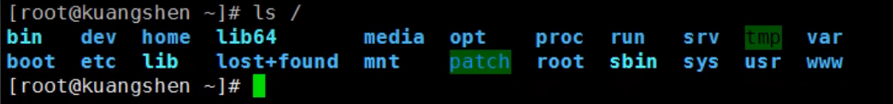
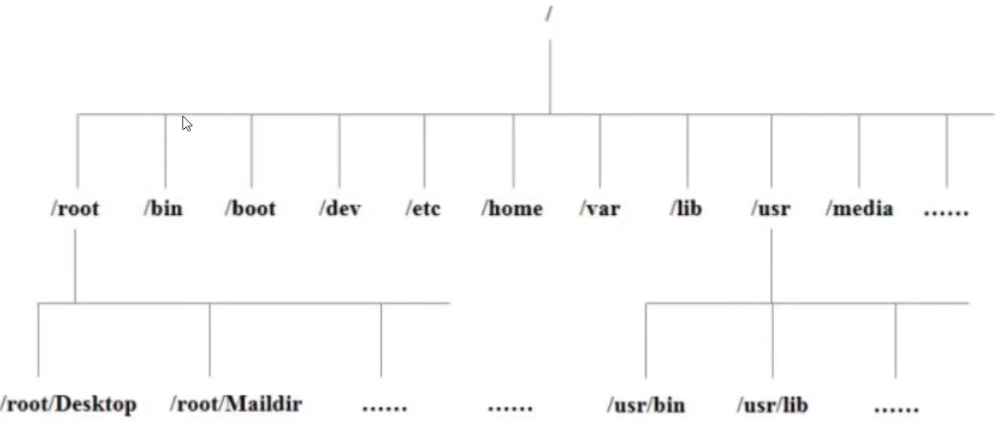

> 关机

在Linux领域内大多用在服务器上，很少遇到关机的操作。

关机指令为：shutdown

```bash
sync				#将数据由内存同步到硬盘中。

shutdown#关机指令，你可以man shutdown来看一下帮助文档。例如你可以运行如下命令关机:

shutdown -h 10		#这个命令告诉大家，计算机将在10分钟后关机

shutdown -h now 	#立马关机

shutdown -h 20:25 	#系统会在今天20:25关机

shutdown -h +10		#十分钟后关机

shutdown -r now		#系统立马重启

shutdown -r +10		#系统十分钟后重启

reboot 				#就是重启，等同于 shutdown -r now

halt				#关闭系统,等同于shutdown -h now和poweroff

```

不管重启系统还是关闭系统，首先运行**sync**命令，把内存中的数据写到硬盘中。

> 系统目录结构

1. 一切皆文件
2. 根目录 / ，所有的文件都挂载在这个节点下

```bash
ls /
```



树状目录结构：



**以下是对这些目录的解释：**

- **/bin** : bin是Binary的缩写,这个目录存放着最经常使用的命令。
- **/boot** : 这里存放的是启动Linux时使用的一些核心文件，包括一些连接文件以及镜像文件。(不要动)
- **/dev** : dev是Device(设备)的缩写,存放的是Linux的外部设备，在Linux中访问设备的方式和访问文件的方式是相同的。
- ==**/etc** : 这个目录用来存放所有的系统管理所需要的配置文件和子目录。==
- **/home** : 用户的主目录，在Linux中，每个用户都有一个自己的目录，一般该目录名是以用户的账号命名的。
- **/lib **: 这个目录里存放着系统最基本的动态连接共享库，其作用类似于Windows里的DLL文件。(不要动)
- **/lost+found** : 这个目录一般情况下是空的，当系统非法关机后，这里就存放了一些文件。(存放突然关机的一些文件)
- **/media** : Linux系统会自动识别一些设备，例如U盘、光驱等等，当识别后，Linux会把识别的设备挂载到这个目录下。
- **/mnt** : 系统提供该目录是为了让用户临时挂载别的文件系统的，我们可以将光驱挂载在/mnt/上，然后进入该目录就可以查看光驱里的内容了。
- ==**/opt** : 这是给主机额外安装软件所摆放的目录。比如你安装一个ORACLE数据库则就可以放到这个目录下。默认是空的。==
- **/proc** : 这个目录是一个虚拟的目录，它是系统内存的映射，我们可以通过直接访问这个目录来获取系统信息。
- /root :该目录为系统管理员，也称作超级权限者的用户主目录。
- /sbin : s就是Super User的意思，这里存放的是系统管理员使用的系统管理程序。
- /srv:该目录存放一些服务启动之后需要提取的数据。\
- /sys :这是linux2.6内核的一个很大的变化。该目录下安装了2.6内核中新出现的一个文件系统sysfs 。
- /tmp:这个目录是用来存放一些临时文件的。
- /usr:这是一个非常重要的目录，用户的很多应用程序和文件都放在这个目录下，类似于windows下的program files目录。
- /usr/bin :系统用户使用的应用程序。

