[toc]

# 1、初识数据库

## 1.1连接数据库

命令行连接：

mysq1 -u root -p123456 --连接数据库

[修改密码参考](https://www.cnblogs.com/tianyee/p/14858531.html)

```mysql
update mysq1.user set authentication_string=password( '123456') where user='root' and Host ='localhost'; -- 修改用户密码，mysql8.0用不了，password()函数的问题，需要修改权限。

-- mysql8.0，修改权限+修改密码
alter user 'root'@ 'localhost' identified with mysql_native_password by 'new_password';
-- 不需要修改权限后，直接修改密码
alter user 'zyw'@ 'localhost' identified by '153573';

flush privileges; -- 刷新权限
---------------------------------------
-- 所有的语句都使用;结尾
show databases;			-- 查看所有的数据库
use school;				-- 切换数据库use数据库名Database changed
show tables; 			-- 查看数据库中所有的表
describe student; 		-- 显示数据库中所有的表的信息
create database westos;	-- 创建一个数据库
exit; 					-- 退出连接
-- 单行注释（Mysql的注释）
/*
多行注释
*/
```

|      | 数据库语言     |
| ---- | -------------- |
| DDL  | 数据库定义语言 |
| DML  | 数据库操作语言 |
| DQL  | 数据库查询语言 |
| DCL  | 数据库控制语言 |

# 2、操作数据库

操作数据库>操作数据库中的表>操作数据库表中的数据

## 2.1、操作数据库

- 创建数据库

```mysql
create database `数据库`;
create database if not exists `数据库`;
```

- 删除数据库

```mysql
drop database `数据库`;
drop database if exists `数据库`;
```

**if exists** 和 **if not exists** 为了代码执行安全，增加一层判断

- 使用数据库

```mysql
use `数据库`;
```

- 查看数据库

```mysql
show database;
```

## 2.2、数据库的数据类型

> 数值

|              |                    |                                   |
| ------------ | ------------------ | --------------------------------- |
| `tinyint`    | 十分小的数据       | 1B                                |
| `smallint`   | 较小的数据         | 2B                                |
| `mediumint`  | 中等大小的数据     | 3B                                |
| **`int`**    | **标准的整数**     | **4B**                            |
| `bigint`     | 较大的数据         | 8B                                |
| `float`      | 浮点数             | 4B                                |
| **`double`** | **双浮点数**       | **8B**                            |
| `decimal`    | 字符串形式的浮点数 | 金融计算的时候，一般是使用decimal |

> 字符串

|               |                |                |
| ------------- | -------------- | -------------- |
| `char`        | 字符串固定大小 | 0~255          |
| **`varchar`** | **可变字符串** | **0~65535**    |
| `tinytext`    | 微型文本       | $2^8-1$        |
| **`text`**    | **文本串**     | **$2^{16}-1$** |

> 时间日期

|                 |                                    |                      |
| --------------- | ---------------------------------- | -------------------- |
| `date`          | `YYYY-MM-DD`                       | 日期格式             |
| `time`          | `HH:mm:ss`                         | 时间格式             |
| **`datetime`**  | **`YYYY-MM-DD HH:mm:ss`**          | **最常用的时间格式** |
| **`timestamp`** | **时间戳，1970.1.1到现在的毫秒数** | **常用**             |

> (*NULL*)

没有值，未知

==**注意，不要使用NULL进行运算，结果为NULL**==

## 2.3、数据库字段属性

**unsigned**：

- 无符号的整数
- 声明该列不能声明为负数

**zerofill**：（将要删除）

- 0填充
- int数据类型的长度指能显示的长度

**auto_increment（自增）**：

```mysql
-- 修改列的定义
alter table `表` change `列` `列` [数据类型] not null auto_increment;
-- 设置自增从[start]开始
alter table `表` auto_increment = [start];
```

**not null（非空）**：

- 假设设置为not null ，如果不给它赋值，就会报错!
- NUII，如果不填写值，默认就是null !

**default**：

- 设置默认的值
- 如果不指定该列的值，则会有默认的值

**拓展**：

```mysql
/*
每一个表，都必须存在以下五个字段!未来做项目用的，表示一个记录存在意义!
id			主键
version		乐观锁
is_delete	伪删除
gmt_create	创建时间
gmt_update	修改时间
*/
```

```mysql
create table `数据库`.`表`( 
    `列` int(4) unsigned zerofill not null auto_increment comment '注释', 
    `列` varbinary(20) default '默认值' comment '注释', 
    primary key (`test`) 
) engine=innodb charset=utf8mb4 collate=utf8_general_ci;
```

## 2.4、创建数据库表

```mysql
-- 目标:创建—个schoo1数据库
-- 创建学生表（列，宁段)使用sol创建
-- 学号int登录密码varchar(20)姓名,性别varchar(2),出生日期(datatime) ,家庭住址, email
-- 注意点，使用英文()，表的名称和字段尽量使用``括起来
-- autoincrement自增
-- 字符串使用单引号括起来!
-- 所有的语句后面加，(英文的)，最后一个不用加
-- primary key 主键，一般一个表只有一个唯一的主键!
create table if not exists `student`(
    `id` int not null auto_increment comment '学号',
    `name` varchar(30) not null default '匿名' comment '姓名',
    `pwd` varchar(20) not null default '123456' comment'密码',
    `sex` varchar(2) not null default '女' comment '性别',
    `birthday` datetime default null comment '出生日期',
    `addresst` varchar(100) default null comment '家庭住址',
    `email` varchar(50) default null comment '邮箱',
    primary key(`id`)
)engine=innodb default charset=utf8mb4
```

```mysql
create table [if not exists] `表`(
    `列` [数据类型] [属性] [索引] [注释],
    `列` [数据类型] [属性] [索引] [注释],
    ......
    `列` [数据类型] [属性] [索引] [注释]
)[表类型][字符集设置][注释]
```

**字符集设置	charset=utf8**

不设置的话，会是mysql默认的字符集编码(不支持中文!)

mysql的默认编码是latin1，不支持中文

在my.ini中配置默认的编码

## 2.5、修改删除表

> 修改

```mysql
-- 修改表名 alter table 旧表名 rename as 新表名
alter table `旧表` rename as `新表`;

-- 增加表的字段 alter table 表名 add 字段名 [数据类型] [属性] [索引] [注释]
alter table `表` add `列'` [数据类型] [属性] [索引] [注释];

-- 修改表的字段（重命名，修改约束）
alter table `表` modify `列` [数据类型] [属性] [索引] [注释];
alter table `表` change `旧列` `新列` [数据类型] [属性] [索引] [注释];

-- 删除表的字段
alter table `表` drop `列`;
```

> 删除

```mysql
-- 删除表
drop table [if exists] `表`;
```

## 注意点

- 字段名使用 `` 包裹
- 注释 -- /**/
- sql 关键字大小写不敏感
- 英文符号！

# 3、数据库数据管理

## 3.1、外键

> 方式一：在创建表的时候，增加约束(麻烦，比较复杂)

```mysql
create table if not exists `student`(
    `id` int not null auto_increment comment '学号',
    `gradeid` int not null comment '年级id',
    primary key(`id`),
    key `fk_gradeid` (`gradeid`),
    constraint `fk_gradeid` foreign key (`gradeid`) references `grade` (`gradeid`)
)engine=innodb charset=utf8mb4

create table if not exists `grade`(
    `gradeid` int not null auto_increment comment '年级id',
    primary key (`gradeid`)
)engine=innodb charset=utf8mb4
```

删除有外键关系的表的时候，必须要先删除引用别人的表 (从表)，再删除被引用的表(主表)

> 方式二：创建表之后，添加外部约束

```mysql
—-创建表的时候没有外键关系
alter table `表` add constraint `约束名` foreign key (`作为外键的列`) references`外键表`(`外键字段`);
```

以上的操作都是物理外键，数据库级别的外键，我们不建议使用。

(避免数据库过多造成困扰)

==实践推荐==

- 数据库就是单纯的表，只用来存数据，只有行(数据）和列（字段)
- 我们想使用多张表的数据，想使用外键(程序去实现)

## 3.2、DML语言 !!!

- insert
- update
- delete

## 3.3、添加

```mysql
-- 正常写法
insert into `表`(`字段1`,`字段2`,......`字段n`) values('值1','值2',......'值n');

-- 如果不写字段，默认一一匹配
insert into `表` values('值1','值2',......'值n');

-- 多行插入
insert into `表` (`字段1`,`字段2`,......`字段n`) values
('值1','值2',......'值n'),
('值1','值2',......'值n'),
......
('值1','值2',......'值n');
```

==values和value有疑问？==

## 3.4、修改

```mysql
-- 修改语句，指定条件
update `表` set `列1` = '值1',`列` = '值',......`列` = '值' where `列` = '值';

-- 不指定条件，会改变整列
update `表` set `列` = '值';
```

## 3.5、删除

> delete 命令

```mysql
-- 删除数据
delete from `表`;

-- 删除指定数据
delete from `表` where `列` = '值';
```

> truncate 命令

```mysql
-- 清空 表
truncate table `表`;
```

> delete 和 truncate 区别

delete是删除表中的数据，truncate是相当于删除整个表，再新建一模一样的表。

```mysql
delete from `表`; -- 删除数据，但不影响自增
truncate table `表`; -- 清空 表，，自增归零
```

# 4、DQL查询数据

Data Query Language∶数据查询语言

## 4.1、select

所有的查询操作都用`select`

> [select完整语法](https://dev.mysql.com/doc/refman/8.0/en/select.html)

```mysql
select
    [all | distinct | distinctrow ]									-- 谓词
    [high_priority]
    [straight_join]
    [sql_small_result] [sql_big_result] [sql_buffer_result]
    [sql_no_cache] [sql_calc_found_rows]
    select_expr [, select_expr] ...
    [into_option]
    [from table_references
      [partition partition_list]] 									-- 联表查询
    [where where_condition]											-- 指定结果需要满足的条件
    [group by {col_name | expr | position}, ... [with rollup]]		-- 既定姐按照哪几个字段来分组
    [having where_condition]										-- 过滤分组的记录必要满足的次要条件
    [window window_name as (window_spec)
        [, window_name as (window_spec)] ...]
    [order by {col_name | expr | position}							-- 指定查询记录按照一个或多个条件排序
      [asc | desc], ... [with rollup]]
    [limit {[offset,] row_count | row_count offset offset}]			-- 指定查询的记录从那条至哪条
    [into_option]
    [for {update | share}
        [of tbl_name [, tbl_name] ...]
        [nowait | skip locked]
      | lock in share mode]
    [into_option]

into_option: {
    into outfile 'file_name'
        [character set charset_name]
        export_options
  | into dumpfile 'file_name'
  | into var_name [, var_name] ...
}
```

## 4.2、谓词

- all：默认为all
- distinct：省略选择字段中包含重复数据的记录
- distinctrow：省略基于整个重复记录的数据，而不是基于重复字段的数据
- top：返回特定数目的记录，且这些记录将落在由ORDER BY 子句指定的前面或后面的范围中。

```mysql
-- 默认为all
select all `列` FROM `表`; -- 等价于 select `列` FROM `表`;
-- 去重distinct 
select distinct `列` FROM `表`;
```

## 4.3、表达式

```mysql
select [表达式];

select version();
select 1651651-165 as '计算结果';
select '文本';
select @@auto_increment_increment;
select `列`+1 as '加分后' from `表`;
```

```mysql
-- 查询全部数据
select * from '表';

-- 查询指定字段
select `字段1`,`字段2` from '表';

-- 给字段起别名
select `字段1` as 别名,`字段2` as 别名 from `表`;

-- 函数 concat(a,b) [字符串拼接] concat_ws
select concat('姓名：',`列`) as 别名 from `表`;
```

==数据库中的表达式:文本值，列，Null，函数，计算表达式，系统变量.....==

## ==4.4、from [表达式]== 

### 单表查询

```mysql
select * from `表`;
```

### ==联表查询== 

> ## **=={表1} [连接方式] join {表2} on [连接条件]==**

| 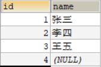 | 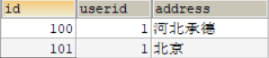 |  |
| :----------------------------------------------------------: | :----------------------------------------------------------: | :----------------------------------------------------------: |

#### 笛卡尔积

```mysql
select * from `表1`,`表2`;
select * from `表1` inner join `表2`;
```

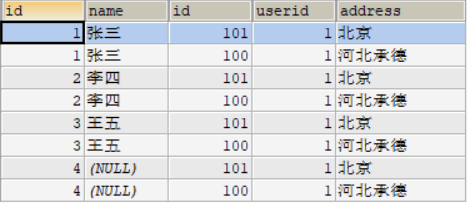

#### 内连接

在笛卡尔积的基础上，进行where操作。

**==注意==**：

- on条件是在生成临时表时使用的条件。
- where条件是在临时表生成好后，再对临时表进行过滤的条件。

```mysql
select * from `user` u, `address` a where u.id = a.userid;

select * from `user` u inner join `address` a where u.id = a.userid;

select * from `user` u inner join `address` a on u.id = a.userid;
```

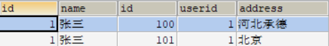

#### 外连接

##### 左连接

==`left outer join`等价于 `left join`==

**以`left outer join`左边的表为主表，右边的表为副表。**

**给主表补充上副表的数据，没有为NULL。**

```mysql
select * from `user` u left join `address` a on u.id = a.userid;
```

|                             主表                             |                             副表                             |
| :----------------------------------------------------------: | :----------------------------------------------------------: |
|  | 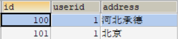 |

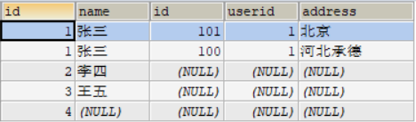

嵌套连接：

```mysql
select * from `user` u left join `address` a on u.id = a.userid
left join `phone` p on u.id = p.userid;
```

|                      第一次连接后的主表                      |                             副表                             |
| :----------------------------------------------------------: | :----------------------------------------------------------: |
|  | 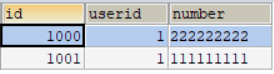 |

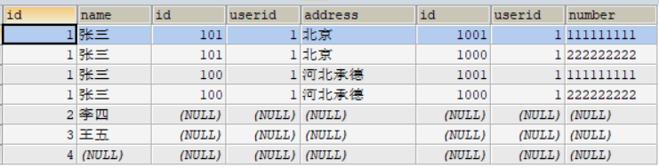

##### 右连接

==`right outer join`等价于 `right join`==

**以`right outer join`右边的表为主表，左边的表为副表。**

**给主表补充上副表的数据，没有为NULL。**

```mysql
select * from `user` u left join `phone` p on u.id = p.userid;
```

|                             主表                             |                             副表                             |
| :----------------------------------------------------------: | :----------------------------------------------------------: |
|  | 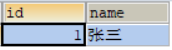 |

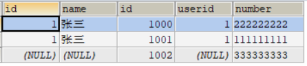

#### 总结

- `MySql`中没有实现`full ourer join` 功能，但是可以将连个表union，组成一个表实现本功能。

```mysql
SELECT * FROM `user` u 
LEFT OUTER JOIN `phone` a 
ON u.id = a.userid
UNION
SELECT * FROM `user` u 
RIGHT OUTER JOIN `phone` a 
ON u.id = a.userid;
```

| 左连接                                                       | 右链接                                                       |
| ------------------------------------------------------------ | ------------------------------------------------------------ |
| 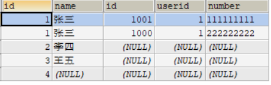 | 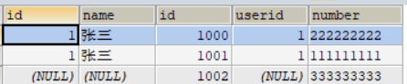 |

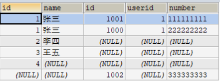


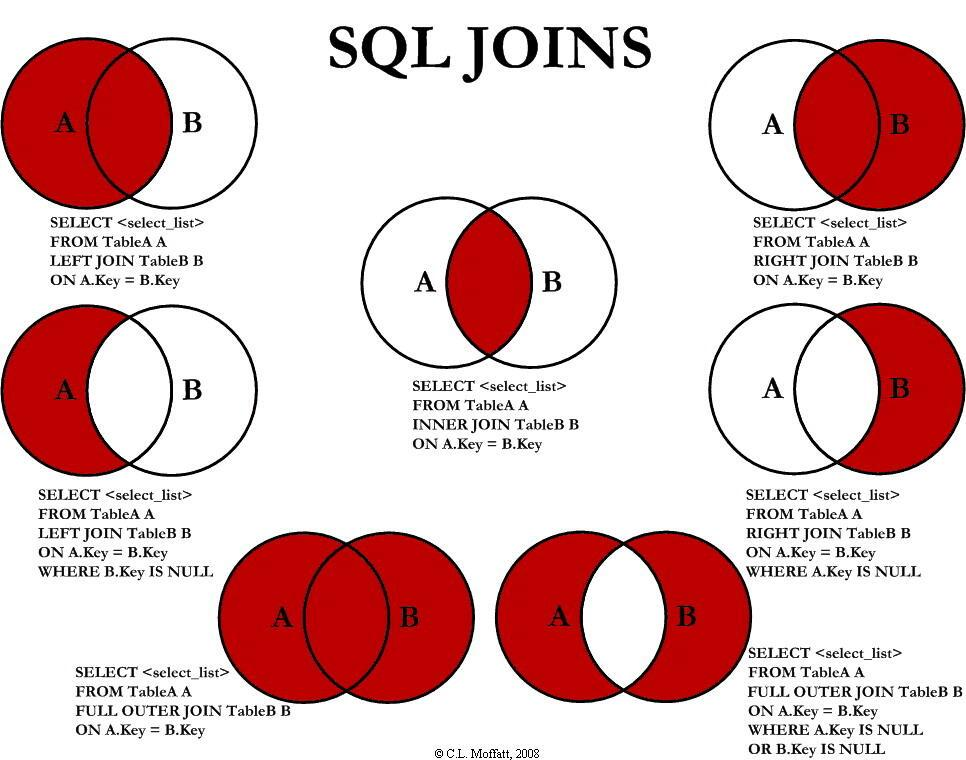

> 重点理解：
>
> [==**join连接的底层原理，知乎**==](https://zhuanlan.zhihu.com/p/150420895)
>
> [==**join连接的底层原理，CSDN**==](https://www.cnblogs.com/jmcui/p/14117113.html)
>
> [什么是B+树？](https://zhuanlan.zhihu.com/p/54102723)

### 自连接

将一个表拆分成两张一样的表，在合成成一个简化的表

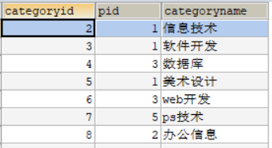

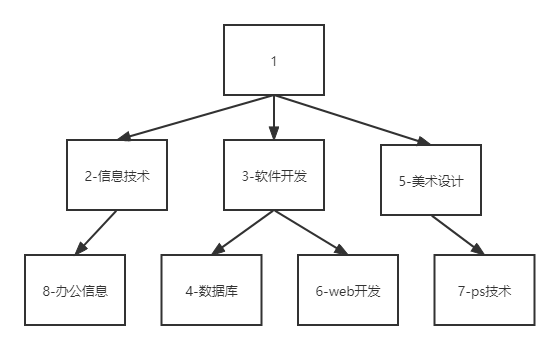

```mysql
SELECT a.`categoryname` AS '父栏目',b.`categoryname` AS '子栏目'
FROM `category` AS a,`category` AS b
WHERE a.`categoryid` = b.`pid`

SELECT a.`categoryname` AS '父栏目',b.`categoryname` AS '子栏目'
FROM `category` AS a INNER JOIN`category` AS b
ON a.`categoryid` = b.`pid`
```

## 4.5、==where [子句]==

[where 子句,帮助文档](https://dev.mysql.com/doc/refman/8.0/en/built-in-function-reference.html) 

> 逻辑运算符

| 运算符                                                       | 语法          | 描述        |
| ------------------------------------------------------------ | ------------- | ----------- |
| [and, &&](https://dev.mysql.com/doc/refman/8.0/en/logical-operators.html#operator_and) | a and b,a&&b  | 逻辑与      |
| [or, \|\|](https://dev.mysql.com/doc/refman/8.0/en/logical-operators.html#operator_or) | a or b,a\|\|b | 逻辑或      |
| [not, !](https://dev.mysql.com/doc/refman/8.0/en/logical-operators.html#operator_not) | not a,!a      | 否定值      |
| [null = null](https://dev.mysql.com/doc/refman/8.0/en/working-with-null.html) | 返回值为false | ANSISQL规范 |

```mysql
-- and、&&、between and
select `列` from `表` where `列`>=95 && `列`<=100;
select `列` from `表` where `列`>=95 and `列`<=100;
select `列` from `表` where `列` between 95 and 100;

-- or、||
select `列` from `表` where `列`<=95 || `列`>=100;
select `列` from `表` where `列`<=95 or `列`>=100;

-- not、!=
select `列` from `表` where not `列` = 100;
select `列` from `表` where `列` != 100;

-- 混合
SELECT `列` FROM `表` WHERE NOT (`表`>=60 AND `表`<=80);
-- 等价于select `列` from `表` where `列`<=60 or `列`>=80;
```

> ==**比较运算符（模糊查询）**==

| 运算符                | 语法                  | 描述                            |
| --------------------- | --------------------- | ------------------------------- |
| is null               | a is null             | 空值测试                        |
| is not null           | a is not null         | 非空测试                        |
| between .. and ..     | a between b and c     | 一个值是否在一个值的范围内      |
| not between .. and .. | not a between b and c | 一个值是否不在一个值的范围内    |
| **like**              | a like b              | 简单的模式匹配                  |
| **in**                | a in (a1,a2.a3)       | 判断a是否再a1或a2中的某一个值中 |

```mysql
-- 查询字段为空的数据 null ''
select `列` from `表`where `列`='' or `列` is null;
-- 查询字段不为空的数据 null ''
select `列` from `表`where `列` is not null;
```

```mysql
-- 查询开头带张的数据
select `列` from `表`where `列` like '张%';
-- 查询结尾带张的数据
select `列` from `表`where `列` like '%张';
-- 查询中间带张的数据
select `列` from `表`where `列` like '%张%';
-- % 代表0到任意个字符 _ 代表一个字符
select `列` from `表`where `列` like '%';
select `列` from `表`where `列` like '_';
```

```mysql
-- in 只能是一个或者多个具体的值
select `列` from `表`where `列` in ('值1','值2','值3');
select `列` from `表`where `列` in ('值');
```

## 4.6、group by ... having ...

**==看官网！==**

[12.20.2 GROUP BY 修饰符](https://dev.mysql.com/doc/refman/8.0/en/group-by-modifiers.html)

`having`子句与 `where`子句一样，指定选择条件。该`where`子句指定选择列表中列的条件，但不能引用聚合函数。该`having`子句指定基团上的条件下，典型地通过所形成的 `group by`子句。查询结果只包含满足`having` 条件的组。（如果 no`group by`存在，则所有行都隐式地形成一个聚合组。）

该`having`子句几乎最后应用，就在项目被发送到客户端之前，没有优化。（`limit`在 之后应用 `having`。）

sql 标准要求`having`必须仅引用`group by` 子句中的列或聚合函数中使用的列。但是，mysql 支持此行为的扩展，并允许 `having`引用`select`列表中的 列和外部子查询中的列。

如果`having`子句引用不明确的列，则会出现警告。在下面的语句中，`col2`是不明确的，因为它同时用作别名和列名：

```sql
select count(col1) as col2 from t group by col2 having col2 = 2;
```

优先考虑标准 sql 行为，因此如果 在选择列列表中`having`同时使用列名 `group by`并作为别名列使用，则优先考虑列中的 `group by`列。

不要`having`用于应该在`where`子句中的项目。例如，不要写以下内容：

```sql
select col_name from tbl_name having col_name > 0;
```

改写这个：

```sql
select col_name from tbl_name where col_name > 0;
```

该`having`子句可以引用聚合函数，而该`where`子句不能：

```sql
select user, max(salary) from users group by user having max(salary) > 10;
```

## 4.8、order by	

```mysql
-- 如果不显示指出是升序还是降序，则默认为是升序
SELECT `列` FROM `表` order by `列1`,`列2`,`列3`......;

-- 升序
select `列` from `表` order by `列` asc;
-- 降序
select `列` from `表` order by `列` desc;
```

多个字段的情况下，第一个字段的优先级最高，当第一个字段相同的时候，再看第二字段，以此类推

## 4.9、limit

分页：目的是缓解数据库压力，两次方式 [分段，瀑布流]

```mysql
-- start是起始值，size是大小，两个字段必须为数字
SELECT `列` FROM `表` limit start,size;
-- size是大小，字段必须为数字，起始值默认为0
SELECT `列` FROM `表` limit size;
```

# 5、子查询

`MySQL`帮助文档 （尽量避免子查询，要做到将子查询转化为其他方式）

## [8.2.2 优化子查询、派生表、视图引用和公用表表达式](https://dev.mysql.com/doc/refman/8.0/en/semijoins.html)

- [8.2.2.1 使用半连接转换优化 IN 和 EXISTS 子查询谓词](https://dev.mysql.com/doc/refman/8.0/en/semijoins.html)
- [8.2.2.2 使用物化优化子查询](https://dev.mysql.com/doc/refman/8.0/en/subquery-materialization.html)
- [8.2.2.3 使用 EXISTS 策略优化子查询](https://dev.mysql.com/doc/refman/8.0/en/subquery-optimization-with-exists.html)
- [8.2.2.4 使用合并或物化优化派生表、视图引用和公用表表达式](https://dev.mysql.com/doc/refman/8.0/en/derived-table-optimization.html)
- [8.2.2.5 派生条件下推优化](https://dev.mysql.com/doc/refman/8.0/en/derived-condition-pushdown-optimization.html)

## [13.2.11子查询](https://dev.mysql.com/doc/refman/8.0/en/subqueries.html)

- [13.2.11.1 作为标量操作数的子查询](https://dev.mysql.com/doc/refman/8.0/en/scalar-subqueries.html)
- [13.2.11.2 使用子查询的比较](https://dev.mysql.com/doc/refman/8.0/en/comparisons-using-subqueries.html)
- [13.2.11.3 带有 ANY、IN 或 SOME 的子查询](https://dev.mysql.com/doc/refman/8.0/en/any-in-some-subqueries.html)
- [13.2.11.4 ALL 子查询](https://dev.mysql.com/doc/refman/8.0/en/all-subqueries.html)
- [13.2.11.5 行子查询](https://dev.mysql.com/doc/refman/8.0/en/row-subqueries.html)
- [13.2.11.6 带有 EXISTS 或 NOT EXISTS 的子查询](https://dev.mysql.com/doc/refman/8.0/en/exists-and-not-exists-subqueries.html)
- [13.2.11.7 相关子查询](https://dev.mysql.com/doc/refman/8.0/en/correlated-subqueries.html)
- [13.2.11.8 派生表](https://dev.mysql.com/doc/refman/8.0/en/derived-tables.html)
- [13.2.11.9 横向派生表](https://dev.mysql.com/doc/refman/8.0/en/lateral-derived-tables.html)
- [13.2.11.10 子查询错误](https://dev.mysql.com/doc/refman/8.0/en/subquery-errors.html)
- [13.2.11.11 优化子查询](https://dev.mysql.com/doc/refman/8.0/en/optimizing-subqueries.html)
- [13.2.11.12 对子查询的限制](https://dev.mysql.com/doc/refman/8.0/en/subquery-restrictions.html)

==**老老实实看帮助文档比什么都强**==

# 6、MySql函数

## 6.1、常用函数(了解，别记)

```mysql
-- 数学函数
select abs(-1);						-- 绝对值
select ceiling(1.5);				-- 向上取整
select floor(1.5);					-- 向下取整
select rand();						-- 返回一个0~1的随机数
select sign(0);						-- 判断一个数的符号 0:0 正数:1 负数:-1
-- 字符串函数
select char_length('123456789');	-- 字符串长度
select concat();					-- 字符串拼接
select insert(str,pos,len,newstr);	-- 字符串替换
select lower('');					-- 小写字母
select upper('');					-- 大写字母
select instr('','');				-- 字符串查找 
-- 时间和日期函数(记住)
select current_date();				-- 获取当前日期
select curdate();					-- 获取当前日期
select now();						-- 获取当前的时间
select localtime();					-- 本地时间
select sysdate();					-- 系统时间
select year(now());
select month (now());
select day(now());
select hour (now());
select minute(now());
select second(now());
--系统
select system_user()
select user()
select version()
```

[where 子句,所有函数 帮助文档](https://dev.mysql.com/doc/refman/8.0/en/built-in-function-reference.html)

## 6.2、聚合函数

这些函数应当去记住，点击连接，结合官网学习，部分配合`group by`使用，常用的描述标粗

| Name                                                         | 描述                           |
| :----------------------------------------------------------- | :----------------------------- |
| [`AVG()**`](https://dev.mysql.com/doc/refman/8.0/en/aggregate-functions.html#function_avg)** | **返回参数的平均值**           |
| [`BIT_AND()`](https://dev.mysql.com/doc/refman/8.0/en/aggregate-functions.html#function_bit-and) | 按位返回 AND                   |
| [`BIT_OR()`](https://dev.mysql.com/doc/refman/8.0/en/aggregate-functions.html#function_bit-or) | 按位或返回                     |
| [`BIT_XOR()`](https://dev.mysql.com/doc/refman/8.0/en/aggregate-functions.html#function_bit-xor) | 返回按位异或                   |
| [`COUNT()`](https://dev.mysql.com/doc/refman/8.0/en/aggregate-functions.html#function_count) | **返回返回的行数的计数**       |
| [`COUNT(DISTINCT)`](https://dev.mysql.com/doc/refman/8.0/en/aggregate-functions.html#function_count-distinct) | 返回多个不同值的计数           |
| [`GROUP_CONCAT()`](https://dev.mysql.com/doc/refman/8.0/en/aggregate-functions.html#function_group-concat) | 返回连接的字符串               |
| [`JSON_ARRAYAGG()`](https://dev.mysql.com/doc/refman/8.0/en/aggregate-functions.html#function_json-arrayagg) | 将结果集作为单个 JSON 数组返回 |
| [`JSON_OBJECTAGG()`](https://dev.mysql.com/doc/refman/8.0/en/aggregate-functions.html#function_json-objectagg) | 将结果集作为单个 JSON 对象返回 |
| [`MAX()`](https://dev.mysql.com/doc/refman/8.0/en/aggregate-functions.html#function_max) | **返回最大值**                 |
| [`MIN()`](https://dev.mysql.com/doc/refman/8.0/en/aggregate-functions.html#function_min) | **返回最小值**                 |
| [`STD()`](https://dev.mysql.com/doc/refman/8.0/en/aggregate-functions.html#function_std) | 返回总体标准差                 |
| [`STDDEV()`](https://dev.mysql.com/doc/refman/8.0/en/aggregate-functions.html#function_stddev) | 返回总体标准差                 |
| [`STDDEV_POP()`](https://dev.mysql.com/doc/refman/8.0/en/aggregate-functions.html#function_stddev-pop) | 返回总体标准差                 |
| [`STDDEV_SAMP()`](https://dev.mysql.com/doc/refman/8.0/en/aggregate-functions.html#function_stddev-samp) | 返回样本标准差                 |
| [`SUM()`](https://dev.mysql.com/doc/refman/8.0/en/aggregate-functions.html#function_sum) | **返回总和**                   |
| [`VAR_POP()`](https://dev.mysql.com/doc/refman/8.0/en/aggregate-functions.html#function_var-pop) | 返回总体标准方差               |
| [`VAR_SAMP()`](https://dev.mysql.com/doc/refman/8.0/en/aggregate-functions.html#function_var-samp) | 返回样本方差                   |
| [`VARIANCE()`](https://dev.mysql.com/doc/refman/8.0/en/aggregate-functions.html#function_variance) | 返回总体标准方差               |

# 7、数据库界别的MD5加密（扩展）

md5() 加密字符串

```mysql
update `表` set pwd = md5(pwd);
```

# 8、==事务==

## 8.1、事务定义与原则

> ACID原则：原子性、一致性、隔离性、持久性——[ACID帮助文档](https://dev.mysql.com/doc/refman/8.0/en/mysql-acid.html)
>
> 参考链接：[CSDN-事务ACID理解](https://blog.csdn.net/dengjili/article/details/82468576)

**原子性（Atomicity）**
原子性是指事务是一个不可分割的工作单位，事务中的操作要么都发生，要么都不发生。
**一致性（Consistency）**
事务前后数据的完整性必须保持一致。
**隔离性（Isolation）**
事务的隔离性是多个用户并发访问数据库时，数据库为每一个用户开启的事务，不能被其他事务的操作数据所干扰，多个并发事务之间要相互隔离。
**持久性（Durability）**
持久性是指一个事务一旦被提交，它对数据库中数据的改变就是永久性的，接下来即使数据库发生故障也不应该对其有任何影响

> 事务的隔离级别

**脏读**：指一个事务读取了另外一个事务未提交的数据。

**不可重复读**：在一个事务内读取表中的某一行数据，多次读取结果不同。（这个不一定是错误，只是某些场合不对）

**幻读**：是指在一个事务内读取到了别的事务插入的数据，导致前后读取数量总量不一致。
（一般是行影响，如下图所示：多了一行）

> 四种隔离级别设置

数据库
set transaction isolation level 设置事务隔离级别
show variables like "transaction_isolation%";查询当前事务隔离级别

|       设置       |                        描述                        |
| :--------------: | :------------------------------------------------: |
|   Serializable   | 可避免脏读、不可重复读、虚读情况的发生。（串行化） |
| Repeatable read  |   可避免脏读、不可重复读情况的发生。（可重复读）   |
|  Read committed  |          可避免脏读情况发生（读已提交）。          |
| Read uncommitted |      最低级别，以上情况均无法保证。(读未提交)      |

 java
适当的 Connection 方法，比如 setAutoCommit 或 setTransactionIsolation

|             设置             |                             描述                             |
| :--------------------------: | :----------------------------------------------------------: |
|   TRANSACTION_SERIALIZABLE   |          指示不可以发生脏读、不可重复读和虚读的常量          |
| TRANSACTION_REPEATABLE_READ  |      指示不可以发生脏读和不可重复读的常量；虚读可以发生      |
| TRANSACTION_READ_UNCOMMITTED | 指示可以发生脏读 (dirty read)、不可重复读和虚读 (phantom read) 的常量 |
|  TRANSACTION_READ_COMMITTED  |      指示不可以发生脏读的常量；不可重复读和虚读可以发生      |

## 8.2、事务流程

```mysql
-- mysq1是默认开启事务自动提交的
set autocommit = 0;	/*关闭*/
set autocommit = 1;	/*开启（默认的）*/
-- 手动处理事务
set autocommit = 0;	-- 关闭自动提交
-- 事务开启
start transaction;	-- 标记一个事务的开始，从这个之后的sq1 都在同一个事务内
insert xx;
insert xx;
-- 提交:持久化（成功!)
commit;
-- 回滚:回到的原来的样子（失败!)
rollback;
-- 事务结束
set autocommit = 1;	-- 开启自动提交
-- 了解
savepoint `保存点名`;				-- 设置一个事务的保存点
rollbackto savepoint `保存点名`;	-- 回滚到保存点
release savepoint `保存点名`;		-- 撤销保存点
```

例子：

```mysql
create table `account`(
 `id` int not null auto_increment,
 `name` varchar(20) not null,
 `money` decimal(9,2) not null,
 primary key(`id`)
)engine=innodb default charset=utf8;

insert into `account`(`name`,`money`) values
('a',2000),('b',1000),('c',10000),('d',3000),('e',100),('f',500),('g',3500);
```

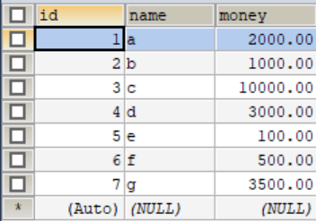

```mysql
-- 模拟转账
set autocomit = 0;	-- 


start transaction;	-- 开启一个事务

update `account` set `money`=`money`-500 where `name`='a';
update `account` set `money`=`money`+500 where `name`='b';

commit;		-- 提交事务
-- rollback;	-- 回滚

set autocommit = 1;	-- 开启自动提交
```

# 9、索引

> [8.3.1 MySQL 如何使用索引](https://dev.mysql.com/doc/refman/8.0/en/mysql-indexes.html)

```mysql
-- 查看索引
show index from `表`;
-- 删除索引
drop index `索引名` on `表`;
alter table `表` drop index `索引名`;
```

## 9.1、索引的分类

- 主键索引（`primary key`）
  - 唯一的标识，主键不可重复，只能有一个列作为主键
- 唯一索引（`unique key`）
  - 避免重复的列出现，唯一索引可以重复，多个列都可以标识为唯一索引
- 常规索引（`key`/`index`）
  - 默认索引，index或者key来设置
- 全文索引（`fulltext`）
  - 快速定位数据

[【MySQL优化】——看懂explain](https://blog.csdn.net/jiadajing267/article/details/81269067)

```mysql
-- 分析sql的执行情况
explain [sql语句];
```

## 9.2、创建索引

索引名命名规范：`id_表_列`

方式一：创建表是创建

```mysql
create table `表`(
 `列1` [数据类型] [属性],
 `列2` [数据类型] [属性],
 ....
 `列n` [数据类型] [属性],
 primary key(`列x`),
 unique key(`列x`),
 key[或者 index](`列x`)
)engine=innodb default charset=utf8;
```

方式二：创建表之后创建

```mysql
create index `索引名` on `表`(`列`);
```

方式三：修改索引

```mysql
alter table `表` add [索引类型] `索引名`(`列`);
```

## 9.3、==索引创建的原则==

- 索引不是越多越好
- 不要对经常变动数据加，索引增删改慢
- 索引小数据量的表不需要加索引
- 索引一般加在常用来查询的字段上

## 9.4、索引的数据结构

> [MySQL索引背后的数据结构及算法原理](http://blog.codinglabs.org/articles/theory-of-mysql-index.html)

Hash

B-tree：InnoDB的默认数据结构

# 10、delimiter

[25.1 定义存储程序](https://dev.mysql.com/doc/refman/8.0/en/stored-programs-defining.html)

# 11、权限管理和备份

## 11.1、用户管理

`WITH mysql_native_password`：8.0修改权限为mysql_native_password，默认为caching_sha2_password

会产生乱码问题。

```mysql
-- 创建用户
create user '用户名'@ 'localhost' identified [with mysql_native_password] by '123456'; 
-- 刷新权限
flush privileges;
-- 设置权限
grant alter, alter routine, create, create routine, create tablespace, create temporary tables, create user, create view, delete, drop, event, execute, file, index, insert, lock tables, process, references, reload, replication client, replication slave, select, show databases, show view, shutdown, super, trigger, update on *.* to '用户名'@'localhost' with grant option;
-- 给予除授权权限以外的全部权限
grant all privileges on *.* to '用户名'@'localhost' with grant option;
-- 取消权限
revoke all privileges on *.* to '用户名'@'localhost' with grant option;
```

## 11.2、备份

备份原因：

- 保证重要数据不丢失
- 数据转移

备份方式：

- 直接拷贝物理文件
- 在sqlyog这种可视化工具中手动导出

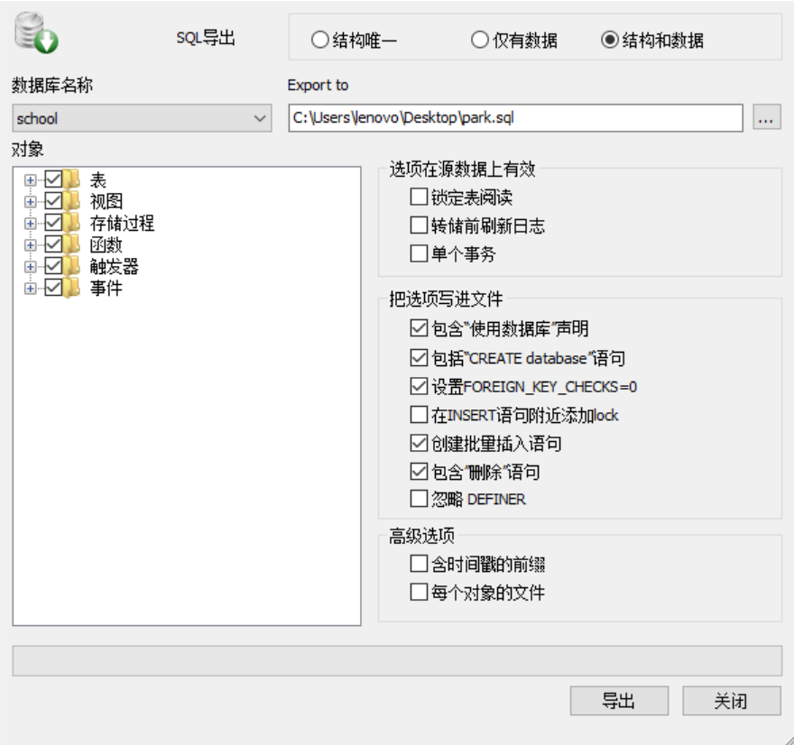

- 使用命令行导出mysqldump命令行使用

```bash
#mysq1dump -h 主机      -u 用户名 -p 密码    数据库   表名        >物理磁盘位置/文件名
mysq1dump -h localhost -u root -p 123456 schoo1 student >D:/a.sq1

#mysq1dump -h 主机      -u 用户名 -p 密码    数据库 表1 表2 表3   >物理磁盘位置/文件名
mysq1dump -h localhost -u root -p 123456 schoo1 student >D:/a.sq1

#mysq1dump -h 主机      -u 用户名 -p 密码    数据库 >物理磁盘位置/文件名
mysq1dump -h localhost -u root -p 123456 schoo1  >D:/a.sq1

#导入 没登陆的情况
#mysq1dump -h 主机      -u 用户名 -p 密码    数据库 <物理磁盘位置/文件名
```

```mysql
-- 导入 登陆的情况
source d:/a.sql;
```

# 12、==数据库规范设计==

## 12.1、设计的原因

**糟糕的数据库设计**

- 数据冗余，浪费空间
- 数据库插入和删除都会麻烦、异常【屏蔽使用物理外键】
- 程序的性能差

**良好的数据库设计**

- 节省内存空间
- 保证数据库的完整性
- 方便我们开发系统

**数据库的设计**

- 分析需求：分析业务和需要处理的数据库的需求
- 概要设计：设计关系图E-R图

设计数据库的步骤

- 收集信息，分析需求
- 标识实体（把需求落地到没个）

- 标识实体之间的关系

## 12.2、三大范式

- 信息重复
- 更新异常
- 插入异常
  - 无法正常显示信息
- 删除异常
  - 丢失有效的信息

> 三大范式

- 第一范式：**当关系模式R的所有属性都不能在分解为更基本的数据单位时**，称R是满足第一范式的，简记为1NF。满足第一范式是关系模式规范化的最低要求，否则，将有很多基本操作在这样的关系模式中实现不了。

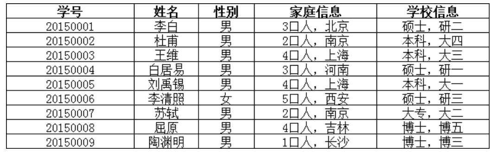

在上面的表中，“家庭信息”和“学校信息”列均不满足原子性的要求，故不满足第一范式，调整如下：

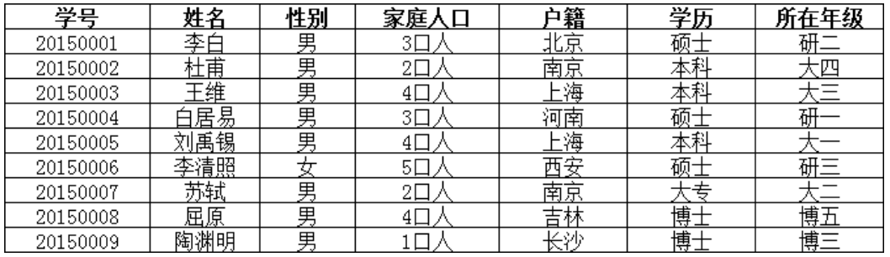

可见，调整后的每一列都是不可再分的，因此满足第一范式（1NF）

- 第二范式：**如果关系模式R满足第一范式**，并且R得所有非主属性都完全依赖于R的每一个候选关键属性，称R满足第二范式，简记为2NF。

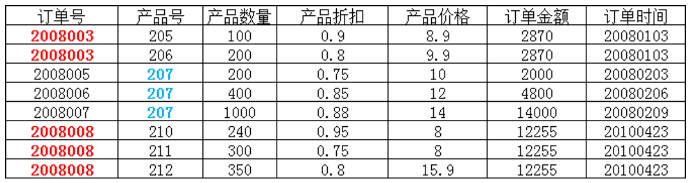

在上图所示的情况中，同一个订单中可能包含不同的产品，因此主键必须是“订单号”和“产品号”联合组成，

但可以发现，产品数量、产品折扣、产品价格与“订单号”和“产品号”都相关，但是订单金额和订单时间仅与“订单号”相关，与“产品号”无关，

这样就不满足第二范式的要求，调整如下，需分成两个表：

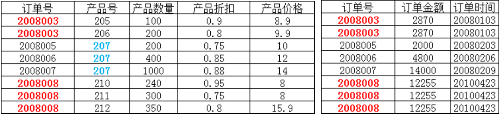

- 第三范式：设R是一个满足第一范式条件的关系模式，X是R的任意属性集，如果X非传递依赖于R的任意一个候选关键字，称R满足第三范式，简记为3NF.

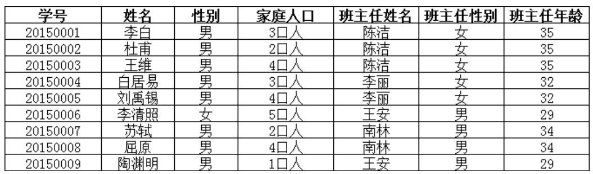

上表中，所有属性都完全依赖于学号，所以满足第二范式，但是“班主任性别”和“班主任年龄”直接依赖的是“班主任姓名”，

而不是主键“学号”，所以需做如下调整：

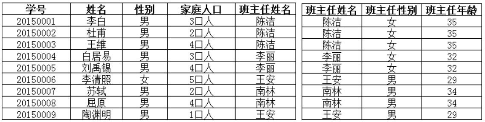

参考：[关系型数据库设计：三大范式的通俗理解](https://www.cnblogs.com/wsg25/p/9615100.html)

​			[数据库设计以及三大范式](https://zhuanlan.zhihu.com/p/194270249)

规范新和性能：

关联的表不能超过三张

- 考虑商业化的需求和目标，（成本，用户体验! ）数据库的性能更加重要
- 在规范性能的问题的时候，需要适当的考虑一下规范性
- 故意给某些表增加一些冗余的字段。（从夺标查询中变为单表查询）
- 故意增加一些计算列（从大数据量降低为小数据量的查询:索引）

# 13、==JDBC==

SUN公司为了简化开发人员的（对数据库的统一）操作，提供了一个（Java操作数据库的）规范，俗称JDBC这些规范的实现由具体的厂商去做。对于开发人员来说，我们只需要掌握JDBC接口的操作即可!

## 13.1、数据库驱动

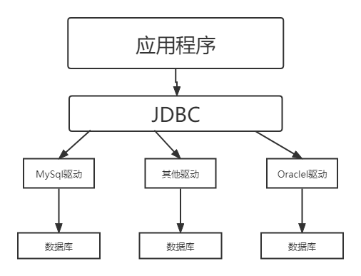

## 13.2、JDBC程序

```java
// 1. 加载驱动
Class.forName("com.mysql.cj.jdbc.Driver");

// 2. 用户信息和url
String url="jdbc:mysql://localhost:3306/school?serverTimezone=GMT&useUnicode=true&characterEncoding=utf-8&useSSL=true";
String user="root";
String password="153573zyw";

// 3. 连接成功，数据库对象Connection代表数据库
Connection connection = DriverManager.getConnection(url, user, password);

// 4. 执行SQL的对象Statement执行SQL的对象
Statement statement = connection.createStatement();

// 5. 执行SQL的对象去执行SQL，可能存在结果，查看返回结果
String sql = "select * from `category`";
ResultSet resultSet = statement.executeQuery(sql);
// 6. 查询结果
while(resultSet.next()){
    System.out.println(resultSet.getObject(1));
    System.out.println(resultSet.getObject(2));
    System.out.println(resultSet.getObject(3));
}
// 7. 释放连接
resultSet.close();
statement.close();
connection.close();
```

> Connection	数据库会话(连接)对象

```java
connection.setAutoCommit(false);
connection.rollback();
connection.commit();
```

> Statement	执行SQL对象 

```java
String sql = 
"insert into `表`(`列1`,`列2`) values ("+值1+","+值2+");";
```

```java
// 获取执行SQL对象
Statement statement = connection.createStatement();

// 执行SQL
statement.executeQuery(sql);    //查询操作返回ResultSet
statement.execute(sql);         //执行任何SQL
statement.executeUpdate(sql);   //更新、插入、删除。都是用这个，返回一个受影响的行数
statement.executeBatch();
```

> ResultSet	查询结果集

`resultset`一开始指向返回的数据的第一个数据。

```java
// 移动到下一个地址
resultset.next();
// 移动到开始
resultSet.beforeFirst();
// 移动到最后
resultSet.afterLast();
```

```java
// 在不知道列类型的情况下使用
resultset.getobject();
// 如果知道列的类型就使用指定的类型
resu1tset.getstring();
resultset.getInt();
resu1tset.getFloat();
resu1tset.getDate();
resu1tset.getobject();
/*......*/
```

## 13.3、SQL注入

> [什么是SQL注入攻击？](https://zhuanlan.zhihu.com/p/41857396)
>
> [`sql`注入基础原理（超详细）](https://www.jianshu.com/p/078df7a35671)
>
> [==如何有效防止`sql`注入==](https://www.cnblogs.com/zhixie/p/13488704.html)

```java
PreparedStatement preparedStatement = connection.prepareStatement();
```

### 13.3.1、`PreparedStatement`

`PreparedStatement`可以有效的防止`SQL`注入，并且效率更高。

```java
// 设置?占位符
String sql = 
"insert into `表`(`列1`,`列2`) values (?,?);";
```

```java
// 获取预编译SQL对象
PreparedStatement preparedStatement = connection.prepareStatement(sql);

// 通过方法给参数赋值
preparedStatement.setObject(index,值);
preparedStatement.setInt(index,值);

// 执行SQL
preparedStatement.executeQuery();
preparedStatement.execute();
preparedStatement.executeUpdate();
```

## 13.4、JDBC事务

与SQL事务操作类比

[**8、数据库事务**](#8.2、事务流程)

```java
// 关闭自动提交
try{
    connection.setAutoCommit(false);

    // 事务逻辑
    String sql1 = "update xx";
    preparedStatement = connection.connection.prepareStatement(sql1);
    preparedStatement.executeUpdate();

    String sql2 = "update xx";
    preparedStatement = connection.connection.prepareStatement(sql2);
    preparedStatement.executeUpdate();

    // 提交事务
    connection.commit();
}catch (SQLException e){
    try{
        connection.rollback();
	}catch(SQLException e1){
        e1.printStackTrace();
    }
    e.printStackTrace();
}finally{
    // 释放资源
    resultSet.close();
    statement.close();
    connection.close();
}
```

## 13.5、数据库连接池

*数据库连接*=>*执行完毕*=>*释放*

连接-释放 十分浪费系统资源

池化技术：准备一些预先的资源。

> [JAVA之JDBC数据库连接池（超详细介绍）](https://blog.csdn.net/weixin_43520450/article/details/107231118)

开源的数据库连接池

- DBCP

  - ```xml
    <!-- https://mvnrepository.com/artifact/commons-dbcp/commons-dbcp -->
    <dependency>
        <groupId>commons-dbcp</groupId>
        <artifactId>commons-dbcp</artifactId>
        <version>1.4</version>
    </dependency>
    ```

- C3P0

  - ```xml
    <!-- https://mvnrepository.com/artifact/com.mchange/c3p0 -->
    <dependency>
        <groupId>com.mchange</groupId>
        <artifactId>c3p0</artifactId>
        <version>0.9.5.5</version>
    </dependency>
    ```

- Druid：阿里巴巴

  - ```xml
    <!-- https://mvnrepository.com/artifact/com.alibaba/druid -->
    <dependency>
        <groupId>com.alibaba</groupId>
        <artifactId>druid</artifactId>
        <version>1.2.8</version>
    </dependency>
    ```

# 14、开窗函数