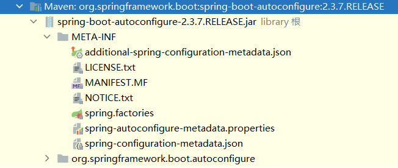
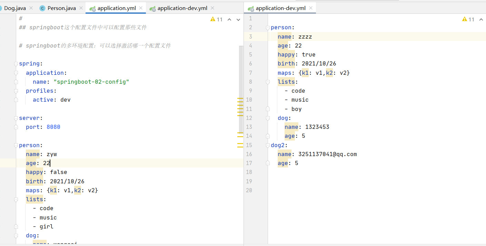
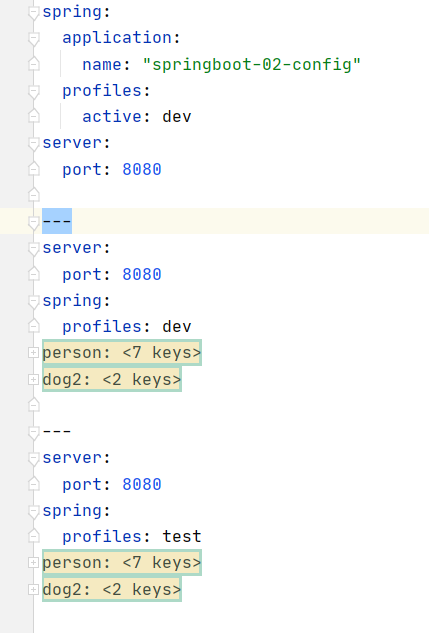
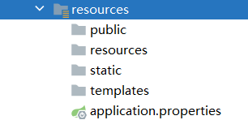
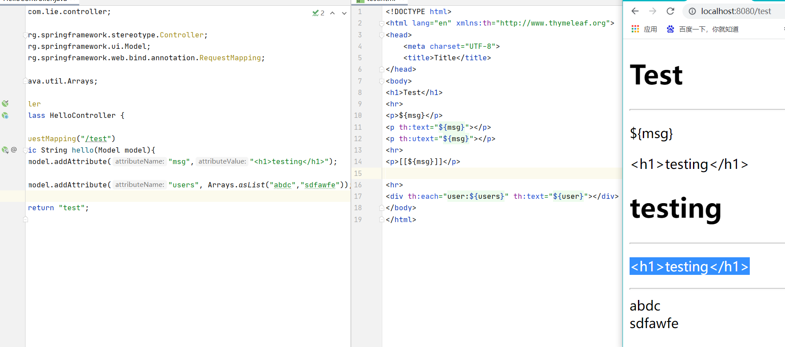

#  springboot-01-helloworld

# springboot-02-config

## 原理初探

**主程序**

```java
// @SpringBootApplication : 标注这个类是有一个springboot的应用
@SpringBootApplication
public class Springboot01HelloworldApplication {

    public static void main(String[] args) {
        // 将springboot应用启动
        SpringApplication.run(Springboot01HelloworldApplication.class, args);
    }
    
}
```

- 注解

  - ```java
    @SpringBootConfiguration	// springboot的配置
    	@Configuration	// springboot的配置
    		@Component		// 说明这也是一个spring的组件
    @EnableAutoConfiguration	// 自动配置
    	@AutoConfigurationPackage	// 自动配置包
    		@Import(AutoConfigurationPackages.Registrar.class) // 自动配置 包注册
    	@Import(AutoConfigurationPackages.Registrar.class)	// 自动配置导入选择
    		
    ```

AutoConfigurationPackages文件中的关键配置语句：

```java
// 获取候选的配置
List<String> configurations = getCandidateConfigurations(annotationMetadata, attributes);

protected List<String> getCandidateConfigurations(AnnotationMetadata metadata, AnnotationAttributes attributes) {
    List<String> configurations = SpringFactoriesLoader.loadFactoryNames(getSpringFactoriesLoaderFactoryClass(),
                                                                         getBeanClassLoader());
    Assert.notEmpty(configurations, "No auto configuration classes found in META-INF/spring.factories. If you "
                    + "are using a custom packaging, make sure that file is correct.");
    return configurations;
}

protected Class<?> getSpringFactoriesLoaderFactoryClass() {
    return EnableAutoConfiguration.class;
}

protected ClassLoader getBeanClassLoader() {
    return this.beanClassLoader;
}
```

META-INF/spring.factories：自动配置的核心文件



**结论**: springboot所有自动配置都是在启动的时候扫描并加载: `spring.factories`所有的自动配置类都在这里面，但是不一定生效，要判断条件是否成立，只要导入了对应的start，就有对应的启动器了，有了启动器，我们自动装配就会生效，然后就配置成功!

1. springboot在启动的时候，从类路径下/META-INF/`spring.factories`获取指定的值
2. 将这些自动配置的类导入容器，自动配置就会生效，帮我进行自动配置
3. 以前我们需要自动配置的东西，现在springboot帮我们做了
4. 整合javaEE，解决方案和自动配置的东西都在spring-boot-autoconfigure-2.2.0.RELEASE.jar这个包下
5. 它会把所有需要导入的组件，以类名的方式返回，这些组件就会被添加到容器
6. 容器中也会存在非常多的xxxAutoConfiguration的文件(@Bean)，就是这些类给容器中导入了这个场
   景需要的所有组件;并自动配置，@Configuration , JavaConfig
7. 有了自动配置类，免去了我们手动编写配置文件的工作

### SpringBoot的大概流程

- 自动装配
- run()


## springboot这个配置文件中可以配置那些文件

### spring-boot-starter-validation启动器

**@Validated**		数据校验

@NotNu11(message="名字不能为空")private string userName;
@Max( value=120,message="年龄最大不能查过120")private int age;
@Email(message=“邮箱格式错误")private string email;

空检查
@Nu1l
验证对象是否为null
@NotNu1l
验证对象是否不为null，无法查检长度为日的字符串
@NotBlank检查约束字符串是不是Nu1l还有被Trim的长度是否大于e,只对字符串,且会去掉前后空格.@NotEmpty
检查约束元素是否为NULL或者是EMPTY.

Booelan检查
@AssertTrue
验证Boolean对象是否为true
@AssertFalse验证 Boolean 对象是否为false长度检查
@Size(min=，max=）验证对象（Array,Collection,Map,String〉长度是否在给定的范围之内
@Length(min=, max=) Validates that the annotated string is between min and max included.

日期检查
@Past
验证 Date和 calendar对象是否在当前时间之前
@Future
验证 Date和 calendar对象是否在当前时间之后
**==@Pattern验证 String 对象是否符合正则表达式的规则==**

······等等.
除此以外，我们还可以自定义一些数据校验规则

### 多文件配置

方式一



方式二：（yml、yaml）



## 这就是自动装配的原理!

**精髓**：

1. **SpringBoot启动会加载大量的自动配置类**
2. **我们看我们需要的功能有没有在SpringBoot默认写好的自动配置类当中**
3. **我们再来看这个自动配置类中到底配置了哪些组件（只要我们要用的组件存在在其中，我们就不需要再手动配置了）**
4. **给容器中自动配置类添加组件的时候，会从properties类中获取某些属性。我们只需要在配置文件中指定这些属性的值即可**

| 类名                   | 类         | 功能                   |
| ---------------------- | ---------- | ---------------------- |
| xxxxAutoConfigurartion | 自动配置类 | 给容器中添加组件       |
| xxxxProperties         | 配置属性类 | 封装配置文件中相关属性 |
|                        |            |                        |

# springboot-03-web

要解决的问题：

- 导入静态资源....

```java
@Override
public void addResourceHandlers(ResourceHandlerRegistry registry) {
    if (!this.resourceProperties.isAddMappings()) {
        logger.debug("Default resource handling disabled");
        return;
    }
    Duration cachePeriod = this.resourceProperties.getCache().getPeriod();
    CacheControl cacheControl = this.resourceProperties.getCache().getCachecontrol().toHttpCacheControl();
    if (!registry.hasMappingForPattern("/webjars/**")) {
        customizeResourceHandlerRegistration(registry.addResourceHandler("/webjars/**")
                                             .addResourceLocations("classpath:/META-INF/resources/webjars/")
                                             .setCachePeriod(getSeconds(cachePeriod)).setCacheControl(cacheControl));
    }
    String staticPathPattern = this.mvcProperties.getStaticPathPattern();
    if (!registry.hasMappingForPattern(staticPathPattern)) {
        customizeResourceHandlerRegistration(registry.addResourceHandler(staticPathPattern)
                                             .addResourceLocations(getResourceLocations(this.resourceProperties.getStaticLocations()))
                                             .setCachePeriod(getSeconds(cachePeriod)).setCacheControl(cacheControl));
    }
}
```




- 首页

```java
@Bean
public WelcomePageHandlerMapping welcomePageHandlerMapping(ApplicationContext applicationContext,
                                                           FormattingConversionService mvcConversionService, ResourceUrlProvider mvcResourceUrlProvider) {
    WelcomePageHandlerMapping welcomePageHandlerMapping = new WelcomePageHandlerMapping(
        new TemplateAvailabilityProviders(applicationContext), applicationContext, getWelcomePage(),
        this.mvcProperties.getStaticPathPattern());
    welcomePageHandlerMapping.setInterceptors(getInterceptors(mvcConversionService, mvcResourceUrlProvider));
    welcomePageHandlerMapping.setCorsConfigurations(getCorsConfigurations());
    return welcomePageHandlerMapping;
}

private Optional<Resource> getWelcomePage() {
    String[] locations = getResourceLocations(this.resourceProperties.getStaticLocations());
    return Arrays.stream(locations).map(this::getIndexHtml).filter(this::isReadable).findFirst();
}

private Resource getIndexHtml(String location) {
    return this.resourceLoader.getResource(location + "index.html");
}
```

放在静态资源下

- jsp，模板引擎Thymeleaf



- 装配扩展SpringMVC
- 增删改查
- 拦截器
- 国际化

