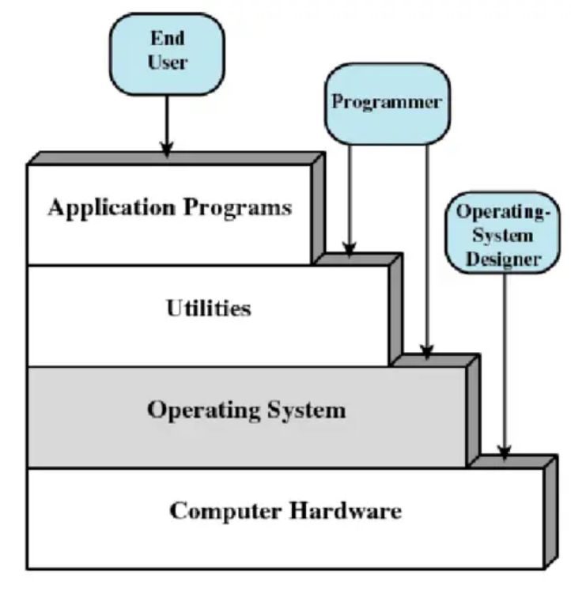
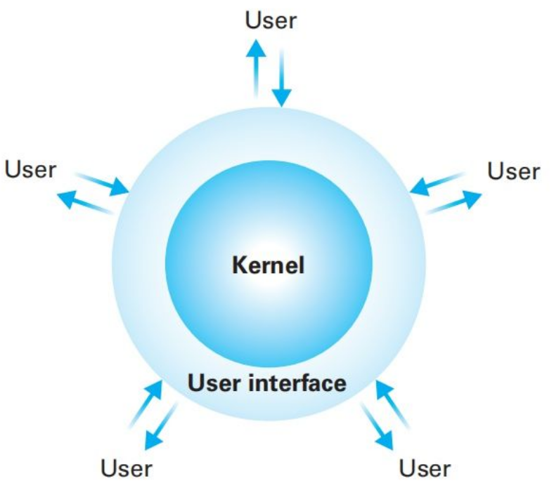
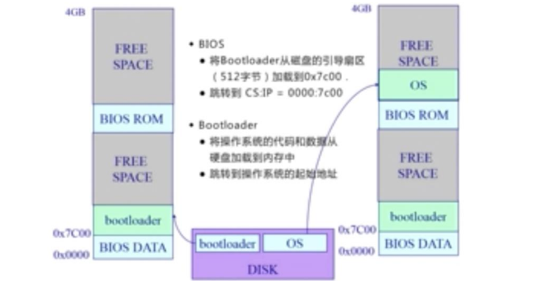

# 1、操作系统的基本概念

**操作系统是什么**

用户角度：操作系统是一个控制软件

- 管理应用程序
- 为应用程序提供服务
- 杀死应用程序

程序角度：操作系统是资源管理器

- 管理外设、分配资源
- 抽象
  - 将CPU抽象成进程
  - 将磁盘抽象成文件
  - 将内存抽象成地址空间

**操作系统层次**

位于硬件之上，应用程序之下。

 

**操作系统的界面和内核**

Linux Windows Android 的界面属于外壳(Shell) ，而不是内核(kernel)。操作系统研究的是内核，处于Shell之下。

 

**操作系统内核的内部组件**

- CPU调度器
- 物理内存管理
- 虚拟内存管理
- 文件系统管理
- 中断处理与设备驱动

> [操作系统与操作系统内核](https://blog.csdn.net/qq_26849233/article/details/74527779)
>
> [操作系统内核框架图整理](https://blog.csdn.net/toraloo/article/details/9153167)

**操作系统内核特征**

- 并发
  - 一段时间内运行多个进程（并行 : 一个时间点运行多个进程，一般要求有多个CPU)
  - 需要OS管理和调度
- 共享
  - “同时”共享
  - 互斥共享
- 虚拟
  - 让每一个用户觉得的有一个计算机专门为他服务
- 异步
  - 程序是走走停停，而不是一直运行

# 2、操作系统的异常/中断/系统调用

## 2.1、计算机探究计算机启动过程

**作用解析**

Disk : 存放OS和Bootloader

BOIS : 基于I/O处理系统

Bootloader : 加载OS，将OS放入内存

**结构**

Disk

|___ OS

|___ Bootloader

**开机流程**

1. BIOS
   - 开机后，寻找显卡和执行BIOS (此时, `CS : IP = 0xF000 : 0xFFF0`, CS/IP 两个寄存器)
   - 将Bootloader从磁盘的引导扇区加载到0x7C00 (Bootloader一共占用512M字节的内存)
   - 跳转到 `CS : IP = 0x0000 : 0x7C00`
2. Bootloader
   - 将操作系统的代码和数据从硬盘加载到内存中
   - 跳转到操作系统的起始地址

## 2.2、中断、异常、系统调用

### 中断

中断来源于外设，来自不同的硬件设备的计时器和网络的中断。

**中断流程**

硬件：设置中断标记（CPU初始化）

1. 将内部、外部事件设置中断标记
2. 中断事件的ID

软件

1. 保存当前处理状态（寄存器之类的一些数据）
2. 根据中断事件的ID跳转到中断服务程序，中断服务程序处理
3. 清楚中断标记

### 异常

异常来源于不良的应用程序，非法指令或者其他坏的处理状态（如：内存出错）。

**异常处理流程**

1. 保存现场
2. 异常处理
   1. 杀死了产生异常的程序
   2. 重新执行异常指令
3. 恢复现场

### 系统调用

系统调用来源于应用程序，应用程序主动向操作系统发出服务请求。程序访问主要是通过高层次的API，而不是直接调用系统调用函数。

**APIs**

- Win32 API 用于Windows
- POSIX API 用于 POSIX-based systems（包括UNIX，LINUX，Mac OS X）
- Java API 用于JAVA虚拟机

**特点**

- 通常情况下，每个系统调用有对应的序号
  - 系统调用接口根据这些序号来维护表的索引
- 系统调用接口调用内核态中预期的系统调用
  - 并返回系统调用的状态和其他任何返回值
- 用户不需要知道系统调用是如何实现的
  - 只需要获取API和了解操作系统将什么作为返回结果
  - 操作系统接口的细节大部分都隐藏在API中

**用户态**：操作系统运行中，CPU处于的特权级别，不能直接执行特权指令

**内核态**：操作系统运行中，CPU处于的特权级别，可以执行任何一条指令

**系统调用**：触发CPU从用户态到内核态的转换，切换程序和内核的堆栈，需要一定的开销

**跨越操作系统边界的开销（值得的且必须的，保证了操作系统的安全性）**

- 在执行时间上的开销超过程序调用
- 开销：
  - 建立中断、异常、系统调用号与对应服务例程映射关系的初始化开销
  - 建立内核堆栈
  - 验证参数
  - 内核态映射到用户态的地址空间（更新页面映射权限）
  - 内核态独立地址空间（TLB）

### 区别

| 类型     | 源头                     | 处理时间   | 响应                 |
| -------- | ------------------------ | ---------- | -------------------- |
| 中断     | 外设                     | 异步       | 持续，对应用程序透明 |
| 异常     | 应用程序意向不到的行为   | 同步       | 杀死或重新执行指令   |
| 系统调用 | 应用程序请求系统提供服务 | 同步或异步 | 等待和持续           |

> 异步：应用程序不知道什么时候会发生中断
>
> 同步：执行到某一条指令一定会发生该事件
>
> 为什么应用程序不能直接访问硬件？
>
> - 在计算机运行时，内核是被信任的第三方
> - 只有内核可以执行特权指令
> - 为了方便应用程序