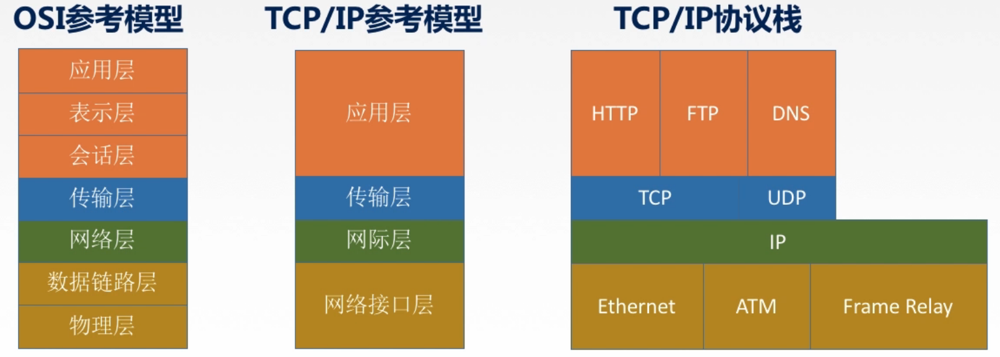
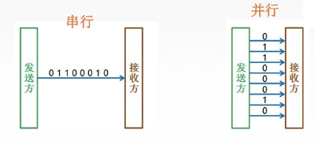
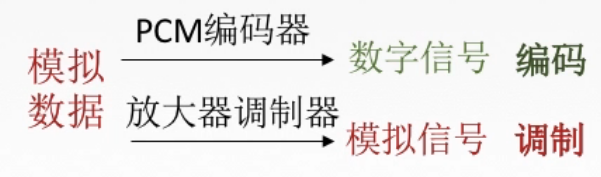
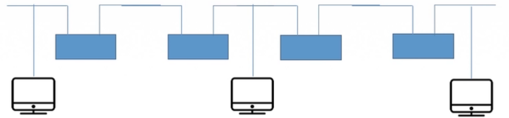

# 1.1.1概念、组成、功能、分类

### 总结图

# 1.1.2标准化工作及相关组织

### 总结图

# 1.1.3速率相关的性能指标

## 速率

数据率或称数据传输率或比特率。 比特1/0位

连接在计算机网络上的主机在数字信道上传送数据位数的速率。单位是b/s， kb/s，Mb/s，Gb/s，Tb/s

$1Byte(字节)=8 bit(比特)$

$千 1kb/s=10^3b/s$

$兆 1Mb/s=10^3kb/s=10^6b/s$

$吉 1Gb/s=10^3Mb/s=10^6kb/s=10^9b/s$

$太 1Tb/s=10^3Gb/s=10^6Mb/s=10^9kb/s=10^{12}b/s$

## 带宽

## 吞吐量

表示在单位时间内通过某个网络（或信道、接口）的数据量。单位b/s，kb/s，Mb/s等。
吞吐量受网络的带宽或网络的额定速率的限制。

## 时延

## 时延带宽积

时延带宽积(比特)=传播时延(秒)*带宽(b/s)

## 往返时延RTT

从发送方发送数据开始，到发送方收到接收方的确认（接收方收到数据后立即发送确认）,总共经历的时延。

## 利用率

### 总结图

# 1.2.1分层结构、协议、接口、服务

## 分层的基本原则

1. 各层之间相互独立，每层只实现一种相对独立的功能。

2. 每层之间界面自然清晰，易于理解，相互交流尽可能少。
3. 结构上可分割开。每层都采用最合适的技术来实现。

4. 保持下层对上层的独立性，==**上层单向使用下层提供的服务**==。

5. 整个分层结构应该能促进标准化工作。

## 分层结构的基本该概念

## 概念总结

网络体系结构是从==**功能**==上描述计算机网络结构。

计算机网络体系结构简称网络体系结构是==**分层结构**==。

每层遵循某个/些网络协议以完成本层功能。

==**计算机网络体系结构**==是计算机网络的==**各层及其协议**==的集合。

第n层在向n+1层提供服务时，此服务不仅包含第n层本身的功能，还包含由下层服务提供的功能。

仅仅在==**相邻层间有接口**==，且所提供服务的具体实现细节对上一层完全屏蔽。

体系结构是==**抽象**==的，而实现是指能运行的一些软件和硬件。

### 总结图

# 1.2.2OSI参考模型

| 计算机网络分层结构 |    ==7层==OSI参考模型     | 总结5层体系结构 |
| :----------------: | :-----------------------: | :-------------: |
|                    | ==**4层**==TCP/IP参考模型 |                 |

## ISO/OSI参考模型

| 物联网淑慧试用 |      |                    |
| :------------: | :--: | :----------------: |
|     应用层     |  7   | 资源子网(数据处理) |
|     表示层     |  6   | 资源子网(数据处理) |
|     会话层     |  5   | 资源子网(数据处理) |
|     传输层     |  4   |                    |
|     网络层     |  3   | 通信子网(数据通信) |
|   数据链路层   |  2   | 通信子网(数据通信) |
|     物理层     |  1   | 通信子网(数据通信) |

## ISO/OSI参考模型通信过程

## 应用层

所有能和用户交互产生网络流量的程序

典型服务：文件传输协议(FTP)、电子邮件协议(SMTP)、万维网协议(HTTP)

## 表示层

用于处理在两个通信系统中交换信息的表示方式(语法和语义)

- 功能一：数据格式变换

- 功能二：数据加密解密

- 功能三：数据压缩与恢复

## 会话层

向表示层实体/用户进程提供==**建立连接**==并在连接上**==有序==**地==**传输**==数据。

即会话，也叫==**建立同步**==(SYN)

- 功能一：建立、管理、终止会话

- 功能二：使用校验点可使会话在通信失效时从校验点/同步点继续恢复通信，实现数据同步。(适用于传输大文件)

主要协议：ADSP、ASP

## 传输层

负责主机中两个进程的通信，即端到端的通信。传输单位是报文段或用户数据报。

- 功能一：可靠传输、不可靠传输

- 功能二：差错控制

- 功能三：流量控制

- 功能四：复用分用

复用：多个应用层进程可同时使用下面运输层的服务。
分用：运输层把收到的信息分别交付给上面应用层中相应的进程。

主要协议：TCP、UDP

## 网络层(IP层、网际层)

主要任务是把==**分组**==从源端传到目的端，为分组交换网上的不同主机提供通信服务。网络层传输单位是==**数据报**==。

- 功能一：路由选择

- 功能二：流量控制

- 功能三：差错控制

- 功能四：拥塞控制

主要协议：IP、IPX、ICMP、IGMP、ARP、RARP、OSRF 

## 数据链路层

主要任务是把网络层传下来的数据报==**组装成帧**==。传输单位：帧

- 功能一：成帧（定义帧的开始和结束)

- 功能二：差错控制帧错+位错

- 功能三：流量控制

- 功能四：访问（接入）控制控制对信道的访问

主要协议：SDLC、HDLC、PPP、STP

## 物理层

主要任务是在==**物理媒体**==上实现比特流的==**透明传输**==。传输单位：比特。

透明传输：指不管所传数据是什么样的比特组合,都应当能够在链路上传送。

- 功能一：定义接口特性

- 功能二：定义传输模式(单工、半双工、双工)

- 功能三：定义传输速率

- 功能四：比特同步

- 功能五：比特编码

主要协议：Rj45、802.3

### 总结图

# 1.2.3TCP/IP模型&5层参考模型

## OSI与TCP/IP的相同点与不同点

| 相同点                 | 不同点                                                 |
| ---------------------- | ------------------------------------------------------ |
| 都分层                 | OSI定义三点：服务、协议、接口                          |
| 基于独立的协议栈的概念 | OSI先出现，参考模型先于协议发明，不偏向特定协议        |
| 可以实现异构网络互联   | TCP/IP设计之初就考虑到异构网互联问题，将IP作为重要层次 |
|                        |                       |

面向连接分为三个阶段，第一是建立连接，在此阶段，发出一个建立连接的请求。只有在连接成功建立之后，才能开始数据传输，这是第二阶段。接着，当数据传输完毕，必须释放连接。

面向无连接没有这么多阶段，它直接进行数据传输。

## 5层参考模型

### 模型图

### 数据封装与解封装

# 1.3第一章知识总结

# 2.1.1物理层

物理层解决如何在连接各种计算机的传输媒体上**传输数据比特流**，而不是指具体的传输媒体。

主要任务：确定与传输媒体接口有关的一些特性→定义标准

## 特性

1. **机械特性**定义物理连接的特性，规定物理连接时所采用的规格、接口形状、==**引线数目**==、==**引脚数量**==和排列情况。
2. **电气特性**规定传输二进制位时，线路上信号的==**电压范围**==、阻抗匹配、传输==**速率**==和**==距离==**限制等。
3. **功能特性**指明某条线上出现的某一**==电平表示何种意义==**，接口部件的信号线的用途。
4. **规程特性(过程特性）**定义各条物理线路的工作**==规程和时序==**关系。

# 2.1.2数据通信

## 典型的数据通信

## 数据通信相关术语

通信的目的是传送消息。

**数据**：传送信息的实体，通常是有意义的符号序列。

**信号**：数据的电气/电磁的表现，是数据在传输过程中的存在形式。

​	**数字信号**：代表消息的参数取值是离散的。

​	**模拟信号**：代表消息的参数取值是连续的。

**信源**：产生和发送数据的源头。

**信宿**：接收数据的终点。

**信道**：信号的传输媒介。一般用来表示向某一个方向传送信息的介质，因此一条通信线路往往包含一条发送信道和一条接收信道。

**信道分类**：

​	传输信号：模拟信道（传送模拟信号）数字信道（传送数字信号)
​	传输介质：无线信道有线信道

## 三种通信方式：

从通信双方信息的交互方式看，有以下三种基本方式：

1. **单工通信**		只有一个方向的通信而没有反方向的交互，仅需要**一条**信道。
2. **半双工通信**	通信的双方都可以发送或接收信息，但任何一方都不能同时发送和接收，需要两条信道。
3. **全双工通信**	通信双方可以同时发送和接受信息，也需要**两条**信道。

## 两种数据传输方式：

**串行传输**：速度**==慢==**、费用**==低==**、适合**==远==**距离

**并行传输**：速度**==快==**、费用**==高==**、适合**==近==**距离

# 2.1.3码元、波特、速率、带宽

## 码元

指用一个**==固定时长==**的==**信号波形**==（数字脉冲)，代表不同离散数值的基本波形，是数字通信中数字信号的计量单位，这个时长内的信号称为k进制码元，而该时长称为码元宽度。当码元的离散状态有M个时(M大于2)，此时码元为M进制码元。
**1码元可以携带多个比特的信息量**。例如，在使用二进制编码时，只有两种不同的码元，一种代表o状态，另一种代表1状态。

==K进制的码元，一个码元携带 $log_2k$ 的bit数据==

## 速率、波特、带宽

速率也叫数据率，是指数据的==**传输速率**==，表示单位时间内传输的数据量。可以用**码元传输速率**和**信息传输速率**表示。

1）**码元传输速率**：别名码元速率、波形速率、调制速率、符号速率等，它表示单位时间内数字通信系统所传输的码元个数（也可称为**脉冲个数**或**信号变化的次数**)，单位是波特(Baud)。1波特表示数字通信系统每秒传输一个码元。这里的码元可以是多进制的，也可以是二进制的，但码元速率与进制数无关。

$1 baud=1码元/s$

2）**信息传输速率**：别名信息速率、比特率等，表示单位时间内数字通信系统传输的二进制码元个数（即比特数)单位是比特/秒(b/s) 。

==关系==：若一个码元携带n bit的信息量，则M Baud的码元传输速率所对应的信息传输速率为M×n bit/s。

$M \ baud={M*n}bit/s$

3）**带宽**：表示在单位时间内从网络中的某一点到另一点所能通过的**“最高数据率”**，常用来表示网络的通信线路所能传输数据的能力。单位是bit/s。 

# 2.1.4奈氏准则、香浓定理、

## 失真

影响失真程度的因素：

- 码元传输速率
- 信号传输距离
- 噪声干扰
- 传输媒体质量

### 失真现象——码间串扰

- 信道带宽：信道能通过的最高频率和最低频率之差
- 码间串扰：接收端收到的信号波形失去了码元之间清晰界限的现象。

## 奈氏准则(奈奎斯特定理)

在理想低通（无噪声，带宽受限）条件下，为了避免码间串扰，极限码元传输速率为2W Baud,w是信道带宽，单位是Hz。

【**仅在这两个公式(奈氏准则、香浓定理)当中带宽才指Hz**】

$理想低通信道下的极限数据传输速率=2W log_2Vb/s$

1. 在任何信道中，**码元传输的速率是有上限的**。若传输速率超过此上限，就会出现严重的码间串扰问题，使接收端对码元的完全正确识别成为不可能。
2. 信道的**频带越宽**（即能通过的信号高频分量越多)，就可以用更高的速率进行码元的有效传输。
3. **奈氏准则给出了码元传输速率的限制，但并没有对信息传输速率给出限制。**
4. 由于码元的传输速率受奈氏准则的制约，所以要提高数据的传输速率，就必须设法使每个码元能携带更多个比特的信息量，这就需要采用多元制的调制方法。

## 香浓定理

### 噪声

存在于所有的电子设备和通信信道中。由于噪声随机产生，它的瞬时值有时会很大，因此噪声会使接收端对码元的判决产生错误。但是噪声的影响是相对的，若信号较强}那么噪声影响相对较小。因此，==**信噪比**==就很重要。

信噪比=信号的平均功率/噪声的平均功率，常记为S/N，并用分贝（dB）作为度量单位

$信噪比(dB)=10log_{10}(S/N)$

### 香农定理

在带宽受限且有噪声的信道中，为了不产生误差，信息的数据传输速率有上限值。

$信道的极限数据传输速率=W log_2(1+S/N)(b/s)$

1. 信道的**带宽**或信道中的**信噪比**越大，则信息的极限传输速率就越高。
2. 对一定的传输带宽和一定的信噪比，信息传输速率的上限就确定了。
3. 只要信息的传输速率低于信道的极限传输速率，就一定能找到某种方法来实现**无差错的传输**。
4. 香农定理得出的为极限信息传输速率，实际信道能达到的传输速率要比它低不少。
5. 从香农定理可以看出，若信道带宽W或信噪比s/N没有上限（不可能)，那么信道的极限信息传输速率也就没有上限。

## 奈氏准则和香浓定理的区别

| 奈氏准则 ==内忧==                                            | 香浓定理 ==外患==                            |
| ------------------------------------------------------------ | -------------------------------------------- |
| 带宽受限无噪声条件下，为了避免码间串扰，码元传输速率的上限2W Baud。 | 带宽受限有噪声条件下的信息传输速率。         |
| 理想低通信道下的极限数据传输速率$=2W log_2Vb/s$              | 信道的极限数据传输速率$=W log_2(1+S/N)(b/s)$ |
| 要想提高数据率，就要提到带宽/采用更好的编码技术              | 想要提高数据率，经济要提高带宽/信噪比        |

# 2.1.5编码与调制

## 基带信号与宽带信号

【==**信道**==】

| 基带信号                                                     | 宽带信号                                                     |
| ------------------------------------------------------------ | ------------------------------------------------------------ |
| 将数字信号1和0直接用两种不同的电压表示，再送到==数字信道==上去传输（==基带传输==）。**来自信源**的信号，像计算机输出的代表各种文字或图像文件的数据信号都属于基带信号。基带信号就是发出的**直接表达了要传输的信息的信号**，比如我们说话的声波就是基带信号。 | 将基带信号进行调制后形成的频分复用模拟信号，再传送到==模拟信道==上去传输（宽带传输）。把基带信号经过**载波调制**后，把信号的**频率范围搬移**到**较高的频段**以便在信道中传输（即仅在一段频率范围内能够通过信道）。 |
| 在传输距离较近时，计算机网络采用**基带传输**方式（近距离衰减小，从而信号内容不易发生变化） | 在传输距离较远时，计算机网络采用**宽带传输**方式（远距离衰减大，即使信号变化大也能最后过滤出来基带信号） |

## 编码与调制

## 数字数据编码为数字信号

- **非归零编码【NRZ】**

  ==**高1低0**==，编码容易实现，但没有检错功能,且无法判断一个码元的开始和结束，以至于收发双方**难以保持同步**。

- **曼彻斯特编码**

  将一个码元分成两个相等的间隔,前一个间隔为低电平后一个间隔为高电平表示码元1;码元o则正好相反。也可以采用相反的规定。该编码的特点是在每一个码元的中间出现电平跳变，位中间的跳变既作时钟信号（可用于同步),又作数据信号，但它所占的频带宽度是原始的基带宽度的两倍。

  ==每一个码元都被调成两个电平,所以数据传输速率只有调制速率的1/2。==

- **差分曼彻斯特编码**

  ==**同1异0**==

  常用于局域网传输，其规则是：若码元为1，则前半个码元的电平与上一个码元的后半个码元的电平相同，若为0，则相反。该编码的特点是，在每个码元的中间,都有一次电平的跳转，可以实现自同步，且抗干扰性**强**于曼彻斯特编码。

- 归零编码【RZ】

  信号电平在一个码元之内都要恢复到零的这种编码成编码方式。

- 反向不归零编码【NRZI】

  信号电平翻转表示o，信号电平不变表示1。

- 4B/5B编码

  比特流中插入额外的比特以打破一连串的0或1，就是用5个比特来编码4个比特的数据，之后再传给接收方,因此称为4B/5B。编码效率为80%。

  

## 数字数据调制为模拟信号

数字数据调制技术在发送端将数字信号转换为模拟信号、而在接收端将模拟信号还原为数字信号，分别对应于调制解调器的调制和解调过程。

调幅+调相（QAM）

## 模拟数据编码为数字信号

计算机内部处理的是二进制数据，处理的都是数字音频，所以需要将模拟音频通过采样、量化转换成有限个数字表示的离散序列（即实现音频数字化）。
最典型的例子就是对音频信号进行编码的脉码调制（PCM)，在计算机应用中，能够达到最高保真水平的就是PCM编码，被广泛用于素材保存及音乐欣赏，CD、DVD以及我们常见的WAV文件中均有应用。它主要包括三步：抽样、量化、编码。

- **抽样**：对模拟信号周期性扫描，把时间上连续的信号变成时间上离散的信号。

  为了使所得的离散信号能无失真地代表被抽样的模拟数据，要使用采样定理进行采样：**==$f_{采样频率}\geq2f_{信号最高频率}$==**

- **量化**：把抽样取得的电平幅值按照一定的分级标度转化为对应的数字值，并取整数，这就把连续的电平幅值转换为离散的数字量。

- **编码**：把量化的结果转换为与之对应的二进制编码。

- **频率**：交流电的频率是指它单位时间内周期性变化的次数，单位是赫兹（Hz），与周期成倒数关系。日常生活中的交流电的频率一般为50Hz或60Hz，而无线电技术中涉及的交流电频率一般较大，达到千赫兹（kHz）甚至兆赫兹（MHz）的度量。$f=1/T$

  物理中频率的基本单位是赫兹（Hz），简称赫，也常用千赫（kHz）或兆赫（MHz）或吉赫（GHz）做单位。

  $1kHz=1^{3}Hz$，$1MHz=1^{6}Hz$，$1GHz=1^{3}MHz$。$y=A\sin{(\omega x+ {\varphi)}}$

## 模拟数据调制为模拟信号

为了实现传输的有效性，可能需要较高的频率。这种调制方式还可以使用频分复用技术，充分利用带宽资源。在电话机和本地交换机所传输的信号是采用模拟信号传输模拟数据的方式;模拟的声音数据是加载到模拟的载波信号中传输的。

### 总结图

# 2.2物理层传输介质

传输介质也称传输媒体/传输媒介，它就是数据传输系统中在发送设备和接收设备之间的物理通路。

==**传输媒体并不是物理层**==

传输媒体在物理层的下面，因为物理层是体系结构的第一层，因此有时称传输媒体为0层。在传输媒体中传输的是信号，但传输媒体并不知道所传输的信号代表什么意思。但物理层规定了**电气特性**，因此能够识别所传送的比特流。

- 导向性传输介质

  电磁波被导向沿着固体媒介（铜线/光纤）传播。

  1. **双绞线**

     双绞线是古老、又最常用的传输介质，它由==两根==采用一定规则并排==绞合==的、相互绝缘的**铜导线**组成。**绞合可以减少对相邻导线的电磁干扰**。

     为了进一步提高抗电磁干扰能力，可在双绞线的外面再加上一个由==金属丝==编织成的屏蔽层，这就是**屏蔽双绞线(STP)**，无屏蔽层的双绞线就称为**非屏蔽双绞线（UTP)** 。

     

     双绞线价格便宜，是最常用的传输介质之一，在局域网和传统电话网中普遍使用。模拟传输和数字传输都可以使用双绞线，其通信距离一般为几公里到数十公里。距离太远时，对于模拟传输，要用放大器放大衰减的信号;对于数字传输，要用中继器将失真的信号整形。

  2. **同轴电缆**

     同轴电缆由**导体铜质芯线、绝缘层、网状编织屏蔽层和塑料外层**构成。按特性阻抗数值的不同，通常将同轴电缆分为两类：50Q同轴电缆和75Q同轴电缆。其中，50Q同轴电缆主要用于传送基带数字信号，又称为==基带同轴电缆==，它在局域网中得到广泛应用;75Q同轴电缆主要用于传送宽带信号，又称为==宽带同轴电缆==，它主要用于有线电视系统。

     

     由于外导体屏蔽层的作用，同轴电缆抗干扰特性比双绞线好，被广泛用于传输较高速率的数据，其传输距离更远，但价格较双绞线贵。

  3. **光纤**

     光纤通信就是利用光导纤维（简称光纤）传递==光脉冲==来进行通信。有光脉冲表示1，无光脉冲表示O。而可见光的频率大约是$10^8MHz$，因此光纤通信系统的**带宽远远大于**目前其他各种传输媒体的带宽。

     > 光纤在发送端有光源，可以采用发光二极管或半导体激光器，它们在电脉冲作用下能产生出光脉冲;在接收端用光电二极管做成光检测器，在检测到光脉冲时可还原出电脉冲。

     光纤主要由==纤芯(实心的! )==和==包层==构成，光波通过纤芯进行传导，包层较纤芯有较低的折射率。当光线从高折射率的介质射向低折射率的介质时，其折射角将大于入射角。因此，如果入射角足够大，就会出现**全反射**，即光线碰到包层时候就会折射回纤芯、这个过程不断重复，光也就沿着光纤传输下去。

     

     - 多模光纤

       

     - 单模光纤

       

     |          | 定义                               | 光源                   | 特点                   | 外观                                                         |
     | -------- | ---------------------------------- | ---------------------- | ---------------------- | ------------------------------------------------------------ |
     | 单模光纤 | 一种在横向模式直接传输光信号的光纤 | 定向性很好的激光二极管 | 衰耗小，适合远距离传输 |  |
     | 多模光纤 | 有多种传输光信号模式的光纤         | 发光二极管             | 易失真，适合近距离传输 |  |

     特点：

     1. 传输损耗小，中继距离长，对远距离传输特别经济。
     2. 抗雷电和电磁干扰性能好。
     3. 无串音干扰，保密性好，也不易被窃听或截取数据。
     4. 体积小，重量轻。

- 非导向性传输介质

  自由空间，介质可以是空气、真空、海水等。

  - 无线电波

    信号向所有方向传播

    较强穿透能力，可传远距离，广泛用于通信领域（如手机通信）。

  - 微波

    信号固定方向传播

    微波通信频率较高、频段范围宽，因此数据率很高。

    - 地面微波接力通信
    - 卫星通信

  - 红外线、激光

    信号固定方向传播

    把要传输的信号分别转换为各自的信号格式，即红外光信号和激光信号，再在空间中传播。

### 总结图

# 2.3物理层设备

## 中继器

**诞生原因**：由于存在损耗，在线路上传输的信号功率会逐渐衰减，衰减到一定程度时将造成信号失真，因此会导致接收错误。

**中继器的功能**：对信号进行再生和还原(==**再生数字信号**==)，对衰减的信号进行放大，保持与原数据相同，以增加信号传输的距离，延长网络的长度。

**中继器的两端**：两端的网络部分是网段，而不是子网，适用于完全相同的两类网络的互连，且两个网段速率要相同。

中继器只将任何电缆段上的数据发送到另一段电缆上，它仅作用于信号的电气部分，并不

数据中是否有错误数据或不适于网段的数据。

两端可连相同媒体，也可连不同媒体。

中继器两端的网段一定要是同一个协议。(中继器不会存储转发，傻)

**5-4-3规则**：网络标准中都对信号的延迟范围作了具体的规定，因而中继器只能在规定的范围内进行，否则会网络故障。

## 集线器(多口中继器)

​			**==再生,放大信号==**
**集线器的功能：**对信号进行==再生放大转发==，对衰减的信号进行放大，接着转发到其他所有（除输入端口外）处于工作状态的端口上，以增加信号传输的距离，延长网络的长度。不具备信号的定向传送能力，是一个共享式设备。

# 2.4第二章总结

# 3.1数据链路层

# 3.2封装成帧和透明传输

## 封装成帧

**==封装成帧==**就是在一段数据的前后部分添加首部和尾部，这样就构成了一个帧。接收端在收到物理层上交的比特流后，就能根据首部和尾部的标记，从收到的比特流中识别帧的开始和结束。

首部和尾部包含许多的控制信息，他们的一个重要作用:==**帧定界**==（确定帧的界限）。

**帧同步**：接收方应当能从接收到的二进制比特流中区分出帧的起始和终止。

**组帧的四种方法**：

1. 字符计数法
2. 字符（节）填充法
3. 零比特填充法
4. 违规编码法

## 透明传输

**透明传输**是指不管所传数据是什么样的比特组合，都应当能够在链路上传送。因此，链路层就“看不见”有什么妨碍数据传输的东西。

当所传数据中的比特组合恰巧与某一个控制信息完全一样时，就必须采取适当的措施，使收方不会将这样的数据误认为是某种控制信息。这样才能保证数据链路层的传输是透明的。

## 在组帧上的应用

1. 字符计数法

   帧首部使用一个计数字段（第一个字节，八位）来标明帧内字符数。

   
   
2. 字符（节）填充法

   

   - 当传送的帧是由文本文件组成时（文本文件的字符都是从键盘上输入的，都是ASCII码)。不管从键盘上输入什么字符都可以放在帧里传过去，即**透明传输**。
   - 当传送的帧是由非ASCII码的文本文件组成时（二进制代码的程序或图像等）。就要采用**字符填充方法实现透明传输**。

   

3. 零比特填充法

   

4. 违规编码法

   

由于字节计数法中Count字段的脆弱性（其值若有差错将导致灾难性后果〉及字符填充实现上的复杂性和不兼容性，目前较普遍使用的帧同步法是**比特填充**和**违规编码法**。

# 3.3.1差错控制

概括来说，传输中的差错都是由于噪声引起的。
**==全局性==**

- 由于线路本身电气特性所产生的随机噪声(热噪声)，是信道固有的，随机存在的。
- 解决办法:提高信噪比来减少或避免干扰。(对传感器下手)

==**局部性**==

- 外界特定的短暂原因所造成的冲击噪声，是产生差错的主要原因。
- 解决办法:通常利用编码技术来解决。

## 检错编码

### 奇偶校验码

### CRC循环冗余码

接收端检错过程

把收到的每一个帧都除以同样的除数，然后检查得到的余数R。

- 余数为0，判定这个帧没有差错，接受。
- 余数为不为0，判定这个帧有差错（无法确定到位），丢弃。

FCS的生成以及接收端CRC检验都是由硬件实现，处理很迅速，因此不会延误数据的传输。

在数据链路层仅仅使用循环冗余检验CRC差错检测技术，只能做到对帧的无差错接收，即“凡是接收端数据链路层接受的帧，我们都能以非常接近于1的概率认为这些帧在传输过程中没有产生差错”。接收端丢弃的帧虽然曾收到了，但是最终还是因为有差错被丢弃。“凡是接收端数据链路层接收的帧均无差错”。

“可靠传输”:数据链路层发送端发送什么，接收端就收到什么。

链路层使用CRC检验，能够实现无比特差错的传输，但这还不是可靠传输。

## 纠错编码

### 海明码

**==发现双比特错，纠正单比特错。==**

工作流程：

海明不等式

$2^r\ge{k+r+1}$

r为冗余信息位，k为信息位

